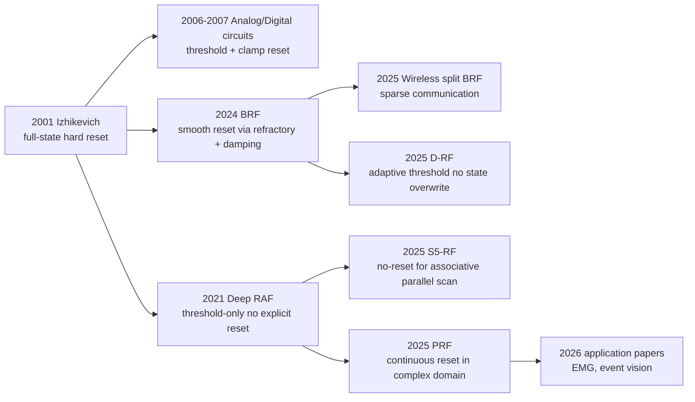
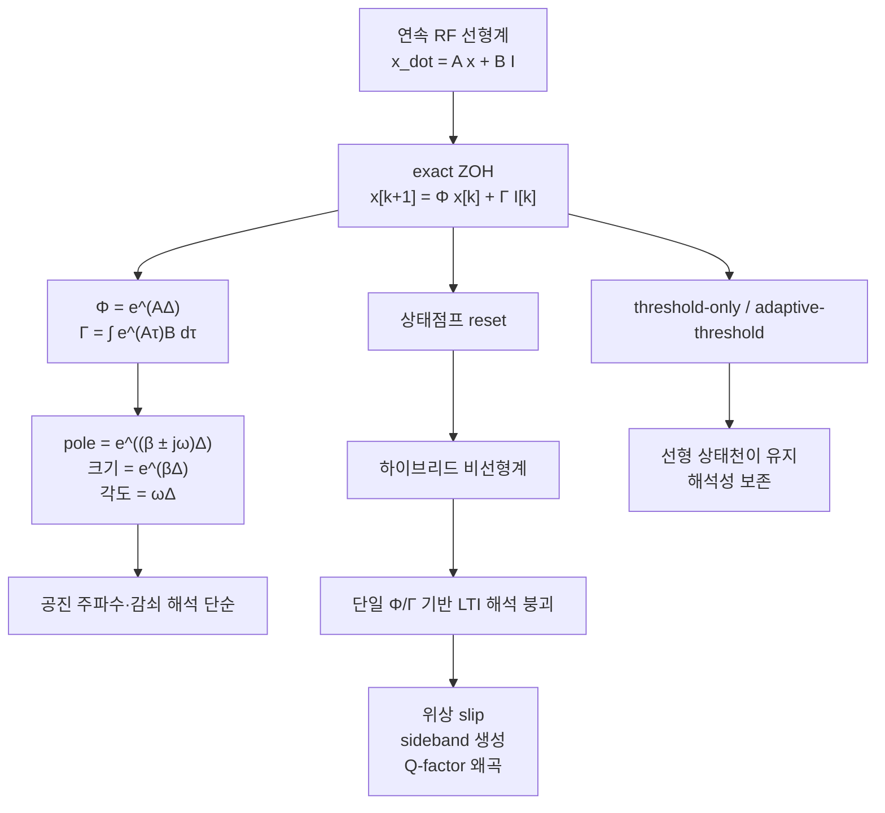
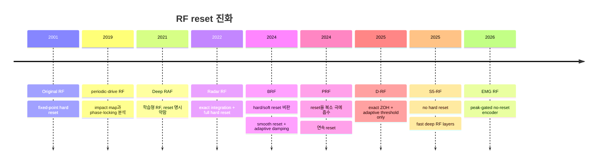

# 스파이킹젤리 구조 + RF

**User:** Anonymous  
**Created:** 5/21/2026 20:32:03  
**Updated:** 5/22/2026 21:04:29  
**Exported:** 5/23/2026 2:30:28  
**Link:** [https://chatgpt.com/c/6a0eed0b-59a4-8320-b4dd-b0b515e1f468](https://chatgpt.com/c/6a0eed0b-59a4-8320-b4dd-b0b515e1f468)  

## Prompt:
2026. 5. 21. 오후 8:32:02

스파이킹젤리 라이브러리 구조 설명 - 대략 어떤식으로 구성되어있고 모델 구축은 어느 틀 위에 있는지

## Response:
2026. 5. 21. 오후 8:32:03

> **Browsing official SpikingJelly documentation and GitHub updates**
>
> [SpikingJelly is an open-source deep learning framework ...](https://github.com/fangwei123456/spikingjelly)
> [spikingjelly 文档 - Read the Docs](https://spikingjelly.readthedocs.io/)
> [SpikingJelly](https://ai-data-base.com/wp-content/uploads/2023/10/2310.16620v1.pdf)
> [spikingjelly](https://pypi.org/project/spikingjelly/)
> [SpikingJelly: An open-source machine learning ...](https://www.science.org/doi/10.1126/sciadv.adi1480)
> [Event-based Spiking Neural Networks for Object Detection](https://arxiv.org/html/2411.17006v1)
> [ridger/spikingjelly](https://www.gitlink.org.cn/ridger/spikingjelly)
> [SpikingJelly: An open-source machine learning infrastructure ...](https://pmc.ncbi.nlm.nih.gov/articles/PMC10558124/)
> [(PDF) SpikingJelly: An open-source machine learning ...](https://www.researchgate.net/publication/374526125_SpikingJelly_An_open-source_machine_learning_infrastructure_platform_for_spike-based_intelligence)
> [SpikingJelly](https://open-neuromorphic.org/neuromorphic-computing/software/snn-frameworks/spikingjelly/)
> [torch.nn — PyTorch 2.12 documentation](https://docs.pytorch.org/docs/stable/nn.html)
> [Spiking neural networks for embedded event-based vision](https://theses.hal.science/tel-04393971/file/2023COAZ4070.pdf)
>
> **공식 문서 검색**
>
> [欢迎来到惊蜇(SpikingJelly)的文档 — spikingjelly  文档](https://spikingjelly.readthedocs.io/)
> [GitHub - fangwei123456/spikingjelly: SpikingJelly is an open-source deep learning framework for Spiking Neural Network (SNN) based on PyTorch. · GitHub](https://github.com/fangwei123456/spikingjelly)
> [spikingjelly · PyPI](https://pypi.org/project/spikingjelly/)
>
> **API 문서 모으기**
>
> [API 文档 | API Docs — spikingjelly  文档](https://spikingjelly.readthedocs.io/zh-cn/latest/APIs/spikingjelly.html)
>
> **Considering tutorial detail improvements**
>
> I think I need to add more lines in the tutorials to make things clearer. Specifically, I should focus on providing more context around the basic concepts and how containers work. This might help users grasp the ideas better, making things less vague and more actionable.
>
> **찾기: 튜토리얼에서 컨테이너 기본 개념**
>
> [Basic Conception — spikingjelly  文档](https://spikingjelly.readthedocs.io/zh-cn/latest/tutorials/en/basic_concept.html)
>
> **Considering container tutorial start**
>
> I think it might help to open the tutorial by explaining the concept of containers more clearly from the beginning. This could provide context, making everything easier to understand and set the stage for the more detailed parts of the tutorial. Let's see if this approach works better!
>
> **컨테이너 여는 라인 아이디어 찾기**
>
> [包装器 — spikingjelly  文档](https://spikingjelly.readthedocs.io/zh-cn/latest/tutorials/cn/container.html)
>
> **Planning SNN example creation**
>
> I think I should build some examples for Spiking Neural Networks (SNNs). I’m considering searching through the documentation, maybe looking for something like "lif_fc_mnist" to get relevant examples. This could help me design clear, practical examples to help illustrate how SNNs work.
>
> **SNN 예제 및 "lif_fc_mnist" 검색**
>
> [Single Fully Connected Layer SNN to Classify MNIST — spikingjelly  文档](https://spikingjelly.readthedocs.io/zh-cn/latest/tutorials/en/lif_fc_mnist.html)
>
> **Looking for references on architecture**
>
> I think I should consider using official papers for more reliable information. It might help to search in journals like Science Advances or PMC for lines discussing architecture. This might give me a more solid foundation for understanding and explaining the topic more accurately.
>
> **Searching Science Advances for architecture-related papers**
>
> [Checking your browser - reCAPTCHA](https://pmc.ncbi.nlm.nih.gov/articles/PMC10558124/)
>
> **Considering Science.org as a source**
>
> Maybe checking out Science.org could be helpful for gathering more relevant information. It seems like a good place to find reliable research or papers related to the topic. I think it could provide what I need, so I’ll take a closer look there.
>
> **Science.org 열 수 있는지 확인 중**
>
>
> **Considering arXiv for research**
>
> Maybe I should check arXiv for relevant papers or research. It’s a great resource for scientific documents, and it could have exactly what I need. I might find some useful references there that will help clarify things, so it feels like the next step.
>
> **arXiv에서 SpikingJelly 관련 논문 검색**
>
> [SpikingJelly: An open-source machine learning infrastructure platform for spike-based intelligence](https://arxiv.org/abs/2310.16620)
> [SpikingJelly: An open-source machine learning ...](https://www.science.org/doi/10.1126/sciadv.adi1480)
> [SpikingJelly: An open-source machine learning infrastructure ...](https://pmc.ncbi.nlm.nih.gov/articles/PMC10558124/)
> [spikingjelly/publications.md at master · fangwei123456 ...](https://github.com/fangwei123456/spikingjelly/blob/master/publications.md?plain=1)
> [SpikingJelly](https://ai-data-base.com/wp-content/uploads/2023/10/2310.16620v1.pdf)
> [(PDF) SpikingJelly: An open-source machine learning ...](https://www.researchgate.net/publication/374526125_SpikingJelly_An_open-source_machine_learning_infrastructure_platform_for_spike-based_intelligence)
> [欢迎来到惊蜇(SpikingJelly)的文档— spikingjelly 文档](https://spikingjelly.readthedocs.io/)
> [SpikingJelly](https://open-neuromorphic.org/neuromorphic-computing/software/snn-frameworks/spikingjelly/)
>
> **Structuring response and clarifying versioning**
>
> I’m thinking it may not be necessary to go too in-depth on the version details. I can mention the stable PyPI version (0.0.0.0.14, released 2023) alongside GitHub’s latest dev version (0.0.0.1.0). I should caution about the differences in torch and Python requirements. In terms of structure, I’ll outline SNN based on PyTorch and explain relevant components like `nn.Module`, and `activation_based` for discrete time SNN. A section on citations throughout would also help support accuracy.
>
> 47s 동안 생각함

공식 문서 기준으로 현재 구조를 확인해서 설명하겠습니다. 특히 예전의 `clock_driven`과 현재의 `activation_based` 명칭 차이를 구분해서 정리하겠습니다.

핵심은 이미 확인됐습니다. SpikingJelly의 현재 중심축은 `activation_based`이고, 모델은 결국 PyTorch의 `nn.Module`과 `nn.Sequential` 위에 얹는 방식입니다.

## 1. 한 줄 요약

**SpikingJelly는 독자적인 모델 프레임워크라기보다, PyTorch의 `nn.Module` 체계 위에 SNN용 뉴런, 시간전개, surrogate gradient, 데이터셋, 모니터링, CUDA/Triton 가속 등을 얹은 라이브러리** 입니다. 공식 문서도 SpikingJelly를 "PyTorch 기반 SNN 딥러닝 프레임워크"라고 설명합니다. ([SpikingJelly](https://spikingjelly.readthedocs.io/))

---

## 2. 전체 구조를 크게 보면

현재 문서 기준으로 SpikingJelly는 대략 아래처럼 나뉩니다.

| 영역 | 역할 |
|---|---|
| `spikingjelly.activation_based` | 현재 가장 중요한 SNN 구현 축. 시간축으로 막전위와 스파이크를 전개하는 RNN-like 방식 |
| `spikingjelly.timing_based` | spike timing 기반 SNN. 예전 `event_driven` 계열이 새 이름으로 정리된 쪽 |
| `spikingjelly.datasets` | N-MNIST, CIFAR10-DVS, DVS128 Gesture, SHD 등 신경형태 데이터셋 처리 |
| `spikingjelly.visualizing` | spike raster, feature map, membrane-spike 시각화 |
| `spikingjelly.configure` | 패키지 레벨 설정 |
| `activation_based.ann2snn` | ANN을 SNN으로 변환 |
| `activation_based.monitor` | 레이어 출력, 뉴런 상태, 스파이크 등을 기록 |
| `activation_based.cuda_kernel`, `triton_kernel` | 뉴런 연산 가속 |
| `activation_based.memopt` | multi-step SNN 학습 메모리 최적화 |
| `activation_based.op_counter` | FLOP, SynOp, 메모리 접근량, 에너지류 프로파일링 |
| `activation_based.nir_exchange`, `lava_exchange` | NIR, Lava 등 다른 neuromorphic 스택과 교환 |

공식 API 문서의 큰 목차도 `Activation-based SNNs`, `Timing-based SNNs`, `Neuromorphic Datasets`, `Visualization`, `Package-level Configurations`로 나뉘어 있습니다. 특히 `activation_based` 안에는 `base`, `neuron`, `surrogate`, `encoding`, `layer`, `functional`, `monitor`, `learning`, `ann2snn`, `model`, `examples`, `cuda_kernel`, `triton_kernel`, `memopt`, `nir_exchange` 등이 들어갑니다. ([SpikingJelly](https://spikingjelly.readthedocs.io/zh-cn/latest/APIs/spikingjelly.html))

---

## 3. 버전 명칭에서 주의할 점

예전 SpikingJelly 자료를 보면 `clock_driven`, `event_driven`이 자주 나옵니다. 그런데 `0.0.0.0.14` 이후로 이름이 바뀌었습니다.

| 구버전 이름 | 신버전 이름 |
|---|---|
| `clock_driven` | `activation_based` |
| `event_driven` | `timing_based` |

즉, 예전 코드에서

```python
from spikingjelly.clock_driven import neuron
```

처럼 쓰던 것을 현재 문서 기준으로는 보통

```python
from spikingjelly.activation_based import neuron
```

으로 봐야 합니다. 공식 migration 문서도 이 rename을 명시합니다. ([SpikingJelly](https://spikingjelly.readthedocs.io/zh-cn/latest/tutorials/en/migrate_from_legacy.html))

---

## 4. 모델 구축은 어떤 틀 위에 있나?

핵심은 **PyTorch의 `nn.Module` 위** 입니다.

SpikingJelly에서 모델을 짤 때도 일반 PyTorch처럼 다음 둘 중 하나로 갑니다.

### 방식 A. `nn.Sequential`로 쌓기

```python
import torch.nn as nn
from spikingjelly.activation_based import layer, neuron, surrogate

net = nn.Sequential(
    layer.Flatten(),
    layer.Linear(28 * 28, 10, bias=False),
    neuron.LIFNode(
        tau=2.0,
        surrogate_function=surrogate.ATan()
    )
)
```

공식 MNIST 예제에서도 ANN의 `nn.Flatten`, `nn.Linear`, `nn.Softmax` 구조를 SNN에서는 `layer.Flatten`, `layer.Linear`, `neuron.LIFNode`로 바꿔서 구성합니다. 즉, **선형층이나 합성곱층은 PyTorch식 layer이고, activation 자리에 spiking neuron이 들어간다** 고 보면 됩니다. ([SpikingJelly](https://spikingjelly.readthedocs.io/zh-cn/latest/tutorials/en/lif_fc_mnist.html))

### 방식 B. `class Net(nn.Module)`로 직접 작성하기

```python
import torch
import torch.nn as nn
from spikingjelly.activation_based import layer, neuron, surrogate, functional

class Net(nn.Module):
    def __init__(self, T=4):
        super().__init__()
        self.T = T
        self.features = nn.Sequential(
            layer.Linear(784, 256, bias=False),
            neuron.LIFNode(surrogate_function=surrogate.ATan()),
            layer.Linear(256, 10, bias=False),
            neuron.LIFNode(surrogate_function=surrogate.ATan())
        )
        functional.set_step_mode(self, step_mode='m')

    def forward(self, x):
        # x: [N, 784]
        x_seq = x.unsqueeze(0).repeat(self.T, 1, 1)  # [T, N, 784]
        y_seq = self.features(x_seq)                 # [T, N, 10]
        return y_seq.mean(0)                         # rate readout
```

이 구조도 완전히 PyTorch식입니다. 차이는 `forward` 안에서 시간축 $T$를 만들고, `LIFNode` 같은 stateful neuron이 시간에 따라 막전위를 누적한다는 점입니다.

---

## 5. `activation_based`가 실제 모델의 중심이다

사용자가 일반적인 SNN 모델을 만들 때 가장 많이 쓰는 건 거의 항상 다음 조합입니다.

```python
from spikingjelly.activation_based import (
    neuron,
    layer,
    surrogate,
    functional,
    encoding,
    monitor
)
```

각 모듈의 역할은 이렇습니다.

| 모듈 | 역할 |
|---|---|
| `neuron` | IF, LIF, ParametricLIF 등 spiking neuron |
| `layer` | Conv2d, Linear, BatchNorm, Pooling, Flatten 등 SNN 시간축 대응 layer |
| `surrogate` | spike 함수의 미분 불가능 문제를 우회하는 surrogate gradient |
| `functional` | `reset_net`, `set_step_mode`, `multi_step_forward`, backend 설정 등 |
| `encoding` | Poisson encoding 등 입력을 spike train으로 바꾸는 인코더 |
| `monitor` | 레이어 출력, spike, membrane potential 기록 |
| `learning` | STDP 등 학습 규칙 |
| `ann2snn` | ANN-SNN 변환 |
| `datasets` | neuromorphic dataset 로딩 및 전처리 |

공식 기본 개념 문서는 `activation_based`에서 spike를 0 또는 1 값을 갖는 tensor로 표현한다고 설명하고, 데이터 형식도 single-step은 `[N, *]`, multi-step은 `[T, N, *]`라고 정리합니다. ([SpikingJelly](https://spikingjelly.readthedocs.io/zh-cn/latest/tutorials/en/basic_concept.html))

---

## 6. SpikingJelly 모델의 핵심 개념: `step_mode`

SpikingJelly를 이해할 때 제일 중요한 축은 `step_mode`입니다.

| 모드 | 입력 shape | 의미 |
|---|---|---|
| `step_mode='s'` | `[N, *]` | single-step. 한 시간스텝씩 직접 for-loop로 돌림 |
| `step_mode='m'` | `[T, N, *]` | multi-step. 시간축 전체를 한 번에 넣음 |

공식 문서는 `activation_based` 모듈이 single-step `'s'`와 multi-step `'m'` 두 propagation mode를 가지며, single-step은 `[N, *]`, multi-step은 `[T, N, *]` 형식을 쓴다고 설명합니다. 기본값은 호환성 때문에 single-step입니다. ([SpikingJelly](https://spikingjelly.readthedocs.io/zh-cn/latest/tutorials/en/basic_concept.html))

즉, 아래 둘은 개념적으로 같은 계산입니다.

### single-step 방식

```python
y_seq = []

for t in range(T):
    y = net(x_seq[t])      # x_seq[t]: [N, *]
    y_seq.append(y)

functional.reset_net(net)
```

### multi-step 방식

```python
functional.set_step_mode(net, step_mode='m')
y_seq = net(x_seq)         # x_seq: [T, N, *]
functional.reset_net(net)
```

공식 문서는 step-by-step과 layer-by-layer propagation의 출력은 동일하지만, computation graph를 만드는 순서가 다르고 속도와 메모리 사용량이 달라질 수 있다고 설명합니다. surrogate gradient로 직접 SNN을 학습할 때는 보통 layer-by-layer, 즉 multi-step 방식이 병렬성과 속도 면에서 유리하다고 설명합니다. ([SpikingJelly](https://spikingjelly.readthedocs.io/zh-cn/latest/tutorials/en/basic_concept.html))

---

## 7. SNN layer는 왜 `spikingjelly.activation_based.layer`를 쓰나?

일반 PyTorch layer는 보통 `[N, C, H, W]`나 `[N, D]`를 받습니다. 그런데 SNN에서는 multi-step으로 가면 입력이 `[T, N, C, H, W]`가 됩니다.

그래서 SpikingJelly는 시간축을 처리할 수 있는 wrapper layer를 제공합니다.

예를 들어 CNN SNN은 대략 이렇게 구성됩니다.

```python
self.conv_fc = nn.Sequential(
    layer.Conv2d(1, channels, kernel_size=3, padding=1, bias=False),
    layer.BatchNorm2d(channels),
    neuron.IFNode(surrogate_function=surrogate.ATan()),
    layer.MaxPool2d(2, 2),

    layer.Conv2d(channels, channels, kernel_size=3, padding=1, bias=False),
    layer.BatchNorm2d(channels),
    neuron.IFNode(surrogate_function=surrogate.ATan()),
    layer.MaxPool2d(2, 2),

    layer.Flatten(),
    layer.Linear(channels * 7 * 7, 10, bias=False),
    neuron.IFNode(surrogate_function=surrogate.ATan())
)
```

공식 Fashion-MNIST CSNN 예제도 `{Conv2d-BatchNorm2d-IFNode-MaxPool2d}-{Conv2d-BatchNorm2d-IFNode-MaxPool2d}-{Linear-IFNode}` 구조를 사용합니다. 이후 `functional.set_step_mode(self, step_mode='m')`로 multi-step 모드로 바꾸고, 입력 이미지를 `[N, C, H, W]`에서 `[T, N, C, H, W]`로 반복시켜 넣습니다. ([SpikingJelly](https://spikingjelly.readthedocs.io/zh-cn/latest/tutorials/en/conv_fashion_mnist.html))

---

## 8. 뉴런 모듈은 stateful module이다

일반 ANN의 ReLU는 상태가 없습니다. 같은 입력을 넣으면 그냥 같은 출력을 냅니다.

하지만 SNN의 IF, LIF 뉴런은 내부에 막전위 $v$ 같은 상태를 갖습니다.

공식 문서는 `IFNode` 같은 spiking neuron layer에서 뉴런 수는 첫 입력 shape에 따라 자동 결정되며, spiking neuron은 RNN처럼 상태 또는 memory를 갖고, 일반적으로 membrane potential $V[t]$를 상태 변수로 가진다고 설명합니다. `activation_based.neuron`의 뉴런들은 `v`라는 member variable을 가집니다. ([SpikingJelly](https://spikingjelly.readthedocs.io/zh-cn/latest/tutorials/cn/neuron.html))

그래서 학습 루프에서 반드시 reset이 필요합니다.

```python
for x, y in loader:
    optimizer.zero_grad()

    out = net(x)
    loss = criterion(out, y)
    loss.backward()
    optimizer.step()

    functional.reset_net(net)
```

공식 문서도 stateful module을 쓰는 네트워크는 batch 하나를 처리한 뒤 `functional.reset_net(net)`으로 상태를 초기화해야 하며, 잊으면 inference 결과가 틀리거나 training 중 autograd 에러가 날 수 있다고 설명합니다. ([SpikingJelly](https://spikingjelly.readthedocs.io/zh-cn/latest/tutorials/en/basic_concept.html))

---

## 9. 학습은 surrogate gradient 위에 있다

SNN의 spike 발생은 본질적으로 계단함수입니다.

예를 들어 뉴런이

$$
S[t]=\Theta(V[t]-V_{\text{threshold}})
$$

처럼 threshold를 넘으면 1, 아니면 0을 출력한다고 합시다. 문제는 $\Theta$가 거의 모든 지점에서 미분값이 0이고, threshold 지점에서는 미분이 정의되지 않는다는 것입니다.

그래서 SpikingJelly는 forward에서는 spike를 만들고, backward에서는 부드러운 surrogate function으로 gradient를 흘립니다. 공식 문서도 Heaviside function의 derivative를 직접 쓰면 학습이 매우 불안정해지므로 surrogate gradient method를 사용한다고 설명합니다. ([SpikingJelly](https://spikingjelly.readthedocs.io/zh-cn/latest/tutorials/en/surrogate.html))

실제로 코드에서는 보통 이렇게 씁니다.

```python
neuron.LIFNode(
    tau=2.0,
    surrogate_function=surrogate.ATan()
)
```

즉, `surrogate.ATan()`은 **forward spike 자체를 바꾸는 핵심 모델 구조라기보다는, backward gradient를 어떻게 근사할지 정하는 요소** 입니다.

---

## 10. 입력 처리 방식: encoding 또는 direct input

SpikingJelly에서 정적 이미지를 SNN에 넣는 방식은 크게 둘입니다.

### 10.1 Poisson encoding

MNIST 같은 정적 이미지를 spike train으로 바꿉니다.

```python
encoder = encoding.PoissonEncoder()

out_fr = 0.
for t in range(T):
    encoded_img = encoder(img)
    out_fr += net(encoded_img)

out_fr = out_fr / T
```

공식 MNIST 예제에서는 Poisson encoder를 사용하고, 출력층의 firing rate 평균을 classification evidence로 씁니다. ([SpikingJelly](https://spikingjelly.readthedocs.io/zh-cn/latest/tutorials/en/lif_fc_mnist.html))

### 10.2 Direct input

이미지를 spike로 먼저 바꾸지 않고, 같은 이미지를 $T$번 반복해서 SNN에 넣습니다.

```python
x_seq = x.unsqueeze(0).repeat(T, 1, 1, 1, 1)
y_seq = net(x_seq)
fr = y_seq.mean(0)
```

공식 Fashion-MNIST CSNN 예제에서는 최근 deep SNN에서 이미지를 직접 SNN에 보내는 방식이 많이 쓰이며, 이 경우 첫 `{Conv2d-BatchNorm2d-IFNode}`가 image-spike encoding 역할을 한다고 설명합니다. ([SpikingJelly](https://spikingjelly.readthedocs.io/zh-cn/latest/tutorials/en/conv_fashion_mnist.html))

---

## 11. 출력 readout은 보통 firing rate

SpikingJelly 기본 예제들은 보통 마지막 spiking neuron layer의 시간 평균 firing rate를 출력으로 씁니다.

```python
fr = y_seq.mean(0)
return fr
```

MNIST 예제 설명에서도 output layer의 firing rate를 일정 시간 동안 평균한 값을 분류 근거로 사용하고, firing rate가 가장 높은 뉴런의 index를 예측 class로 간주합니다. ([SpikingJelly](https://spikingjelly.readthedocs.io/zh-cn/latest/tutorials/en/lif_fc_mnist.html))

다만 연구 코드에서는 꼭 rate readout만 써야 하는 것은 아닙니다. 네가 다루는 쪽처럼 `temporal_membrane`, `final membrane`, `max_rate`, `first_spike` 등을 따로 정의할 수 있습니다. SpikingJelly는 기본 뉴런과 시간전개 도구를 제공하고, readout 정책은 모델 작성자가 `forward`에서 정하는 구조입니다.

---

## 12. 레이어 출력 관찰은 어떻게 하나?

SpikingJelly에는 `monitor`가 있습니다.

대표적으로:

```python
from spikingjelly.activation_based import monitor, neuron

spike_monitor = monitor.OutputMonitor(net, neuron.IFNode)
```

공식 monitor 문서는 `spikingjelly.activation_based.monitor`가 사용자가 관심 있는 데이터를 기록하기 위해 자주 쓰이는 monitor들을 정의한다고 설명합니다. 예제로는 `OutputMonitor(net, neuron.IFNode)`를 사용해 `IFNode` 출력 spike를 기록합니다. ([SpikingJelly](https://spikingjelly.readthedocs.io/zh-cn/latest/tutorials/en/monitor.html))

너의 PSD 분석 관점에서는 다음 둘이 중요합니다.

| 방법 | 의미 |
|---|---|
| PyTorch forward hook | 일반 `nn.Module` 출력 기록. 네 코드처럼 layer별 출력 잡기에 적합 |
| SpikingJelly `monitor` | 특정 neuron class의 spike, membrane 등 기록에 편리 |

단, `monitor`를 쓸 때도 state reset은 별개로 관리해야 합니다. SNN은 내부 상태가 남기 때문입니다.

---

## 13. 데이터셋 구조

`spikingjelly.datasets`는 neuromorphic dataset 처리용 패키지입니다.

공식 문서는 `spikingjelly.datasets`가 N-MNIST, CIFAR10-DVS, DVS128 Gesture, N-Caltech101, ASLDVS 등을 제공하며, 새 데이터셋 구현자가 코드를 쓰기 쉽게 같은 방식으로 처리한다고 설명합니다. ([SpikingJelly](https://spikingjelly.readthedocs.io/zh-cn/latest/tutorials/en/neuromorphic_datasets.html))

API 문서 기준으로는 다음 데이터셋 모듈들이 보입니다.

- `cifar10_dvs`
- `dvs128_gesture`
- `n_mnist`
- `n_caltech101`
- `shd`
- `speechcommands`
- `asl_dvs`
- `es_imagenet`
- `hardvs`
- 기타 transform, utils, base

즉, SpikingJelly는 단순히 뉴런만 제공하는 라이브러리가 아니라, **데이터셋 전처리 + 모델 구성 + 학습 + 시각화 + 배포 교환까지 어느 정도 묶은 full-stack SNN 도구** 에 가깝습니다. 공식 논문 초록도 SpikingJelly가 neuromorphic dataset 전처리, deep SNN 구축, parameter optimization, neuromorphic chip deployment를 위한 full-stack toolkit이라고 설명합니다. ([arXiv](https://arxiv.org/abs/2310.16620?utm_source=chatgpt.com))

---

## 14. 전체 계산 흐름

일반적인 SpikingJelly SNN은 이렇게 흐릅니다.

```text
입력 데이터
  ↓
encoding 또는 direct repeat
  ↓
[T, N, ...] 형태의 sequence tensor
  ↓
layer.Conv2d / layer.Linear / layer.BatchNorm ...
  ↓
neuron.IFNode / neuron.LIFNode
  ↓
시간축 동안 spike 또는 membrane state 누적
  ↓
rate / membrane / first spike 등 readout
  ↓
loss 계산
  ↓
surrogate gradient로 BPTT
  ↓
optimizer.step()
  ↓
functional.reset_net(net)
```

핵심은 **시간축을 가진 PyTorch computation graph** 입니다. SNN이라서 완전히 다른 계산 프레임워크가 되는 것이 아니라, PyTorch graph 안에서 시간축 $T$ 방향으로 뉴런 상태가 전개됩니다.

---

## 15. 네 연구 코드 관점에서 중요한 포인트

너처럼 레이어 출력을 PSD로 분석하려면 아래를 구분해야 합니다.

### 15.1 `layer.Linear`, `layer.Conv2d`의 출력

이건 보통 synaptic current 또는 pre-spike activation에 가까운 연속값일 수 있습니다. 위치에 따라 의미가 다릅니다.

```text
Linear/Conv 출력 → neuron 입력
```

### 15.2 `neuron.LIFNode`의 출력

이건 spike입니다. 보통 0/1 tensor입니다.

```text
LIFNode 출력 → spike train
```

### 15.3 `neuron.v`

이건 막전위입니다. 즉, membrane potential state입니다.

```text
LIFNode 내부 상태 → v
```

따라서 PSD 분석할 때 "레이어 출력"이라고 말하면 최소한 세 가지를 분리해야 합니다.

| 분석 대상 | 의미 |
|---|---|
| pre-neuron activation | Linear/Conv 뒤, LIF 전 |
| spike output | LIFNode 출력, 0/1 |
| membrane potential | LIFNode 내부 `v` |

이 구분을 안 하면 PSD 해석이 섞입니다. 예를 들어 spike PSD와 membrane PSD는 신호 성질이 다릅니다. spike는 thresholding된 binary event이고, membrane은 누적된 analog state입니다.

---

## 16. 결론

SpikingJelly의 모델 구축 틀은 다음처럼 이해하면 됩니다.

```text
PyTorch nn.Module
  └── SpikingJelly activation_based
        ├── layer: 시간축 대응 Linear/Conv/BN/Pool/Flatten
        ├── neuron: IF/LIF/PLIF 등 stateful spiking neuron
        ├── surrogate: spike 미분 근사
        ├── functional: reset, step_mode, backend, forward helper
        ├── encoding: static input → spike train
        ├── monitor: spike/state/output 기록
        └── datasets/visualizing/ann2snn/memopt/cuda/triton 등 지원 도구
```

가장 중요한 감각은 이것입니다.

**SpikingJelly 모델은 PyTorch 모델이다. 단, activation function 자리에 상태를 가진 spiking neuron이 들어가고, 입력과 layer가 시간축 `[T, N, ...]`을 처리하도록 확장된 것이다.**

---

**Sources:**

- [欢迎来到惊蜇(SpikingJelly)的文档 — spikingjelly  文档](https://spikingjelly.readthedocs.io/)
- [SpikingJelly: An open-source machine learning infrastructure platform for spike-based intelligence](https://arxiv.org/abs/2310.16620?utm_source=chatgpt.com)

## Prompt:
2026. 5. 21. 오후 8:35:01

메모리모듈은 어떤거야?

## Response:
2026. 5. 21. 오후 8:35:02

> **SpikingJelly의 메모리 모듈에 대해 설명하기**
>
> 사용자가 "메모리모듈은 어떤 거야?"라고 묻고 있어요. SpikingJelly에서 "메모리모듈"은 상태 변수를 갖는 모듈을 의미하는 것 같아요. 예를 들면, 뉴런, 인코더, 모니터들이 있습니다. 이 모듈은 `spikingjelly.activation_based.base.MemoryModule`로 정의됩니다. 그러니까 `memopt`는 메모리 최적화와 관련이 있지 않아요. 공식 문서를 찾아보며 확인해야겠어요.
>
> **Searching SpikingJelly MemoryModule in official docs**
>
> [spikingjelly.activation_based.base 源代码](https://spikingjelly.readthedocs.io/zh-cn/latest/_modules/spikingjelly/activation_based/base.html)
> [Sigmoid(alpha=4.0, spiking=True) ), which is not ...](https://github.com/fangwei123456/spikingjelly/issues/598)
> [SpikingJelly](https://ai-data-base.com/wp-content/uploads/2023/10/2310.16620v1.pdf)
>
> **문서에서 세부 사항 확인하기**
>
> 웹을 더 찾아볼 필요 없을 것 같아요. 대신 공식 문서를 열어서 필요한 세부 정보를 확인할 수 있을 것 같아요. 이게 더 빠르고 확실한 방법일 것 같아요.
>
> **검토 중인 답변 및 문서 확인**
>
> [spikingjelly.activation_based.base — spikingjelly  文档](https://spikingjelly.readthedocs.io/zh-cn/latest/_modules/spikingjelly/activation_based/base.html)
>
> **register_memory에 대해 더 살펴보기**
>
> `register_memory`에 대해서 좀 더 열어서 살펴봐야 할 것 같아요. 이 부분이 핵심이 될 수 있으니까, 좀 더 깊이 이해하고 정확한 정보를 얻는 것이 필요할 것 같아요.
>
> **메모리 등록 부분 분석 중**
>
> [spikingjelly.activation_based.base — spikingjelly  文档](https://spikingjelly.readthedocs.io/zh-cn/latest/_modules/spikingjelly/activation_based/base.html)
>
> **메모리 모듈에 대한 자세한 설명**
>
> "메모리 모듈"에 대한 답변을 해야 되는데, SpikingJelly에서는 `base.MemoryModule` 상태 기반 모듈을 의미할 가능성이 큽니다. GPU 메모리 최적화와는 다르며, `activation_based.memopt`는 메모리 최적화를 위한 또 다른 모듈입니다. 두 가지 모듈에 대해 설명해야 해서, 관련 문서도 확인할 필요가 있어요.
>
> **Searching for SpikingJelly memory module documentation**
>
> [spikingjelly.activation_based.memopt package](https://spikingjelly.readthedocs.io/zh-cn/latest/APIs/spikingjelly.activation_based.memopt.html)
>
> **SpikingJelly의 MemoryModule에 대한 설명**
>
> "MemoryModule"은 `spikingjelly.activation_based.base.MemoryModule` 아래에 있는 상태 기반 모듈로, LSTM같은 "memory layer"와는 다릅니다. 이 모듈은 상태와 메모리 관리를 위한 클래스입니다. 예를 들어, `LIFNode`와 같은 뉴런 유형이 이 모듈을 확장합니다. 각 메소드와 역할을 코드로 설명할 수 있으며, `memopt`는 별도의 개념으로 다뤄야 할 필요가 있습니다.
>
> 27s 동안 생각함

## 결론부터

SpikingJelly에서 말하는 **메모리 모듈(memory module)** 은 보통  
`spikingjelly.activation_based.base.MemoryModule` 을 말합니다.

이건 **LSTM 같은 "기억 네트워크 레이어"** 가 아니라, **시간에 따라 내부 상태를 들고 있어야 하는 모듈들의 공통 부모 클래스** 입니다.

대표적으로 SNN 뉴런은 매 시각마다 막전위가 바뀝니다.

$$
v[t]\rightarrow s[t]\rightarrow v[t+1]
$$

이때 $v$ 같은 내부 상태를 저장하고, reset하고, detach하는 틀이 바로 `MemoryModule` 입니다.

공식 문서도 `MemoryModule`을 "SpikingJelly의 모든 stateful module의 base class"라고 설명합니다. ([스파이킹젤리](https://spikingjelly.readthedocs.io/zh-cn/latest/_modules/spikingjelly/activation_based/base.html))

---

## 1. 왜 필요한가?

ANN의 ReLU는 상태가 없습니다.

```text
y = ReLU(x)
```

같은 입력을 넣으면 항상 같은 출력만 나옵니다.

그런데 SNN의 LIF 뉴런은 다릅니다.

```text
현재 입력 x[t]
+ 이전 막전위 v[t-1]
→ 현재 막전위 v[t]
→ spike s[t]
```

즉, 뉴런 출력이 현재 입력만으로 결정되지 않습니다. **이전 시간의 막전위가 남아있습니다.**

그래서 SpikingJelly는 이런 상태를 저장하기 위해 `MemoryModule`이라는 추상 기반을 둡니다.

---

## 2. `MemoryModule`이 저장하는 것

대표적으로 저장되는 것은 이런 것들입니다.

| 상태 변수 | 의미 |
|---|---|
| `v` | 막전위(membrane potential) |
| `x` | NeuNorm 같은 layer의 누적 상태 |
| pre/post trace | STDP류 학습에서 쓰는 spike trace |
| 기타 hidden state | recurrent container, custom neuron 상태 등 |

공식 `register_memory()` 설명에서도 상태 변수 예시로 **spiking neuron의 membrane potential** 을 듭니다. `register_memory(name, value)`는 상태 변수를 memory dict에 등록하고, `reset()` 호출 시 초기값으로 되돌립니다. ([스파이킹젤리](https://spikingjelly.readthedocs.io/zh-cn/latest/_modules/spikingjelly/activation_based/base.html))

---

## 3. 내부 구조는 대략 이렇다

`MemoryModule`은 내부적으로 두 개의 딕셔너리를 둡니다.

```python
self._memories = {}
self._memories_rv = {}
```

의미는 이렇습니다.

| 내부 변수 | 의미 |
|---|---|
| `_memories` | 현재 상태값 저장 |
| `_memories_rv` | reset할 때 돌아갈 기준값 저장 |
| `_step_mode` | `'s'` 또는 `'m'` |
| `_backend` | `"torch"`, `"cupy"` 등 backend 선택 |

공식 source 기준으로 `MemoryModule`은 `nn.Module`과 `StepModule`을 상속하고, `_memories`, `_memories_rv`, `_backend`, `_step_mode`를 초기화합니다. ([스파이킹젤리](https://spikingjelly.readthedocs.io/zh-cn/latest/_modules/spikingjelly/activation_based/base.html))

---

## 4. 핵심 메서드

### 4.1 `register_memory`

상태 변수를 등록합니다.

예를 들어 LIF 뉴런은 내부적으로 막전위 $v$를 memory로 등록하는 식입니다.

```python
self.register_memory("v", 0.0)
```

그러면 이후에는 다음처럼 접근할 수 있습니다.

```python
self.v
```

하지만 실제로는 `self.v`가 일반 attribute처럼 보일 뿐, 내부적으로는 `_memories["v"]`에 저장됩니다. 공식 구현도 `__getattr__`, `__setattr__`를 통해 memory dict에 등록된 이름을 attribute처럼 접근하게 만듭니다. ([스파이킹젤리](https://spikingjelly.readthedocs.io/zh-cn/latest/_modules/spikingjelly/activation_based/base.html))

---

### 4.2 `reset`

상태를 초기화합니다.

```python
functional.reset_net(net)
```

를 호출하면, 네트워크 내부 module들을 훑으면서 `reset()` 가능한 module을 reset합니다. 공식 문서도 `reset_net`이 네트워크의 모든 module을 순회하면서 `MemoryModule`이거나 `reset()`을 가진 module에 대해 `m.reset()`을 호출한다고 설명합니다. ([스파이킹젤리](https://spikingjelly.readthedocs.io/zh-cn/latest/_modules/spikingjelly/activation_based/functional/net_config.html))

이게 중요한 이유는 SNN의 상태가 batch 사이에 남으면 안 되기 때문입니다.

```python
for x, y in loader:
    out = net(x)
    loss = criterion(out, y)
    loss.backward()
    optimizer.step()

    functional.reset_net(net)
```

`reset_net(net)`을 빼먹으면 다음 batch가 이전 batch의 막전위 영향을 받습니다. 그러면 데이터가 섞인 것과 비슷한 문제가 생깁니다.

---

### 4.3 `detach`

상태 변수를 computation graph에서 끊습니다.

```python
functional.detach_net(net)
```

또는 개별적으로

```python
module.detach()
```

를 쓸 수 있습니다.

공식 문서도 `detach()`가 모든 stateful variable을 computation graph에서 분리하며, TBPTT, 즉 truncated backpropagation through time 구현에 사용할 수 있다고 설명합니다. ([스파이킹젤리](https://spikingjelly.readthedocs.io/zh-cn/latest/_modules/spikingjelly/activation_based/base.html))

쉽게 말하면:

```text
상태값은 유지하되,
이전 시간 구간까지 gradient가 계속 타고 올라가지는 못하게 끊는 기능
```

입니다.

---

## 5. `step_mode`와도 연결된다

`MemoryModule`은 단순히 상태 저장만 하는 게 아니라, single-step과 multi-step forward의 틀도 제공합니다.

공식 구현상 `forward()`는 다음처럼 동작합니다.

| `step_mode` | 호출되는 함수 | 입력 형태 |
|---|---|---|
| `'s'` | `single_step_forward(...)` | `[N, *]` |
| `'m'` | `multi_step_forward(...)` | `[T, N, *]` |

공식 source에서도 `step_mode == "s"`이면 `single_step_forward`, `step_mode == "m"`이면 `multi_step_forward`를 호출한다고 되어 있습니다. 기본 `multi_step_forward`는 $T$번 `single_step_forward(x[t])`를 반복한 뒤 결과를 stack합니다. ([스파이킹젤리](https://spikingjelly.readthedocs.io/zh-cn/latest/_modules/spikingjelly/activation_based/base.html))

즉, `MemoryModule`은 다음 역할을 같이 합니다.

```text
1. 상태 저장
2. 상태 reset
3. 상태 detach
4. single-step / multi-step forward 분기
5. backend 관리
```

---

## 6. 예시로 보면

간단한 가짜 stateful module을 만들면 이런 느낌입니다.

```python
import torch
import torch.nn as nn
from spikingjelly.activation_based import base

class MyStatefulModule(base.MemoryModule):
    def __init__(self):
        super().__init__()
        self.register_memory("counter", torch.tensor(0.0))
        self.linear = nn.Linear(10, 5)

    def single_step_forward(self, x):
        self.counter = self.counter + 1
        return self.linear(x)
```

여기서 `counter`는 parameter가 아닙니다. 그냥 시간 진행 중에 변하는 **상태값** 입니다.

사용하면:

```python
m = MyStatefulModule()

x = torch.rand(2, 10)

y1 = m(x)
print(m.counter)  # 1

y2 = m(x)
print(m.counter)  # 2

m.reset()
print(m.counter)  # 0
```

SNN 뉴런의 막전위도 이와 비슷합니다. 다만 `counter` 대신 $v$가 누적되는 것입니다.

---

## 7. LIF 뉴런에서의 의미

LIFNode를 아주 단순화하면 내부적으로 이런 느낌입니다.

```python
class LIFNode(MemoryModule):
    def __init__(self):
        super().__init__()
        self.register_memory("v", 0.0)

    def single_step_forward(self, x):
        self.v = self.v + (x - self.v) / tau
        spike = self.v >= v_threshold

        if spike:
            self.v = reset(self.v)

        return spike
```

정확한 구현은 더 복잡하지만 핵심은 이겁니다.

```text
입력 x만으로 출력 spike가 정해지는 것이 아니라,
이전에 남아 있던 self.v가 같이 들어간다.
```

따라서 LIFNode는 상태 없는 activation이 아니라, **MemoryModule 기반 stateful activation** 입니다.

---

## 8. PSD 분석 관점에서 매우 중요함

네 연구처럼 레이어 출력을 PSD로 분석할 때 이 구분이 중요합니다.

```text
Conv/Linear 출력
↓
LIFNode 입력
↓
LIFNode 내부 막전위 v
↓
LIFNode 출력 spike
```

forward hook을 어디에 거느냐에 따라 잡히는 신호가 달라집니다.

| 어디를 기록하나 | 기록되는 것 |
|---|---|
| `layer.Conv2d`, `layer.Linear` 뒤 | pre-neuron activation 또는 synaptic current류 |
| `neuron.LIFNode` 출력 | spike tensor |
| `neuron.LIFNode.v` | membrane potential |
| `base.named_memories(net)` | 등록된 memory state들 |

SpikingJelly에는 module tree에서 memory variable들을 재귀적으로 얻는 `named_memories(module)`와 `memories(module)`도 있습니다. 공식 문서상 `named_memories`는 `named_parameters()`와 비슷하게 module tree의 모든 상태 변수 이름과 값을 생성합니다. ([스파이킹젤리](https://spikingjelly.readthedocs.io/zh-cn/latest/_modules/spikingjelly/activation_based/base.html))

예를 들어 분석 코드에서 이런 식으로 확인할 수 있습니다.

```python
from spikingjelly.activation_based import base

for name, value in base.named_memories(net):
    print(name, type(value), getattr(value, "shape", None))
```

LIF 뉴런들이 `v`를 memory로 등록하고 있다면, 여기서 각 레이어의 막전위 상태를 볼 수 있습니다.

---

## 9. `MemoryModule`과 `memopt`는 다르다

헷갈리기 쉬운 게 하나 있습니다.

| 이름 | 의미 |
|---|---|
| `base.MemoryModule` | 상태를 가진 module의 기반 클래스 |
| `activation_based.memopt` | 훈련 중 GPU memory 절약 도구 |

즉, "메모리모듈"이라고 하면 보통은 `base.MemoryModule`이고, "메모리 최적화 모듈"이라면 `memopt`입니다.

`memopt`는 gradient checkpointing과 spike compression 등을 이용해서 `activation_based` 모델의 training memory consumption을 줄이는 도구입니다. 공식 문서도 `memopt`를 `activation_based` 모델 훈련의 메모리 사용량을 줄이는 package라고 설명합니다. ([스파이킹젤리](https://spikingjelly.readthedocs.io/zh-cn/latest/APIs/spikingjelly.activation_based.memopt.html?utm_source=chatgpt.com))

---

## 10. 핵심 정리

`MemoryModule`은 다음 한 문장으로 보면 됩니다.

> **SNN에서 막전위, trace, recurrent state처럼 시간에 따라 유지되어야 하는 값을 PyTorch module 안에 안전하게 저장하고, reset하고, detach하고, single/multi-step으로 forward하기 위한 SpikingJelly의 stateful module 기반 클래스다.**

네 PSD 분석 코드 관점에서는 특히 이게 중요합니다.

```text
LIFNode 출력 hook = spike 기록
LIFNode.v 접근 = membrane potential 기록
named_memories = 네트워크 내부 상태 변수 탐색
reset_net = batch/sample 사이 상태 초기화
detach_net = 긴 시퀀스에서 gradient graph 절단
```

따라서 막전위 기반 PSD를 하려면 단순 forward hook만으로는 부족할 수 있고, `MemoryModule` 내부 memory, 특히 `v`를 직접 기록하는 구조가 필요합니다.

---

**Sources:**

- [spikingjelly.activation_based.base — spikingjelly  文档](https://spikingjelly.readthedocs.io/zh-cn/latest/_modules/spikingjelly/activation_based/base.html)

## Prompt:
2026. 5. 21. 오후 8:40:35

exact zoh 이산화 rf를 구현하기 위해 알아야할 기능 전부 설명

## Response:
2026. 5. 21. 오후 8:40:39

> **SpikingJelly RF 및 ZOH 구현 기능 설명**
>
> [SpikingJelly](https://ai-data-base.com/wp-content/uploads/2023/10/2310.16620v1.pdf)
> [spikingjelly.activation_based.neuron.lif_variants 源代码](https://spikingjelly.readthedocs.io/zh-cn/latest/_modules/spikingjelly/activation_based/neuron/lif_variants.html)
> [parametric_lif_net.py](https://github.com/fangwei123456/spikingjelly/blob/master/spikingjelly/activation_based/model/parametric_lif_net.py)
> [spikingjelly](https://pypi.org/project/spikingjelly/)
> [Efficient Surrogate Gradients for Training Spiking Neural ...](https://openreview.net/pdf?id=rCElOjqugM)
> [SpikingJelly: An open-source machine learning infrastructure ...](https://pmc.ncbi.nlm.nih.gov/articles/PMC10558124/)
>
> **찾기 오픈 소스 관련 정보**
>
> [spikingjelly.activation_based.neuron.lif_variants — spikingjelly  文档](https://spikingjelly.readthedocs.io/zh-cn/latest/_modules/spikingjelly/activation_based/neuron/lif_variants.html)
> [Checking your browser - reCAPTCHA](https://pmc.ncbi.nlm.nih.gov/articles/PMC10558124/)
>
> **MemoryModule 소스 코드 검색**
>
> [Sigmoid(alpha=4.0, spiking=True) ), which is not ...](https://github.com/fangwei123456/spikingjelly/issues/598)
> [spikingjelly.activation_based.base 源代码](https://spikingjelly.readthedocs.io/zh-cn/latest/_modules/spikingjelly/activation_based/base.html)
> [SpikingJelly](https://ai-data-base.com/wp-content/uploads/2023/10/2310.16620v1.pdf)
>
> **문서의 최신 버전 사용 검토**
>
> [spikingjelly.activation_based.base — spikingjelly  文档](https://spikingjelly.readthedocs.io/zh-cn/latest/_modules/spikingjelly/activation_based/base.html)
>
> **웹에서 BaseNode 소스 코드 검색**
>
> [Core Neuron Modules - spikingjelly 文档- Read the Docs](https://spikingjelly.readthedocs.io/zh-cn/latest/APIs/spikingjelly.activation_based.neuron.core.html)
> [Learnable Membrane Time Constant with new version of ...](https://github.com/fangwei123456/spikingjelly/issues/604)
> [SpikingJelly](https://ai-data-base.com/wp-content/uploads/2023/10/2310.16620v1.pdf)
> [RMP-SNN: Residual Membrane Potential Neuron for Enabling Deeper High-Accuracy and Low-Latency Spiking Neural Network](https://arxiv.org/abs/2003.01811)
>
> **찾아보기: RF 및 공명화 및 발화 모델**
>
> 현재 RF 및 공명화, 발화의 정확한 방정식을 찾아야 할 것 같아요. Izhikevich의 공명화 및 발화 모델을 이용할 수 있을까요? 먼저 해당 모델을 정의하고, 참고할 수 있는 자료를 찾아야겠어요.
>
> **Searching for resonate-and-fire 모델과 방정식**
>
> [Resonate-and-fire neurons](https://www.izhikevich.org/publications/resfire.pdf)
> [Signals and Systems - Lecture 1: From Continuous Time to ...](https://ethz.ch/content/dam/ethz/special-interest/mavt/dynamic-systems-n-control/idsc-dam/Lectures/Signals-and-Systems/Lectures/Fall2018/Lecture1_SigSys18.pdf)
> [Balanced Resonate-and-Fire Neurons](https://arxiv.org/html/2402.14603v1)
> [PRF: Parallel Resonate and Fire Neuron for Long ...](https://openreview.net/forum?id=OujTnpmAZG)
> [(PDF) Zero-order hold discretization of general state space ...](https://www.researchgate.net/publication/360232436_Zero-order_hold_discretization_of_general_state_space_systems_with_input_delay)
> [Resonate-and-fire neurons - Neural Networks](https://www.sciencedirect.com/science/article/abs/pii/S0893608001000788)
> [The Resonate-and-fire Neuron: Time Dependent and ...](https://digitalcommons.bucknell.edu/cgi/viewcontent.cgi?article=1022&context=masters_theses)
> [zero-order hold - studywolf](https://studywolf.wordpress.com/tag/zero-order-hold/)
> [Balanced Resonate-and-Fire Neurons - GitHub](https://raw.githubusercontent.com/mlresearch/v235/main/assets/higuchi24a/higuchi24a.pdf)
> [A Discussion on Discretization and Practical Tradeoffs of ...](https://dabramovitch.com/pubs/Abramovitch_23bb.pdf)
> [Resonate-and-Fire Neurons as Frequency Selective Input ...](https://mediatum.ub.tum.de/attfile/1544346/incoming/2020-Apr/847969.pdf)
> [Zero-order hold discretization of general state space systems ...](https://academic.oup.com/imamci/article/39/2/708/6574615)
> [Linear Systems: 13-Discretization of state-space systems](https://www.youtube.com/watch?v=t1f_K5v9ZsE)
> [All-Digital Resonate-and-Fire Neuron Design | PDF](https://www.scribd.com/document/742148511/Modeling-and-Designing-of-an-All-Digital-Resonate-and-Fire-Neuron-Circuit-1)
> [- Discretization of State-Space System Models](https://faculty.washington.edu/chx/teaching/me547/1-8_zohSS_slides.pdf)
> [Tutorial 2 - The Leaky Integrate-and-Fire Neuron](https://snntorch.readthedocs.io/en/latest/tutorials/tutorial_2.html)
> [Zero-order hold](https://en.wikipedia.org/wiki/Zero-order_hold)
> [Derivation of ZOH Discretization](https://dsp.stackexchange.com/questions/59725/derivation-of-zoh-discretization)
> [From Hodgkin-Huxley to Integrate-and-Fire - Nicolas Brunel](https://neuron.t.u-tokyo.ac.jp/wp-content/uploads/2019/04/CMMN_7.pdf)
> [Synchronization of Electrically Coupled Resonate-and-Fire ...](https://pmc.ncbi.nlm.nih.gov/articles/PMC7709966/)
> [Crucial Aspects of Zero-Order Hold LPV State-Space ...](https://rolandtoth.eu/wp-content/uploads/2018/07/IFAC2008.pdf)
>
> **출처 찾기 및 Balanced RF 검토**
>
> 출처를 찾아야겠어요. 아마 Balanced RF를 열어보면 도움이 될 것 같아요. 이 모델의 세부 사항을 확인하고, 필요한 정보를 얻기 위해 더 깊이 파봐야겠네요. 어떤 방법으로 시작할지 고민 중입니다.
>
> **찾기 위한 출처 검색 및 Balanced RF 분석**
>
> [Balanced Resonate-and-Fire Neurons](https://arxiv.org/html/2402.14603v1)
> [PII: S0893-6080(01)00078-8](https://www.izhikevich.org/publications/resfire.pdf)
> [PRF: Parallel Resonate and Fire Neuron for Long Sequence Learning in Spiking Neural Networks | OpenReview](https://openreview.net/forum?id=OujTnpmAZG)
>
> **PDF 분석 시 스크린샷 사용 여부 고민**
>
> PDF를 분석할 때 스크린샷을 사용하는 것이 좋을까요? 시스템 지침에 따르면 PDF 분석 시 스크린샷을 사용해야 한다고 하네요. 그러나 단순히 텍스트를 인용하는 경우라면 필요 없을 수도 있습니다. 데이터를 추출할 때는 HTML 형식 자료가 더 나을 수도 있어요.
>
> **PDF와 비PDF 소스 비교**
>
> 라인 93-95는 근사로 인한 발산을 다루고, 156-158에서는 작은 단계 크기로 오프셋 아티팩트가 사라진다고 합니다. 정확한 ZOH 공식 인용이 필요하네요. PDF에서 추출한 텍스트를 사용할 수 있지만, PDF 인용 시 스크린샷이 필요할 수 있습니다. 공식 Scipy 문서도 고려해봐야겠어요.
>
> **검색하여 ZOH 공식 참조**
>
> [cont2discrete — SciPy v1.17.0 Manual](https://docs.scipy.org/doc/scipy/reference/generated/scipy.signal.cont2discrete.html)
> [c2d](https://help.altair.com/compose/help/en_us/topics/reference/oml_language/ControlSystem/c2d.htm)
> [Discretization](https://en.wikipedia.org/wiki/Discretization)
> [control.matlab.c2d - Python Control Systems Library](https://python-control.readthedocs.io/en/0.9.4/generated/control.matlab.c2d.html)
> [- Discretization of State-Space System Models](https://faculty.washington.edu/chx/teaching/me547/1-8_zohSS_slides.pdf)
> [c2d - Convert model from continuous to discrete time](https://www.mathworks.com/help/control/ref/dynamicsystem.c2d.html)
> [Derivation of ZOH Discretization](https://dsp.stackexchange.com/questions/59725/derivation-of-zoh-discretization)
> [MATLAB compatibility module — Python Control Systems ...](https://web.math.princeton.edu/~cwrowley/python-control/matlab.html)
> [nengolib.signal.cont2discrete](https://arvoelke.github.io/nengolib-docs/nengolib.signal.cont2discrete.html)
> [Python Control Documentation](https://ethz.ch/content/dam/ethz/special-interest/mavt/dynamic-systems-n-control/idsc-dam/Lectures/Control-Systems-2/Exercises/python-control.pdf)
> [Discrete-time systems: discretization, models and their ...](https://www.researchgate.net/profile/Mohamed_Mourad_Lafifi/post/How_to_discretize_a_continuous_system_model_using_a_zero-order_hold_method/attachment/5dfb23053843b0938396fcbe/AS%3A837720708493313%401576739589264/download/Chapter_2%2B%28print%29.pdf)
> [Discretization of Linear Systems](https://theory.ldstr.dev/discretization/)
> [Introduction to the Python Control Package](https://www.techteach.no/python_control/python_control_2019_11_03_v01.pdf)
> [Discretization of Linear Systems using the Matrix Exponential](https://arxiv.org/html/2505.18187v1)
> [선형 시불변 시스템의 연속 상태 공간 모델의 이산화](https://ropiens.tistory.com/264)
> [python-control/control/statesp.py at main](https://github.com/python-control/python-control/blob/main/control/statesp.py)
> [Matrix exponential for variance discretization, linear stochastic ...](https://www.youtube.com/watch?v=Rj9imQ6rLJc)
>
> **최신 공식 문서 확인**
>
> cont2discrete 함수에 대해 최신 공식 문서를 확인해야 할 것 같아요. SciPy의 공식 사이트에서 자료를 찾아보면 정확한 정보가 있을 테니, 업데이트된 내용을 참조하는 게 좋겠네요. 이를 통해 더 신뢰할 수 있는 자료를 얻을 수 있을 것입니다.
>
> **SciPy 공식 문서 검색**
>
> [cont2discrete — SciPy v1.17.0 Manual](https://docs.scipy.org/doc/scipy/reference/generated/scipy.signal.cont2discrete.html)
> [c2d - Convert model from continuous to discrete time - MATLAB
](https://www.mathworks.com/help/control/ref/dynamicsystem.c2d.html)
> [theory.ldstr.dev](https://theory.ldstr.dev/discretization/)
>
> **PyTorch 문서 확인**
>
> torch.matrix_exp 함수에 대한 문서를 찾아봐야 할 것 같아요. PyTorch의 최신 공식 문서를 확인하면 함수에 대한 정확한 정보와 사용 예시를 얻을 수 있을 것 같습니다. 이 자료를 통해 더 구체적으로 이해할 수 있을 거예요.
>
> **PyTorch torch.matrix_exp 문서 검색**
>
> [torch.linalg.matrix_exp — PyTorch 2.12 documentation](https://docs.pytorch.org/docs/stable/generated/torch.linalg.matrix_exp.html)
> [torch.matrix_exp exhibits poor parallelism on large batch ...](https://github.com/pytorch/pytorch/issues/107291)
> [What implementation is used for `matrix_exp`?](https://discuss.pytorch.org/t/what-implementation-is-used-for-matrix-exp/159608)
> [torch.matrix_exp — PyTorch master documentation](https://alband.github.io/doc_view/generated/torch.matrix_exp.html)
> [Efficient Householder transformation in PyTorch](https://www.obukhov.ai/torch-householder.html)
> [Matrix_exp — torch_matrix_exp](https://torch.mlverse.org/docs/reference/torch_matrix_exp)
> [An Introduction to PyTorch functions](https://medium.com/%40siddubb.sid/an-introduction-to-pytorch-functions-b1a93ca171f1)
> [torch.linalg.matrix_exp — PyTorch 2.11 文档](https://docs.pytorch.ac.cn/docs/stable/generated/torch.linalg.matrix_exp.html)
> [fairseq: A Fast, Extensible Toolkit for Sequence Modeling](https://arxiv.org/abs/1904.01038)
>
> **PyTorch 문서 확인**
>
> PyTorch 함수에 대한 설명을 찾기 위해 문서를 열어봐야 할 것 같아요. 필요한 세부 정보를 확인하고 정확한 사용법이나 예시를 이해하는 데 도움이 될 거예요. 공식 문서에서 찾은 자료를 기반으로 진행하면 더 신뢰할 수 있겠죠.
>
> **찾기 OpenTorch 문서**
>
> [Redirecting…](https://docs.pytorch.org/docs/stable/generated/torch.linalg.matrix_exp.html)
>
> **Searching for potential open redirect vulnerabilities**
>
> [torch.linalg.matrix_exp — PyTorch 2.12 documentation](https://docs.pytorch.org/docs/2.12/generated/torch.linalg.matrix_exp.html)
>
> **ZOH RF 모델 설명과 코드 제공**
>
> 사용자는 모든 함수와 기능에 대한 설명을 원하므로, 내용을 제공하면서 중요한 부분을 간단히 설명할 수 있어야 해요. 하지만 불필요한 자세한 사항은 제외할 필요가 있어요. 웹에서 찾은 사실들을 인용해야 하므로, 인용은 적어도 5개 필요합니다.
>
> **RF 모델의 매개변수화 및 스파이킹 기능 논의**
>
> RF 모델의 매개변수화에서 b(감쇠)와 ω(주파수)를 사용하고, 안정성을 위해 β ≤ 0을 주의해야 해요. ZOH 안정성에 대해선 e^{βdt}로 안정을 점검하고, 스파이크 함수에서는 적절한 서브레이트 함수와 문턱값을 설정하는 것이 중요했어요.
>
> **스파이킹 젤리 구현을 위한 리셋 및 구조 고민**
>
> 스파이킹 젤리를 구현할 때, 리셋 함수에서 스파이크를 분리하려면 `spike.detach()`를 사용하고 in-place 수정은 피해야 해요. 또 `MemoryModule`에서 2상태 RF를 구현하는 게 아마 쉬운데, 최신 문서에 따르면 `SimpleBaseNode`는 확장이 간단해 보여요.
>
> **Spiking 뉴런 모델 및 리셋 함수 구성**
>
> [Core Neuron Modules — spikingjelly  文档](https://spikingjelly.readthedocs.io/zh-cn/latest/APIs/spikingjelly.activation_based.neuron.core.html)
>
> **RF(Resonate-and-Fire) 뉴런 구현 계획**
>
> 이번 프로젝트는 Izhikevich RF/2D 발진기의 "정확한 ZOH 구현"에 대한 내용. 사이클 내 입출력 변화를 다룰 때, 지속적인 상태 방정식을 정의하고, 입력은 샘플링 간격 동안 일정하며 ZOH를 적용해야 해요. 이를 MATLAB/SciPy를 기반으로 참조합니다.
>
> 2m 6s 동안 생각함

정확한 구현 관점으로 나누겠습니다. 필요한 것은 수식 1개가 아니라, **연속 RF 모델 → exact ZOH 이산화 → SpikingJelly stateful neuron 구현 → surrogate gradient/초기화/reset/멀티스텝 처리** 전체입니다.

## 결론

**exact ZOH 이산화 RF neuron** 을 SpikingJelly로 구현하려면 알아야 할 기능은 크게 6개다.

1. **RF neuron의 연속시간 상태방정식**
2. **ZOH 기반 exact discretization**
3. **SpikingJelly의 `MemoryModule`**
4. **`step_mode='s'`, `step_mode='m'` 처리**
5. **surrogate gradient spike 발생**
6. **spike 이후 reset 설계**

여기서 핵심은 이거다.

> RF neuron은 LIF처럼 상태가 1개인 뉴런이 아니라, 보통 **2차원 oscillator state** 를 갖는 뉴런이다.  
> 그래서 단순히 `LIFNode.neuronal_charge()`만 바꾸는 수준보다, `MemoryModule` 위에서 `v`, `u` 두 상태를 직접 관리하는 방식이 가장 깔끔하다.

---

# 1. RF neuron에서 구현할 대상

RF는 보통 **Resonate-and-Fire neuron** 을 말한다.  
문헌상 RF neuron은 막전위가 단순히 누적/감쇠되는 것이 아니라, **감쇠 진동(damped oscillation)** 을 한다. Balanced RF 논문도 RF neuron이 Izhikevich 2001에서 제안된 모델이며, 입력 주파수가 뉴런의 감쇠 진동 주파수와 맞을 때 잘 발화한다고 설명한다. ([arXiv](https://arxiv.org/html/2402.14603v1))

가장 단순한 2차원 표현은 다음이다.

$$
\mathbf h(t)=
\begin{bmatrix}
v(t) \\
u(t)
\end{bmatrix}
$$

여기서 $v(t)$는 발화 판정에 쓰는 막전위, $u(t)$는 oscillator의 보조 상태다.

연속시간 dynamics는 보통 다음 꼴로 둔다.

$$
\frac{d\mathbf h(t)}{dt}
=
A\mathbf h(t)+Bx(t)
$$

RF oscillator의 대표적인 $A$는 다음이다.

$$
A=
\begin{bmatrix}
\beta & -\omega \\
\omega & \beta
\end{bmatrix}
$$

$$
B=
\begin{bmatrix}
g \\
0
\end{bmatrix}
$$

각 기호의 의미는 이렇다.

| 기호 | 의미 |
|---|---|
| $v(t)$ | 발화 판정에 쓰는 막전위 |
| $u(t)$ | 보조 oscillator state |
| $\beta$ | damping factor. 보통 $\beta<0$이면 감쇠 |
| $\omega$ | angular frequency. 진동 주파수 |
| $x(t)$ | 이전 layer에서 들어오는 입력 전류 또는 spike 기반 synaptic input |
| $g$ | 입력 gain |

Balanced RF 논문도 RF의 oscillatory behavior가 두 개의 선형 미분방정식으로 표현되고, 이를 하나의 complex equation으로도 표현할 수 있다고 설명한다. ([arXiv](https://arxiv.org/html/2402.14603v1))

---

# 2. exact ZOH 이산화가 뭔지

ZOH는 **Zero-Order Hold** 다.

뜻은 간단하다.

$$
x(t)=x_k
$$

$$
k\Delta t\le t < (k+1)\Delta t
$$

즉, 한 time step 안에서는 입력이 변하지 않는다고 보는 것이다.

MATLAB의 `c2d` 문서도 ZOH가 sample time 동안 입력이 piecewise constant라고 가정한다고 설명하고, SciPy의 `cont2discrete`도 기본 method가 `zoh`라고 설명한다. ([MathWorks](https://www.mathworks.com/help/control/ref/dynamicsystem.c2d.html)) ([Scipy Documentation](https://docs.scipy.org/doc/scipy/reference/generated/scipy.signal.cont2discrete.html))

연속시간 시스템이

$$
\frac{d\mathbf h(t)}{dt}
=
A\mathbf h(t)+Bx_k
$$

이고, $x_k$가 한 step 동안 상수라면 exact ZOH 이산화는 다음이다.

$$
\mathbf h_{k+1}^{-}
=
\Phi\mathbf h_{k}^{+}
+
\Gamma x_k
$$

여기서

$$
\Phi=e^{A\Delta t}
$$

$$
\Gamma=
\int_{0}^{\Delta t}e^{A\tau}B\,d\tau
$$

이다.

중요한 점은 **Euler 근사** 가 아니라는 것이다.

Euler는 대충

$$
\mathbf h_{k+1}
\approx
\mathbf h_k+\Delta t(A\mathbf h_k+Bx_k)
$$

이다.  
반면 exact ZOH는 선형 subthreshold dynamics를 한 step 안에서 정확히 푼다.

Balanced RF 논문은 기존 RF 구현에서 Euler method를 적용했다고 설명하고, discrete step approximation 때문에 parameter 조합과 time scale에 따라 divergence 문제가 생긴다고 지적한다. ([arXiv](https://arxiv.org/html/2402.14603v1))  
그래서 네가 말한 **exact ZOH RF** 는 이 문제를 줄이려는 방향으로 매우 타당하다.

---

# 3. 2차원 RF의 closed-form exact ZOH

위에서

$$
A=
\begin{bmatrix}
\beta & -\omega \\
\omega & \beta
\end{bmatrix}
$$

이면 matrix exponential은 닫힌형으로 계산된다.

$$
\Phi
=
e^{\beta\Delta t}
\begin{bmatrix}
\cos(\omega\Delta t) & -\sin(\omega\Delta t) \\
\sin(\omega\Delta t) & \cos(\omega\Delta t)
\end{bmatrix}
$$

즉, 한 step은 다음 의미다.

```text
1. 상태를 회전시킨다.
2. 동시에 e^{βΔt}만큼 감쇠시킨다.
3. 입력 x_k를 ZOH 방식으로 누적한다.
```

입력이 첫 번째 상태 $v$에만 들어간다고 두면

$$
B=
\begin{bmatrix}
g \\
0
\end{bmatrix}
$$

이고,

$$
\Gamma
=
g
\begin{bmatrix}
\gamma_v \\
\gamma_u
\end{bmatrix}
$$

이다.

$$
\gamma_v
=
\frac{
e^{\beta\Delta t}
\left(
\beta\cos(\omega\Delta t)
+
\omega\sin(\omega\Delta t)
\right)
-
\beta
}{
\beta^2+\omega^2
}
$$

$$
\gamma_u
=
\frac{
e^{\beta\Delta t}
\left(
\beta\sin(\omega\Delta t)
-
\omega\cos(\omega\Delta t)
\right)
+
\omega
}{
\beta^2+\omega^2
}
$$

따라서 실제 업데이트는 다음이다.

$$
v_{k+1}^{-}
=
\phi_{11}v_{k}^{+}
+
\phi_{12}u_{k}^{+}
+
\gamma_v x_k
$$

$$
u_{k+1}^{-}
=
\phi_{21}v_{k}^{+}
+
\phi_{22}u_{k}^{+}
+
\gamma_u x_k
$$

여기서

$$
\phi_{11}=e^{\beta\Delta t}\cos(\omega\Delta t)
$$

$$
\phi_{12}=-e^{\beta\Delta t}\sin(\omega\Delta t)
$$

$$
\phi_{21}=e^{\beta\Delta t}\sin(\omega\Delta t)
$$

$$
\phi_{22}=e^{\beta\Delta t}\cos(\omega\Delta t)
$$

이다.

이 방식은 `torch.linalg.matrix_exp`를 매번 쓰지 않아도 된다.  
PyTorch의 `torch.linalg.matrix_exp`는 정사각행렬의 matrix exponential을 계산하며 batched matrix도 지원하지만, RF처럼 항상 $2\times2$ 구조가 고정되어 있으면 위 closed-form이 더 단순하고 빠르다. ([PyTorch Docs](https://docs.pytorch.org/docs/2.12/generated/torch.linalg.matrix_exp.html))

---

# 4. SpikingJelly에서 필요한 핵심 클래스

## 4.1 가장 중요한 건 `MemoryModule`

SpikingJelly에서 stateful module의 기반은 `spikingjelly.activation_based.base.MemoryModule`이다. 공식 source 문서도 `MemoryModule`을 SpikingJelly의 모든 stateful module의 base class라고 설명한다. ([스파이킹젤리](https://spikingjelly.readthedocs.io/zh-cn/latest/_modules/spikingjelly/activation_based/base.html))

RF neuron은 상태가 최소 2개다.

```text
v: 발화 판정용 막전위
u: oscillator 보조 상태
```

따라서 구현에서는 다음처럼 memory를 등록해야 한다.

```python
self.register_memory("v", 0.0)
self.register_memory("u", 0.0)
```

`register_memory()`는 막전위 같은 stateful variable을 memory dict에 저장하고, `reset()` 호출 시 초기값으로 되돌린다. 공식 문서도 `register_memory()`가 membrane potential 같은 stateful variable을 저장하기 위한 함수라고 설명한다. ([스파이킹젤리](https://spikingjelly.readthedocs.io/zh-cn/latest/_modules/spikingjelly/activation_based/base.html))

---

## 4.2 `BaseNode`를 쓸 수도 있지만 RF는 `MemoryModule`이 더 낫다

SpikingJelly에는 `BaseNode`도 있다.  
공식 문서상 `BaseNode`는 differentiable spiking neuron의 base class이고, `v_threshold`, `v_reset`, `surrogate_function`, `detach_reset`, `step_mode`, `backend`, `store_v_seq` 등을 받는다. ([스파이킹젤리](https://spikingjelly.readthedocs.io/zh-cn/latest/APIs/spikingjelly.activation_based.neuron.core.html))

또 `BaseNode.single_step_forward()`는 보통 다음 순서로 동작한다.

```text
neuronal_charge
→ neuronal_fire
→ neuronal_reset
```

공식 문서도 이 순서를 명시한다. ([스파이킹젤리](https://spikingjelly.readthedocs.io/zh-cn/latest/APIs/spikingjelly.activation_based.neuron.core.html))

하지만 RF는 문제가 있다.

| 선택 | 장점 | 단점 |
|---|---|---|
| `BaseNode` 상속 | SpikingJelly neuron convention에 잘 맞음 | 기본적으로 `v` 중심이라 2-state RF는 추가 state 관리가 애매함 |
| `MemoryModule` 상속 | `v`, `u`, reset, 기록을 전부 직접 통제 가능 | spike/reset 함수를 직접 구현해야 함 |

**exact ZOH RF는 `MemoryModule` 상속이 더 안전하다.**

이유는 단순하다.  
RF의 핵심은 `v` 하나의 decay가 아니라

$$
(v,u)
$$

두 상태의 회전-감쇠 dynamics이기 때문이다.

---

# 5. `step_mode` 처리

SpikingJelly의 `activation_based` module은 두 가지 step mode를 가진다.

| 모드 | 입력 shape | 의미 |
|---|---|---|
| `step_mode='s'` | `[N, *]` | single-step |
| `step_mode='m'` | `[T, N, *]` | multi-step |

공식 문서도 single-step은 `[N, *]`, multi-step은 `[T, N, *]` 형식을 사용한다고 설명한다. ([스파이킹젤리](https://spikingjelly.readthedocs.io/zh-cn/latest/tutorials/en/basic_concept.html))

`MemoryModule`의 기본 `multi_step_forward()`는 내부적으로 다음처럼 돈다.

```python
for t in range(T):
    y = self.single_step_forward(x_seq[t])
```

공식 source도 `multi_step_forward()`가 $T$번 `single_step_forward(x[t])`를 호출한 뒤 stack한다고 되어 있다. ([스파이킹젤리](https://spikingjelly.readthedocs.io/zh-cn/latest/_modules/spikingjelly/activation_based/base.html))

따라서 RF neuron에서는 최소한 다음 둘을 구현하면 된다.

```python
def single_step_forward(self, x):
    ...

def multi_step_forward(self, x_seq):
    ...
```

단, `multi_step_forward()`는 기본 구현을 그대로 써도 된다.  
하지만 PSD 분석이나 막전위 기록을 위해 $v$, $u$ sequence가 필요하면 직접 override하는 게 좋다.

---

# 6. spike 발생에는 surrogate gradient가 필요하다

RF의 발화는 보통 $v$가 threshold를 넘는지로 판정한다.

$$
s_k=H(v_k^{-}-\theta)
$$

문제는 $H$가 Heaviside step function이라 미분이 안 된다.

SpikingJelly는 forward에서는 spike를 만들고, backward에서는 surrogate function의 gradient를 쓰는 방식을 제공한다. 공식 surrogate 문서도 forward에서는 $y=\Theta(x)$를 쓰고 backward에서는 $\sigma'(x)$를 쓰는 surrogate gradient method를 설명한다. ([스파이킹젤리](https://spikingjelly.readthedocs.io/zh_CN/0.0.0.0.14/activation_based_en/surrogate.html))

코드에서는 보통 다음처럼 한다.

```python
spike = self.surrogate_function(self.v - self.v_threshold)
```

실제로 SpikingJelly 문서도 `BaseNode.neuronal_fire()`가 `self.surrogate_function(self.v - self.v_threshold)` 형태라고 보여준다. ([스파이킹젤리](https://spikingjelly.readthedocs.io/zh_CN/0.0.0.0.14/activation_based_en/surrogate.html))

RF에서도 동일하게 쓰면 된다.

---

# 7. reset 설계가 매우 중요하다

RF에서 reset은 LIF보다 더 민감하다.

LIF는 막전위 하나만 reset하면 된다.  
하지만 RF는 상태가 2개다.

$$
\mathbf h_k=
\begin{bmatrix}
v_k \\
u_k
\end{bmatrix}
$$

따라서 spike 이후에 무엇을 reset할지 정해야 한다.

## 7.1 hard reset

$$
v_k^{+}
=
(1-s_k)v_k^{-}
+
s_kv_{\text{reset}}
$$

$$
u_k^{+}
=
(1-s_k)u_k^{-}
+
s_ku_{\text{reset}}
$$

장점은 단순하다.  
단점은 oscillator phase를 강하게 끊는다.

RF에서는 이게 치명적일 수 있다.  
Balanced RF 논문도 기존 hard/soft reset이 oscillation을 방해할 수 있고, reset mechanism이 RF의 중요한 한계 중 하나였다고 지적한다. ([arXiv](https://arxiv.org/html/2402.14603v1))

## 7.2 soft reset

$$
v_k^{+}=v_k^{-}-s_k\theta
$$

$$
u_k^{+}=u_k^{-}
$$

장점은 잔여 막전위를 보존한다.  
단점은 spike 이후에도 진동 에너지가 많이 남아 burst가 날 수 있다.

## 7.3 scale reset

$$
\mathbf h_k^{+}
=
(1-s_k)\mathbf h_k^{-}
+
s_k\rho\mathbf h_k^{-}
$$

$$
0\le\rho<1
$$

즉, spike가 나면 oscillator state 전체를 줄인다.

이 방식은 hard reset보다 phase를 덜 망가뜨린다.  
RF에는 꽤 자연스럽다.

## 7.4 smooth reset 또는 damping reset

spike 이후 일시적으로 damping을 키우는 방식이다.  
Balanced RF 논문은 spike 이후 감쇠를 빠르게 하는 smooth reset을 제안한다. ([arXiv](https://arxiv.org/html/2402.14603v1))

구현 난이도는 올라가지만 RF 철학에는 가장 잘 맞는다.

---

# 8. 구현 시 알아야 할 SpikingJelly 함수들

## 8.1 `functional.reset_net(net)`

SNN은 상태가 남는다.  
batch 하나 끝나면 reset해야 한다.

공식 문서도 `reset_net(net)`이 모든 module을 순회하면서 `MemoryModule`이거나 `reset()`을 가진 module에 대해 `reset()`을 호출한다고 설명한다. ([스파이킹젤리](https://spikingjelly.readthedocs.io/zh-cn/latest/_modules/spikingjelly/activation_based/functional/net_config.html))

사용 예:

```python
from spikingjelly.activation_based import functional

for x, y in loader:
    out = net(x)
    loss = criterion(out, y)
    loss.backward()
    optimizer.step()

    functional.reset_net(net)
```

RF도 마찬가지다.  
`v`, `u`가 batch 사이에 남으면 안 된다.

---

## 8.2 `functional.detach_net(net)`

긴 sequence에서 TBPTT를 쓰려면 state는 유지하되 graph는 끊어야 한다.

공식 문서도 `detach_net(net)`이 이전 time-step의 computation graph와 네트워크를 분리한다고 설명한다. ([스파이킹젤리](https://spikingjelly.readthedocs.io/zh-cn/latest/_modules/spikingjelly/activation_based/functional/net_config.html))

사용 예:

```python
functional.detach_net(net)
```

RF에서는 특히 중요하다.  
왜냐하면 $v$, $u$ 상태가 계속 이어지면 graph가 시간 길이만큼 계속 커지기 때문이다.

---

## 8.3 `base.named_memories(net)`

RF 상태를 확인하거나 PSD용으로 내부 state를 볼 때 유용하다.

`MemoryModule` 문서에는 module tree 안의 모든 memory variable을 재귀적으로 yield하는 `named_memories()`가 있다. `named_parameters()`와 비슷한 역할이다. ([스파이킹젤리](https://spikingjelly.readthedocs.io/zh-cn/latest/_modules/spikingjelly/activation_based/base.html))

예:

```python
from spikingjelly.activation_based import base

for name, value in base.named_memories(net):
    print(name, value.shape if hasattr(value, "shape") else value)
```

RF를 제대로 구현했다면 `v`, `u`가 보여야 한다.

---

# 9. 구현 골격

아래는 **정확한 방향의 최소 구현 골격** 이다.  
완성 연구코드라기보다, 어떤 기능이 필요한지 한눈에 보이게 만든 형태다.

```python
import torch
import torch.nn as nn
import torch.nn.functional as F
from spikingjelly.activation_based import base, surrogate

def inv_softplus(x: float) -> torch.Tensor:
    x = torch.as_tensor(float(x))
    return torch.log(torch.expm1(x))

class ExactZOHRFNode(base.MemoryModule):
    def __init__(
        self,
        v_threshold: float = 1.0,
        beta: float = -0.5,
        omega: float = 1.0,
        dt: float = 1.0,
        input_scale: float = 1.0,
        v_reset: float | None = None,
        u_reset: float = 0.0,
        reset_mode: str = "soft",
        detach_reset: bool = False,
        learnable_params: bool = False,
        surrogate_function=surrogate.ATan(),
        step_mode: str = "s",
        store_state_seq: bool = False,
    ):
        super().__init__()

        if omega <= 0:
            raise ValueError("omega must be positive.")
        if dt <= 0:
            raise ValueError("dt must be positive.")
        if reset_mode not in {"soft", "hard", "scale", "none"}:
            raise ValueError("reset_mode must be one of soft, hard, scale, none.")

        self.v_threshold = float(v_threshold)
        self.v_reset = v_reset
        self.u_reset = float(u_reset)
        self.reset_mode = reset_mode
        self.detach_reset = bool(detach_reset)
        self.surrogate_function = surrogate_function
        self.store_state_seq = bool(store_state_seq)

        self.register_memory("v", 0.0)
        self.register_memory("u", 0.0)

        self.register_buffer("dt", torch.tensor(float(dt)))
        self.register_buffer("input_scale", torch.tensor(float(input_scale)))

        if learnable_params:
            self.raw_omega = nn.Parameter(inv_softplus(omega))
            self.raw_beta_abs = nn.Parameter(inv_softplus(abs(beta)))
        else:
            self.register_buffer("omega_const", torch.tensor(float(omega)))
            self.register_buffer("beta_const", torch.tensor(float(beta)))

        self.learnable_params = bool(learnable_params)
        self.step_mode = step_mode

    def omega(self, x: torch.Tensor) -> torch.Tensor:
        if self.learnable_params:
            return F.softplus(self.raw_omega).to(device=x.device, dtype=x.dtype) + 1e-6
        return self.omega_const.to(device=x.device, dtype=x.dtype)

    def beta(self, x: torch.Tensor) -> torch.Tensor:
        if self.learnable_params:
            return -F.softplus(self.raw_beta_abs).to(device=x.device, dtype=x.dtype)
        return self.beta_const.to(device=x.device, dtype=x.dtype)

    def _materialize_state(self, x: torch.Tensor):
        if isinstance(self.v, float):
            self.v = torch.full_like(x, float(self.v))
        if isinstance(self.u, float):
            self.u = torch.full_like(x, float(self.u))

    def _coefficients(self, x: torch.Tensor):
        beta = self.beta(x)
        omega = self.omega(x)
        dt = self.dt.to(device=x.device, dtype=x.dtype)
        g = self.input_scale.to(device=x.device, dtype=x.dtype)

        e = torch.exp(beta * dt)
        c = torch.cos(omega * dt)
        s = torch.sin(omega * dt)

        phi11 = e * c
        phi12 = -e * s
        phi21 = e * s
        phi22 = e * c

        denom = beta * beta + omega * omega
        denom = denom.clamp_min(torch.finfo(x.dtype).eps)

        gamma_v = g * (e * (beta * c + omega * s) - beta) / denom
        gamma_u = g * (e * (beta * s - omega * c) + omega) / denom

        return phi11, phi12, phi21, phi22, gamma_v, gamma_u

    def _reset_after_spike(self, spike: torch.Tensor):
        spike_d = spike.detach() if self.detach_reset else spike

        if self.reset_mode == "none":
            return

        if self.reset_mode == "soft":
            self.v = self.v - spike_d * self.v_threshold
            return

        if self.reset_mode == "hard":
            v_reset = 0.0 if self.v_reset is None else float(self.v_reset)
            self.v = self.v * (1.0 - spike_d) + v_reset * spike_d
            self.u = self.u * (1.0 - spike_d) + self.u_reset * spike_d
            return

        if self.reset_mode == "scale":
            scale = 0.5
            self.v = self.v * (1.0 - spike_d + scale * spike_d)
            self.u = self.u * (1.0 - spike_d + scale * spike_d)
            return

    def single_step_forward(self, x: torch.Tensor):
        self._materialize_state(x)

        phi11, phi12, phi21, phi22, gamma_v, gamma_u = self._coefficients(x)

        v_next = phi11 * self.v + phi12 * self.u + gamma_v * x
        u_next = phi21 * self.v + phi22 * self.u + gamma_u * x

        self.v = v_next
        self.u = u_next

        spike = self.surrogate_function(self.v - self.v_threshold)

        self._reset_after_spike(spike)

        return spike

    def multi_step_forward(self, x_seq: torch.Tensor):
        y_seq = []
        v_seq = []
        u_seq = []

        for t in range(x_seq.shape[0]):
            y = self.single_step_forward(x_seq[t])
            y_seq.append(y)

            if self.store_state_seq:
                v_seq.append(self.v)
                u_seq.append(self.u)

        if self.store_state_seq:
            self.v_seq = torch.stack(v_seq, dim=0)
            self.u_seq = torch.stack(u_seq, dim=0)

        return torch.stack(y_seq, dim=0)
```

---

# 10. 이 구현에서 중요한 포인트

## 10.1 `self.v`, `self.u`는 in-place로 바꾸면 안 된다

SpikingJelly의 `register_memory()` 문서에는 상태 변수가 tensor일 경우 in-place modification을 하지 말라는 warning이 있다. ([스파이킹젤리](https://spikingjelly.readthedocs.io/zh-cn/latest/_modules/spikingjelly/activation_based/base.html))

따라서 아래처럼 하면 위험하다.

```python
self.v += something
```

대신 이렇게 해야 한다.

```python
self.v = self.v + something
```

위 코드도 모두 assignment 방식이다.

---

## 10.2 발화는 $v$만 기준으로 하는 게 기본이다

RF 상태는 2개지만 spike 판정은 보통 real part, 즉 $v$로 한다.

$$
s_k=H(v_k-\theta)
$$

물론 다른 선택지도 있다.

| 발화 기준 | 의미 |
|---|---|
| $v_k>\theta$ | 가장 일반적 |
| $\lVert\mathbf h_k\rVert>\theta$ | oscillator energy 기준 |
| $v_k$와 refractory threshold | Balanced RF류 |
| phase-sensitive threshold | 특정 위상에서만 발화 |

처음 구현은 $v_k>\theta$로 가는 게 맞다.  
그다음 실험적으로 threshold 방식을 바꾸면 된다.

---

## 10.3 exact ZOH는 subthreshold dynamics에 대해서만 exact다

중요하다.

exact ZOH가 정확하다는 말은 다음 선형 구간에 대해서다.

$$
\frac{d\mathbf h(t)}{dt}=A\mathbf h(t)+Bx_k
$$

하지만 spike와 reset은 비선형 event다.

```text
linear oscillator update
→ threshold crossing
→ spike
→ reset
```

이 전체 과정은 여전히 event-driven exact solution이 아니다.  
여기서 구현하는 것은 **time-step boundary에서 spike를 판정하는 exact-discretized RF** 다.

정말 연속시간 event time까지 정확히 찾으려면 threshold crossing time을 step 내부에서 풀어야 한다. 그건 훨씬 복잡하고, 일반적인 deep SNN 학습 코드에서는 잘 안 한다.

---

# 11. 파라미터 안정성

RF의 discrete pole은 다음이다.

$$
\lambda_{\pm}
=
e^{(\beta\pm i\omega)\Delta t}
$$

크기는

$$
|\lambda_{\pm}|
=
e^{\beta\Delta t}
$$

따라서 subthreshold 안정 조건은 단순하다.

$$
\beta<0
$$

이면 감쇠한다.

$$
\beta=0
$$

이면 지속 진동한다.

$$
\beta>0
$$

이면 입력이 없어도 발산한다.

그래서 learnable RF를 만들 때는 보통 이렇게 둔다.

```python
omega = softplus(raw_omega) + eps
beta = -softplus(raw_beta_abs)
```

즉,

$$
\omega>0
$$

$$
\beta<0
$$

가 자동으로 보장된다.

---

# 12. 기존 Euler RF와 exact ZOH RF의 차이

Euler RF는 대략 다음이다.

$$
\mathbf h_{k+1}
=
(I+\Delta tA)\mathbf h_k
+
\Delta tBx_k
$$

exact ZOH RF는 다음이다.

$$
\mathbf h_{k+1}
=
e^{A\Delta t}\mathbf h_k
+
\Gamma x_k
$$

차이는 크다.

| 항목 | Euler RF | exact ZOH RF |
|---|---|---|
| subthreshold dynamics | 근사 | 선형 구간에서는 정확 |
| stability | $\Delta t$, $\beta$, $\omega$ 조합에 민감 | 연속계 안정성이 더 직접 반영됨 |
| frequency response | step size에 의해 더 왜곡될 수 있음 | 왜곡이 작음 |
| 구현 | 쉬움 | 조금 복잡 |
| 학습 안정성 | 불리할 수 있음 | 유리할 가능성 큼 |

Balanced RF 논문도 discrete approximation에서 divergence가 생기고, frequency response peak offset은 numerical integration artifact이며 temporal step size가 줄면 사라진다고 설명한다. ([arXiv](https://arxiv.org/html/2402.14603v1))

네가 exact ZOH를 쓰려는 이유는 바로 이 지점에서 정당화된다.

---

# 13. 모델에 넣는 방식

예를 들어 MLP SNN에 넣으면 이런 식이다.

```python
import torch.nn as nn
from spikingjelly.activation_based import layer, functional

net = nn.Sequential(
    layer.Flatten(),
    layer.Linear(28 * 28, 256, bias=False),
    ExactZOHRFNode(step_mode="m", omega=1.0, beta=-0.5),
    layer.Linear(256, 10, bias=False),
    ExactZOHRFNode(step_mode="m", omega=1.0, beta=-0.5),
)

functional.set_step_mode(net, "m")
```

입력은 multi-step이면 다음 shape이어야 한다.

```text
[T, N, ...]
```

정적 이미지를 $T$번 반복한다면:

```python
x_seq = x.unsqueeze(0).repeat(T, 1, 1, 1, 1)
out_seq = net(x_seq)
out = out_seq.mean(0)
```

---

# 14. PSD 분석 관점에서 기록해야 할 것

RF는 특히 PSD 분석에 좋다.  
하지만 무엇을 기록하는지 명확히 해야 한다.

| 기록 대상 | 의미 |
|---|---|
| `x` | RF로 들어오기 전 synaptic input |
| `v_seq` | 발화 판정에 쓰는 real membrane trajectory |
| `u_seq` | oscillator 보조 state |
| `sqrt(v_seq^2+u_seq^2)` | oscillator amplitude |
| `atan2(u_seq,v_seq)` | phase |
| spike output | thresholded event train |

네 연구에서는 최소한 다음 둘을 나눠야 한다.

```text
membrane PSD: v_seq 또는 amplitude sequence의 PSD
spike PSD: RFNode 출력 spike sequence의 PSD
```

둘은 성질이 완전히 다르다.  
막전위는 연속값 oscillator이고, spike는 thresholding된 binary event다.

---

# 15. 구현 전 체크리스트

## 필수 기능

| 기능 | 구현 필요 여부 |
|---|---|
| `MemoryModule` 상속 | 필수 |
| `register_memory("v", 0.0)` | 필수 |
| `register_memory("u", 0.0)` | 필수 |
| `single_step_forward()` | 필수 |
| `multi_step_forward()` | 기본 구현 가능, 기록하려면 override |
| `surrogate_function` | 학습하려면 필수 |
| `reset_after_spike()` | 필수 |
| `detach_reset` | 권장 |
| `functional.reset_net()` 대응 | 필수 |
| `functional.detach_net()` 대응 | 긴 sequence면 권장 |
| `store_state_seq` | PSD 분석이면 강력 권장 |
| stable parameterization | learnable이면 필수 |
| closed-form $\Phi$, $\Gamma$ | exact ZOH면 필수 |

## 처음에는 빼도 되는 것

| 기능 | 이유 |
|---|---|
| CuPy backend | custom RF correctness 확인 후 |
| Triton kernel | 나중 최적화 단계 |
| event-time exact crossing | deep SNN 학습에서는 과함 |
| refractory/smooth reset | 기본 exact ZOH 검증 후 |
| complex dtype 구현 | real 2-state가 디버깅 쉬움 |

---

# 16. 가장 안전한 구현 순서

## 1단계: spike 없는 RF oscillator 검증

먼저 spike와 reset을 끈다.

```python
reset_mode="none"
v_threshold=1e9
```

그리고 impulse input을 넣어서 $v$, $u$가 감쇠 진동하는지 본다.

## 2단계: Euler 구현과 비교

같은 $\beta$, $\omega$, $\Delta t$에서 Euler RF와 exact ZOH RF를 비교한다.  
큰 $\Delta t$에서 exact ZOH가 더 안정적이어야 한다.

## 3단계: spike 추가

$$
s_k=H(v_k-\theta)
$$

를 넣는다.

## 4단계: reset 비교

다음 reset을 모두 비교한다.

```text
soft
hard
scale
smooth damping
```

RF에서는 reset이 성능과 spike sparsity에 크게 영향을 준다.

## 5단계: 네 PSD 분석에 연결

`v_seq`, `u_seq`, spike output을 따로 저장해서 PSD를 비교한다.

---

# 17. 핵심 요약

exact ZOH RF 구현에 필요한 기능은 다음 한 문장으로 정리된다.

> SpikingJelly의 `MemoryModule` 위에서 $v,u$ 두 상태를 memory로 등록하고, `single_step_forward()` 안에서 $e^{A\Delta t}$와 ZOH 입력 적분항 $\Gamma$로 RF 상태를 갱신한 뒤, `surrogate_function(v-\theta)`로 spike를 만들고, spike 이후 reset을 직접 정의하면 된다.

가장 중요한 구현 선택은 이것이다.

```text
1. RF state는 v 하나가 아니라 v,u 두 개다.
2. exact ZOH는 Euler가 아니라 matrix exponential 기반 업데이트다.
3. spike 판정은 보통 v 기준이다.
4. reset은 RF의 oscillator phase를 망가뜨릴 수 있으므로 실험변수로 둬야 한다.
5. PSD 분석을 하려면 spike만 저장하지 말고 v_seq, u_seq도 저장해야 한다.
```

---

**Sources:**

- [Balanced Resonate-and-Fire Neurons](https://arxiv.org/html/2402.14603v1)
- [c2d - Convert model from continuous to discrete time - MATLAB
](https://www.mathworks.com/help/control/ref/dynamicsystem.c2d.html)
- [cont2discrete — SciPy v1.17.0 Manual](https://docs.scipy.org/doc/scipy/reference/generated/scipy.signal.cont2discrete.html)
- [torch.linalg.matrix_exp — PyTorch 2.12 documentation](https://docs.pytorch.org/docs/2.12/generated/torch.linalg.matrix_exp.html)
- [spikingjelly.activation_based.base — spikingjelly  文档](https://spikingjelly.readthedocs.io/zh-cn/latest/_modules/spikingjelly/activation_based/base.html)

## Prompt:
2026. 5. 21. 오후 8:50:52

reset 설계가 매우 중요하다 <- 이 부분말인데 내가 논문 많이 읽어보고 결정할거거든?(어차피 구현할땐 옵션식으로 설계가능하지만 실험돌릴땐 옵션 줘야하니까)
rf 뉴런 사용 연구 최대한 많이 찾아보고 어떤 연구가 어떤 리셋방법을 사용했는지 최대한 많이 조사해줘(오직 rf 모델만 찾고 2026년도까지의 논문을 최신순으로 찾기)

## Response:
2026. 5. 21. 오후 8:50:54

# RF 뉴런 리셋 방법 연구 보고서

## 핵심 요약

RF(resonate-and-fire) 뉴런의 리셋 설계는 지난 25년 동안 **"스파이크 뒤에 상태를 강제로 덮어쓰는 방식"** 에서 **"위상과 진폭을 최대한 보존하면서 발화율만 제어하는 방식"** 으로 이동해 왔습니다. 가장 오래된 원형인 Izhikevich의 RF 뉴런은 임계 통과 뒤 복소 상태 \(z\) 자체를 고정된 점으로 되돌리는 **전상태 hard reset** 을 썼습니다. 반면 후속 구현들에서는 \(\Im z\) 같은 전압-유사 상태만 0으로 보내거나 \(V_{th}\) 만큼 빼는 **one-state hard/soft reset** 이 널리 쓰였고, 2024년 BRF 이후에는 리셋 자체를 상태 overwrite가 아니라 **적응 임계치와 감쇠 증가** 로 대체하는 방향이 본격화되었습니다. 2025년 PRF, S5-RF, D-RF 계열은 한 걸음 더 나아가 **continuous reset**, **threshold-only/no-reset**, **adaptive-threshold reset** 으로 분기했습니다. 이 흐름의 공통 목적은 세 가지입니다. 첫째, 공진 위상을 덜 깨기. 둘째, burst와 divergence를 줄이기. 셋째, 병렬 학습과 긴 시퀀스 학습을 가능하게 만들기. [^1]

실무적으로 보면, **학습 가능한 RF-RSNN** 에서는 전통적 hard/soft reset이 대체로 불리합니다. BRF 논문은 전통적 hard/soft reset이 "즉각적인 resonance behavior" 를 방해했고, smooth reset과 refractory threshold, divergence boundary를 함께 넣었을 때 연속적 burst가 줄고 학습 안정성이 크게 좋아졌다고 보고했습니다. 실제로 BRF/BHRF는 S-MNIST, PS-MNIST, ECG, SHD에서 표준 RF보다 더 높은 성능 또는 더 안정적 학습을 보였고, SHD에서는 ALIF 대비 훨씬 적은 spike operation으로 더 높은 정확도를 냈습니다. [^2]

긴 시퀀스 쪽에서는 해답이 둘로 갈립니다. **정확한 공진 동역학 보존과 병렬화** 가 목표면 S5-RF처럼 **no-reset** 이 유리합니다. S5-RF는 hard reset이 내부 동역학의 associative property를 깨서 prefix-sum 기반 고속 계산을 못 쓰게 만든다고 명시하고, threshold-only spiking으로 이를 피했습니다. 반대로 **리셋 개념 자체는 유지하되 미분 가능성과 병렬성을 얻고 싶다면** PRF가 적합합니다. PRF는 reset을 허수축 상태로 흡수한 continuous-time complex dynamics로 재정의해 long-range dependency와 병렬 학습을 동시에 노렸고, LRA 계열에서 S4 수준의 성능과 두 자릿수 이상의 학습 가속을 보고했습니다. [^3]

가장 추천할 기본 선택지는 목적별로 다릅니다. **주파수 선택성과 희소 발화를 동시에 원하면 BRF형 smooth reset** 이 가장 균형이 좋습니다. **초장기 시퀀스와 병렬 학습이 우선이면 PRF 또는 S5-RF형 no-reset/continuous-reset** 이 더 유리합니다. **멀티밴드 신호 분해가 핵심이면 D-RF처럼 multi-dendrite + adaptive threshold** 가 더 적합합니다. 반대로 **아날로그/광전자 회로** 에서는 comparator와 clamp로 구현되는 hard reset류가 여전히 유효하지만, 이것은 학습 친화성보다 회로 단순성과 이벤트 통신 호환성 때문에 선택되는 경우가 많습니다. [^2]

## 검색 범위와 기준

이번 정리는 2001년 원형 RF 뉴런부터 2026년 상반기까지를 대상으로 했고, 다음 범주의 논문을 포함했습니다.  
첫째, RF 자체를 새로 정의하거나 변형한 논문.  
둘째, RF를 SNN 학습/인코딩/하드웨어/센서 처리에 핵심 구성요소로 사용한 논문.  
셋째, 원문 접근이 제한된 경우라도 DOI, 초록, 기관 저장소, arXiv/OpenReview/PMLR/PubMed/IEEE/SPIE 메타데이터로 RF 사용이 명확한 논문.  

사용한 검색 경로는 arXiv, PubMed, Springer, IEEE 색인 페이지, OpenReview, PMLR, 대학 리포지터리, Google Scholar 색인 결과였습니다. 대표 질의어는 `"resonate-and-fire"`, `"resonate-and-fire neuron reset"`, `"balanced resonate-and-fire"`, `"parallel resonate and fire neuron"`, `"dendritic resonate-and-fire"`, `"direct signal encoding with analog resonate-and-fire neurons"`, `"resonate-and-fire radar"`, `"resonate-and-fire EMG"`, `"resonate-and-fire FPGA"`, `"analog VLSI implementation of resonate-and-fire neuron"` 이었습니다.  

중요한 한계도 분명합니다. 2026년 SPIE 논문, 일부 하드웨어 논문, 2024 ICASSP/2023 ACM/2023 Springer 챕터 일부는 본문 전체가 접근되지 않아 **reset 세부식이 명시되지 않은 항목** 이 있습니다. 이런 경우 표에서 반드시 **"unspecified"** 로 표시했고, 필요한 경우에만 **"원형 RF나 해당 저자군의 직전 변형을 따랐을 가능성"** 을 추론으로 분리해 적었습니다. 이 보고서는 **확인 가능한 RF 핵심 계보와 응용 논문을 최대한 넓게 정리한 것** 이지, 세상 모든 "RF를 한 줄이라도 언급한" 문헌의 완전한 목록은 아닙니다.

## 리셋 분류와 진화

가장 중요한 분류는 아래 여섯 가지입니다.

| 분류 | 대표 수식 | 상태 영향 | 장점 | 단점 | 대표 논문 |
|---|---|---|---|---|---|
| 전상태 hard reset | \(z \leftarrow z_r\) | 복소 상태 전체 | 구현 단순, 스파이크 직후 상태 명확 | 위상과 진폭을 동시에 깨서 공진 기억 손실 큼 | Izhikevich 2001. 원문 [^1] |
| one-state hard reset | \(\Im z \leftarrow 0\) | 전압-유사 상태만 | 직관적, 회로 구현 용이 | 위상 단절, 비선형 왜곡 큼 | 전통 reset 복기. 원문 [^4] |
| one-state soft reset | \(\Im z \leftarrow \Im z - V_{th}\) | 전압-유사 상태만 | hard보다 덜 거칠다 | 여전히 oscillatory dynamics를 깨뜨림 | 전통 reset 복기. 원문 [^4] |
| smooth reset | 상태 overwrite 없음. \(q_t=\gamma q_{t-1}+s_{t-1}\), \(\vartheta_t=\vartheta_c+q_t\), \(b_t=b_{\text{base}}-\hat b-q_t\) | 직접 덮어쓰지 않지만 결과적으로 복소 상태 전체 감쇠 | 위상 보존, burst 감소, 학습 안정성 향상 | 파라미터 설계 필요, divergence boundary 필요 | BRF 2024. 원문 [^2] |
| continuous reset | \(\tilde u=u+ir\), \(\dot{\tilde u}=(\gamma+i\theta)\tilde u+c(t)\) | 실수 막전위와 reset 보조상태가 연속 결합 | 미분 가능, 병렬화 가능, 장기 의존성 강화 | 생물학적 해석이 직관적이지 않을 수 있음 | PRF 2024/2025. 원문 [^5] |
| no-reset 또는 threshold-only | \(s_t=H(\Re z_t-\xi)\), 상태는 그대로 진행 | 상태 overwrite 없음 | 위상/연상성 최대 보존, exact ZOH/FFT 병렬화 쉬움 | burst·지속 진동 억제가 어려울 수 있음 | Deep RAF 2021, S5-RF 2025, D-RF adaptive threshold. 원문 [^6] |

이 진화는 논리적으로 아주 일관됩니다. RF의 본질은 공진과 위상 선택성인데, hard/soft reset은 공진 상태를 "지우는" 연산입니다. 그래서 초기 이론/회로 단계에서는 hard reset이 자연스러웠지만, 학습 가능한 RF-SNN이 등장하자 오히려 그 reset이 성능 병목이 되었습니다. BRF는 이를 "진폭을 빨리 죽이되 위상은 덜 깨는 방식" 으로 바꿨고, PRF와 S5-RF는 더 나아가 "아예 상태 overwrite를 없애거나 연속 보조상태로 흡수" 하는 방향으로 진화했습니다. D-RF는 상태 리셋 대신 **적응 threshold** 만으로 spike sparsity를 얻으면서 병렬성을 유지했습니다. [^2]



## 논문별 정리

아래 표는 **최신순** 으로 정렬했습니다. `리셋 규칙` 은 가능한 경우 수학식과 말 설명을 같이 넣었고, 명시되지 않은 경우 `unspecified` 로 적었습니다.

| 연도 | 완전 서지 | 짧은 초록 | RF 변형 | 리셋 규칙 | 리셋 분류 | 상태 영향 | 결정성 | 이산화 | 학습 방법 | 과제/데이터 | 핵심 결과와 안정성 메모 | 근거 |
|---|---|---|---|---|---|---|---|---|---|---|---|---|
| 2026 | **Manna, D. L., Bihl, T., Di Caterina, G.** "Resonate-and-fire neurons meet EMG: enhancing gesture classification with spiking neural networks." **ICASSP 2026**. DOI: 10.1109/ICASSP55912.2026.11462339. | RF 뉴런을 EMG 인코딩층으로 써서 Ninapro DB5 제스처 분류를 저전력 NM 파이프라인으로 수행. | RF bank encoder + 3-layer LAVA SNN | \(z_k[t]=\lambda_k e^{i\omega\Delta t} z_k[t-1]+a_k[t]\). \(\phi[t]=\Re z_k[t]\) if \(\Im z_k[t]=0\) and \(\Re z_k[t]\ge V_{th}\), else 0. **명시적 reset 없음** | other / phase-gated threshold | overwrite 없음 | deterministic | discrete complex recurrence | SNN은 **SLAYER** | Ninapro DB5 | 기존 방식과 NM 방식보다 우수한 성능과 낮은 latency 보고. 위상 조건 \(\Im z=0\) 을 둬서 주파수 위상 정렬을 강조하지만 reset은 쓰지 않음. | 원문 [^7] |
| 2026 | **Lan, Y., Zhang, Y., Zhu, H.** "Efficient event-based visual recognition with resonate-and-fire spiking neurons." **Proc. SPIE 14070**, 140700M, 2026. DOI: 10.1117/12.3107170. | 이벤트 비전 인식에 RF spiking neuron을 도입한 SPIE 논문. | unspecified | **unspecified** | unspecified | unspecified | unspecified | unspecified | unspecified | event-based visual recognition | 본문 전체를 확인하지 못해 reset 상세는 판단 불가. 제목과 SPIE 메타데이터로 RF 사용만 확인. | 메타데이터 [^8] |
| 2025 | **Zhang, M. et al.** "Dendritic Resonate-and-Fire Neuron for Effective and Efficient Long Sequence Modeling." **NeurIPS 2025**. OpenReview PDF. | 다중 dendrite RF와 soma adaptive threshold를 결합해 long sequence 모델링 성능과 sparsity를 동시에 노림. | **D-RF** | Soma: \(H[t]=C\Re\{Z[t]\}\), \(S[t]=\Theta(H[t]-V_{th}[t])\). Threshold: \(V_{th}[t]=\sum_{k=1}^{n}\alpha_k \Theta(\Re\{Z[t-k-1,\dots,t-1]\}-V_{pre})+V_{pre}\). **상태 reset 대신 threshold 적응 사용** | adaptive-threshold / other | hidden state overwrite 없음 | deterministic | dendrite는 **exact ZOH**, 전체는 병렬 convolution | double-Gaussian surrogate | LRA: ListOps, Text, Retrieval, Image, Pathfinder | ListOps 60.02%, Text 86.52%, Retrieval 90.02%, Image 85.32%. ListOps에서 spike rate 9.8%, energy 62.48mJ, 길이 32768에서 BPTT 대비 581× 속도 향상. phase 보존은 좋지만 threshold만 제어하므로 state dynamics는 그대로 유지. | 원문 [^4] |
| 2025 | **Wu, D., Chen, J., Poor, H. V., Rajendran, B., Simeone, O.** "Neuromorphic Wireless Split Computing with Resonate-and-Fire Neurons." **arXiv:2506.20015**, 2025. DOI: 10.48550/arXiv.2506.20015. | 무선 split computing에서 BRF-SNN을 써서 오디오와 변조 분류의 spike rate와 총 에너지를 줄임. | **BRF** 사용 | \(u_{t}=u_{t-1}+\delta((b_t+j\omega)u_{t-1}+I_t)\). \(S_t=\mathbf{1}[\Re(u_t)>\vartheta_t]\). \(\vartheta_t=\vartheta_c+q_t\), \(q_t=\gamma q_{t-1}+S_{t-1}\). \(b_t=b_{\text{boundary}}-\hat b-q_t\). 즉 spike 후 **threshold 상승 + damping 증가**, direct overwrite 없음 | smooth reset | 복소 상태 전체에 간접 영향 | deterministic | Euler-style discrete BRF | training detail inspected 부분에서는 명시 부족 | SHD, ITS-band modulation classification | BRF-SNN이 LIF-SNN/ANN과 비슷한 정확도로 spike 수와 총 computation+communication energy를 줄임. smooth reset이 sparse communication에 특히 유리. | 원문 [^9] |
| 2025 | **Huber, T. E., Lecomte, J., Polovnikov, B., von Arnim, A.** "Scaling Up Resonate-and-Fire Networks for Fast Deep Learning." **arXiv:2504.00719**, 2025. | RF를 SSM/HiPPO 관점으로 재구성한 S5-RF를 제안. | **S5-RF** | \(s_k=H(\Re(x_k)-\xi)\), \(\xi=1\). **spike 후 refractory/hard reset을 두지 않음**. 이유는 hard reset이 associative property를 깨기 때문. | no-reset | state overwrite 없음 | deterministic | input layer는 **ZOH**, event stream/intermediate는 **Dirac-SSM discretization** | surrogate gradient + BPTT | SHD, SSC | SSC 78.8%, SHD 91.86%, 3시간 미만 학습. reset을 없애 deep RF를 처음으로 4층까지 확장. phase 보존이 매우 좋고 병렬 prefix-sum 가능. 대신 burst 억제는 decay 자체에 의존. | 원문 [^3] |
| 2025 | **Huang, Y. et al.** "PRF: Parallel Resonate and Fire Neuron for Long Sequence Learning in Spiking Neural Networks." **ICLR 2025 under review / OpenReview PDF**, 2024/2025. | decoupled reset과 복소 continuous reset으로 병렬 학습과 장기 의존성을 동시에 확보. | **PRF** | LIF decoupled reset: \(d_t=V_{th}(\beta A_t+1)\), \(s_t=H(u'_t-d_t)\). PRF: \(\tilde u(t)=u(t)+ir(t)\), \(\dot{\tilde u}(t)=(\gamma+i\theta)\tilde u(t)+c(t)\). Discrete: \(\tilde u_t=e^{\Delta(\gamma+i\theta)}\tilde u_{t-1}+\Delta c_t\), \(s_t=H(\Re\tilde u_t-V_{th})\). | continuous reset / decoupled reset | real membrane + reset state 연속 결합 | deterministic | FFT/scan 기반 병렬 discrete form | parallel direct training, differentiable reset | LRA long sequence tasks | 길이 1024에서 32768 사이에서 training time 6.57×~16.50× 단축, S4 급 성능, 에너지 두 자릿수 감소. 이론상 \(u_t\) 가 bounded/convergent라고 증명. 위상은 hard reset보다 훨씬 덜 깨짐. | 원문 [^5] |
| 2025 | **Leo, G., Gibertini, P., Ilter, I., Covi, E., Richter, O., Chicca, E.** "An Asynchronous Mixed-Signal Resonate-and-Fire Neuron." **arXiv:2512.07361**, 2025. | 비동기 handshake를 갖는 mixed-signal CMOS RF 뉴런 구현. | asynchronous mixed-signal RF circuit | comparator가 threshold 초과를 감지하면 REQ를 발생시키고, 그동안 한 변수는 transistor를 통해 reset, handshake 동안 두 membrane node를 clamp/hold 한 뒤 ACK 후 정상 oscillation 재개. | hardware hard/clamp reset | 최소 1개 state 직접 reset, handshake 동안 2개 state hold | deterministic | continuous-time analog | 학습 없음 | 회로 특성화, chirp frequency detection | 평균 power 571 pW, energy/spike 196 fJ, 주파수 선택성 검증. 학습 친화성보다 AER 통신 호환성과 회로 안정성이 목표. | 원문 [^10] |
| 2025 | **Adair, A., Owen-Newns, D., Robertson, J., Figueiredo, J., Wasige, E., Romeira, B., Hurtado, A.** "Resonate-and-fire photonic-electronic spiking neuron with a photo-detecting resonant tunnelling diode." **CLEO/Europe-EQEC 2025**. DOI: 10.1109/cleo/europe-eqec65582.2025.11110901. | 광전자 RTD 기반 RF 스파이킹 뉴런 제안. | photonic-electronic RF neuron | 초록 수준에서는 thresholding, refractoriness, integration이 RTD 비선형성으로 구현된다고만 명시. **정확한 reset 식은 unspecified** | hardware / unspecified | unspecified | deterministic로 보이지만 세부식 미공개 | continuous-time device dynamics | 학습 없음 | photonic/optical stimuli | 회로/device 기반 RF 구현. reset은 회로 물성으로 실현되는 것으로 보이지만 본문을 직접 확인하지 못해 식 수준 정리는 불가. | 메타데이터 [^11] |
| 2024 | **Higuchi, S., Kairat, S., Bohte, S. M., Otte, S.** "Balanced Resonate-and-Fire Neurons." **ICML 2024, PMLR 235:18305-18323**. DOI: 10.48550/arXiv.2402.14603. | RF의 divergence, burst, 학습 불안정을 해결하기 위해 BRF/BHRF 제안. | **BRF / BHRF** | threshold: \(\vartheta_t=\vartheta_c+q_t\), \(q_t=\gamma q_{t-1}+s_{t-1}\). smooth reset: \(b_t=b_{\text{boundary}}-\hat b-q_t\). 전통 hard/soft reset 대신 감쇠를 일시 증가시켜 amplitude를 빠르게 죽임. | smooth reset | 복소 상태 전체에 간접 영향 | deterministic | Euler discretization | BPTT + double-Gaussian surrogate | S-MNIST, PS-MNIST, ECG, SHD | PS-MNIST에서 vanilla RF 9.9% vs BRF 95.0%. SHD에서 ALIF 90.4% 대비 BRF 91.7%, BHRF 92.7%, spike ops는 BRF가 ALIF의 14% 수준. 학습 수렴 빠르고 안정적. phase 보존이 hard/soft보다 낫다는 것이 핵심 주장. | 원문 [^12] |
| 2024 | **Shaaban, A., Chaabouni, Z., Strobel, M., Furtner, W., Weigel, R., Lurz, F.** "Resonate-and-Fire Spiking Neurons for Hand Gesture Label Refinement." **WiSNeT 2024**, pp. 53-56. DOI: 10.1109/WiSNeT59910.2024.10438644. | 32개 RF 뉴런 한 층만으로 raw radar time-domain 신호에서 gesture frame refinement 수행. | RF encoding layer | **unspecified** | unspecified | unspecified | deterministic로 보임 | unspecified | 학습 상세 불명 | radar hand gesture label refinement | FFT 기반 target-detection 파이프라인과 비슷한 결과를 단일 RF layer로 달성. 응용은 분명하지만 reset는 검증 불가. | 원문 [^13] |
| 2024 | **Shrestha, S. B., Timcheck, J., Frady, P., Campos-Macias, L., Davies, M.** "Efficient Video and Audio Processing with Loihi 2." **ICASSP 2024**, pp. 13481-13485. DOI: 10.1109/ICASSP48485.2024.10448003. | Loihi 2에서 RF 기반 비디오/오디오 처리를 시연한 응용 논문. | Loihi 2 RF neurons | **unspecified** | unspecified / likely hardware RF primitive | unspecified | deterministic | hardware-specific | application deployment | video, audio | 2차 문헌에서 state-of-the-art DNN 대비 energy-latency product 400× 개선이 인용됨. reset 세부는 접근한 자료로 확인 못함. | 인용 메타데이터 [^14] |
| 2023 | **Lehmann, H. M., Hille, J., Grassmann, C., Issakov, V.** "Direct Signal Encoding With Analog Resonate-and-Fire Neurons." **IEEE Access 11**, 50052-50063, 2023. DOI: 10.1109/ACCESS.2023.3278098. | 실제 아날로그 RF 뉴런으로 신호를 직접 spike 도메인으로 인코딩. | analog RF neuron encoder | **unspecified** | hardware / unspecified | unspecified | deterministic로 보임 | continuous-time analog | 학습 논문 아님 | analog signal encoding | RF를 센서단 인코더로 사용하는 대표 사례. 최신 RF 학습계열 논문들이 이를 RF raw-signal encoder 선행연구로 반복 인용. | 메타데이터 [^15] |
| 2023 | **Hille, J., Auge, D., Grassmann, C., Knoll, A.** "Resonate-and-Fire Neurons for Radar Interference Detection." **Proceedings of the International Conference on Neuromorphic Systems**, 2022/2023. DOI: 10.1145/3546790.3546816. | RF로 radar temporal signal을 spike로 바꾼 뒤 LIF population으로 interference 검출. | RF encoder + LIF classifier | **unspecified** | unspecified | unspecified | deterministic | simulation, discretization unspecified | BPTT + surrogate gradient | radar interference detection | 평균 정확도 85% 보고. RF가 raw temporal radar를 sparse spike로 바꾸는 실용 응용. reset 상세는 접근 자료에서 미확인. | 초록/요약 [^16] |
| 2023 | **Le, T.-K., Bui, T.-T., Le, D.-H.** "An All-Digital Implementation of Resonate-and-Fire Neuron on FPGA." **ICISN 2023 / LNNS 752**, 2023. DOI: 10.1007/978-981-99-4725-6_22. | FPGA 상의 all-digital RF 뉴런 구현. | all-digital RF circuit | **unspecified** | hardware / unspecified | unspecified | deterministic | digital circuit update | 학습 없음 | FPGA implementation | RF의 디지털 회로화 사례. accessible source 수준에서는 reset 식 확인 불가. | 메타데이터 [^17] |
| 2022 | **Frady, E. P., Sanborn, S., Shrestha, S. B., Rubin, D. B. D., Orchard, G., Sommer, F. T., Davies, M.** "Efficient Neuromorphic Signal Processing with Resonator Neurons." **Journal of Signal Processing Systems 94**, 917-927, 2022. DOI: 10.1007/s11265-022-01772-5. | Loihi 2 resonator neurons로 STFT 대체, optical flow 등 스트리밍 신호 처리. | resonator / RF neurons on Loihi 2 | **unspecified** | unspecified | unspecified | deterministic | hardware RF primitive | deployment/application | STFT, optical flow, audio/video stream processing | STFT와 비슷한 복잡도로 output bandwidth 47× 감소, optical flow에서 90× 이상 적은 연산 보고. reset보다 RF의 공진 인코딩 장점이 핵심. | 메타데이터 [^18] |
| 2021 | **AlKhamissi, B., ElNokrashy, M., Bernal-Casas, D.** "Deep Spiking Neural Networks with Resonate-and-Fire Neurons." **arXiv:2109.08234**, 2021. DOI: 10.48550/arXiv.2109.08234. | RAF-SNN을 gradient descent로 직접 학습한 초기 딥러닝 계열 RF 논문. | **RAF-SNN** | spike: \(s_t=H(v_t-\theta)\). hidden dynamics는 Euler 1차 근사 \(v_{t+1}=v_t+\Delta u_t\), \(u_{t+1}=u_t+\Delta(I_{ext}[t]-2\xi u_t-\omega^2 v_t)\). **명시적 reset 없음** | no-reset / threshold-only | \(v,u\) 둘 다 연속 진행 | deterministic | Euler | sigmoid surrogate with learnable \(\beta\) | MNIST, N-MNIST | 정확도는 LSTM/CNN 급 이상, noise robustness가 강함. reset이 없어서 위상/동역학 보존은 좋지만 burst 억제 장치가 약하다. | 원문 [^19] |
| 2006 | **Nakada, K., Asai, T., Hayashi, H.** "Analog VLSI implementation of resonate-and-fire neuron." **International Journal of Neural Systems 16(6)**, 445-456, 2006. DOI: 10.1142/S0129065706000846. | Lotka-Volterra 기반 아날로그 RF 회로 구현. | analog VLSI RFN | **unspecified** | hardware / likely threshold-clamp | unspecified | deterministic | continuous-time analog | 학습 없음 | analog VLSI implementation | coincidence detection, frequency preference, post-inhibitory rebound 특성 구현을 목표로 한 고전 하드웨어 논문. reset 세부식은 접근 자료에서 미확인. | PubMed/DOI metadata [^20] |
| 2001 | **Izhikevich, E. M.** "Resonate-and-fire neurons." **Neural Networks 14(6-7)**, 883-894, 2001. DOI: 10.1016/S0893-6080(01)00078-8. | RF 원형 제안. damped subthreshold oscillation과 phase-sensitive spiking을 단순 선형 복소 ODE로 설명. | **original RF** | 상태 \(z=x+iy\), spike 조건은 \(y=\Im z\) 가 threshold \(1\) 통과. spike 후 \(z_i\leftarrow i\) 로 reset하며, 저자는 "other reset values are also feasible" 라고 명시. 즉 **고정 복소점으로의 전상태 hard reset** | hard reset | \(x,y\) 둘 다 | deterministic | continuous-time / event-driven conceptual | 학습 논문 아님 | 이론, post-inhibitory spike, doublet resonance | 원형 RF. 공진 위상 의존성을 잘 보여주지만 reset가 상태 전체를 덮어써 phase memory를 짧게 만든다. | 원문 [^21] |

## 구현 패턴과 비교 실험 설계

실제로 구현할 때는 **SpikingJelly의 기본 LIF reset 습관을 RF에 그대로 들고 오면 안 됩니다**. RF는 상태가 2차이며, 리셋이 공진 위상을 얼마나 깨는지가 성능의 핵심이기 때문입니다. 그래서 구현은 `v` 하나가 아니라 최소한 **복소 상태 \((u,v)\)** 또는 이를 대신하는 2개 실수 state, 그리고 BRF류라면 추가로 `q`, PRF류라면 `r`, D-RF류라면 threshold history를 저장하는 메모리까지 가져야 합니다. 이 점은 BRF, PRF, D-RF, S5-RF가 모두 서로 다른 방식으로 보여 줍니다. [^2]

### 구현 스니펫 비교표

| reset 유형 | PyTorch 핵심 갱신 | SpikingJelly 패턴 | 논문 대응 |
|---|---|---|---|
| 전상태 hard reset | `z = torch.where(spike.bool(), z_reset, z)` | `register_memory('z', None)` 후 `self.z = torch.where(spike.bool(), self.z_reset.expand_as(self.z), self.z)` | Izhikevich 2001. [^1] |
| one-state soft reset | `v = torch.where(spike.bool(), v - v_th, v)` | `register_memory('u', None); register_memory('v', None)` 후 imag/voltage state만 차감 | 전통 soft reset. [^4] |
| BRF smooth reset | `q = gamma*q + spike.detach(); theta = theta_c + q; b = b_base - b_hat - q; z = z + dt*((b + 1j*omega)*z + x)` | `register_memory('z',None); register_memory('q',None)` 로 두 state + refractory state 보관 | BRF 2024. [^2] |
| no-reset | `z = A*z + B*x; spike = sg(z.real - th)` | custom node에서 `neuronal_charge` 만 구현, reset 함수 비움 | Deep RAF 2021, S5-RF 2025. [^6] |
| PRF continuous reset | `u = torch.exp(dt*(gamma+1j*theta))*u + dt*c; spike = sg(u.real - v_th)` | 복소 tensor가 불편하면 `(u,r)` 2실수 state로 풀어 구현 | PRF 2025. [^5] |
| D-RF adaptive threshold | `vth = causal_conv(prev_spikes, alpha) + v_pre; spike = sg((C @ z.real) - vth)` | dendrite state 텐서 `Z` + causal conv threshold 모듈 분리 | D-RF 2025. [^4] |

아래는 가장 많이 쓸 세 가지 패턴의 최소 예시입니다.

```python
# PyTorch: BRF-style smooth reset
class BRFCell(torch.nn.Module):
    def __init__(self, omega, b_hat, dt=0.01, gamma=0.9, theta_c=1.0):
        super().__init__()
        self.omega = torch.nn.Parameter(torch.tensor(omega))
        self.b_hat = torch.nn.Parameter(torch.tensor(b_hat))
        self.dt = dt
        self.gamma = gamma
        self.theta_c = theta_c

    def forward(self, x, z, q):
        # divergence boundary term은 논문 식에 맞춰 별도 구현
        b_base = (-1.0 + torch.sqrt(torch.clamp(1 - (self.dt * self.omega) ** 2, min=1e-6))) / self.dt
        theta = self.theta_c + q
        b = b_base - self.b_hat - q
        z = z + self.dt * ((b + 1j * self.omega) * z + x)
        spike = surrogate_heaviside(z.real - theta)
        q = self.gamma * q + spike.detach()
        return spike, z, q
```

```python
# PyTorch: no-reset RF / S5-RF-style
class NoResetRF(torch.nn.Module):
    def __init__(self, omega, b, dt=0.01, th=1.0):
        super().__init__()
        self.omega = torch.nn.Parameter(torch.tensor(omega))
        self.b = torch.nn.Parameter(torch.tensor(b))
        self.dt = dt
        self.th = th

    def forward(self, x, z):
        A = torch.exp(self.dt * (self.b + 1j * self.omega))
        z = A * z + self.dt * x
        spike = surrogate_heaviside(z.real - self.th)
        return spike, z
```

```python
# SpikingJelly-style skeleton: custom MemoryModule for RF
from spikingjelly.activation_based import base, surrogate

class RFNode(base.MemoryModule):
    def __init__(self, dt=0.01, th=1.0):
        super().__init__()
        self.dt = dt
        self.th = th
        self.sg = surrogate.Sigmoid()
        self.register_memory('u', None)
        self.register_memory('v', None)
        self.register_memory('q', None)

    def neuronal_charge(self, x, omega, b):
        z = self.u + 1j * self.v
        z = z + self.dt * ((b + 1j * omega) * z + x)
        self.u = z.real
        self.v = z.imag

    def single_step_forward(self, x, omega, b, use_brf=False, gamma=0.9):
        if self.u is None:
            self.u = torch.zeros_like(x)
            self.v = torch.zeros_like(x)
            self.q = torch.zeros_like(x)

        theta = self.th
        if use_brf:
            theta = self.th + self.q
            b = b - self.q

        self.neuronal_charge(x, omega, b)
        spike = self.sg(self.u - theta)

        if use_brf:
            self.q = gamma * self.q + spike.detach()

        return spike
```

권장 파라미터는 목적별로 다르게 잡는 것이 좋습니다.  
BRF류는 \(\gamma=0.9\) 가 논문 기본값이고, threshold baseline은 보통 1 부근에서 시작하는 것이 가장 자연스럽습니다. 시간 step은 BRF 본문에서 \(\Delta\) 가 너무 크면 divergence가 커진다고 명시하므로, 학습형 RF는 대체로 **작은 \(\Delta\)** 가 안전합니다. S5-RF는 threshold를 \(\xi=1\) 로 둡니다. D-RF는 \(V_{pre}=1\), \(\alpha_k>0\) 인 causal threshold kernel을 쓰며, ablation상 dendrite 수는 8에서 16으로 갈수록 성능이 좋아지는 경향이 나왔습니다. EMG 인코더 논문은 80개 RF 뉴런, 20Hz에서 100Hz 범위, decay 0.00774에서 0.0933 범위를 최적값으로 보고했습니다. [^2]

reset 비교 실험은 다음 설계가 가장 깔끔합니다. **같은 RF backbone, 같은 \(\omega\) 초기화, 같은 optimizer, 같은 surrogate** 를 유지한 채 reset만 바꾸는 것이 핵심입니다. 비교군은 최소한  
\(a\) full hard reset  
\(b\) one-state soft reset  
\(c\) BRF smooth reset  
\(d\) no-reset  
\(e\) PRF continuous reset  
\(f\) D-RF adaptive threshold  
여섯 개를 둬야 합니다. 데이터셋은 RF의 장점이 드러나는 순서대로 S-MNIST, PS-MNIST, ECG-QT, SHD, LRA-ListOps/Text/Retrieval, Ninapro DB5, raw radar를 추천합니다. 평가 지표는 정확도만으로 부족하고, **spike rate, SOPs, wall-clock 학습시간, gradient norm, burst ratio, phase error, resonance peak sharpness, 발화 지연 분포, long-horizon memory retention** 을 같이 봐야 합니다. BRF는 안정성과 sparse spiking, PRF는 병렬 학습속도, S5-RF는 associative scan 가능성, D-RF는 bandwidth coverage를 각각 장점으로 주장하므로, ablation도 그 주장과 정확히 대응되게 짜야 합니다. [^22]

## 한계와 결론

가장 강한 결론은 단순합니다. **RF 뉴런에서는 reset이 단순한 후처리가 아니라, 공진 기억을 남길지 지울지를 결정하는 핵심 설계 변수** 입니다. 고전 hard/soft reset은 회로적으로는 단순하지만, 학습형 RF에서는 phase preservation과 즉시 공진 재진입을 깨뜨리기 쉽습니다. 그래서 최근 주류는 BRF의 smooth reset, PRF의 continuous reset, S5-RF의 no-reset, D-RF의 adaptive threshold처럼 **"상태를 덜 지우는 리셋"** 으로 이동하고 있습니다. 이 흐름은 long-sequence SNN, RF raw-signal encoder, 무선 split computing, mixed-signal/photonic hardware까지 일관되게 이어집니다. [^2]

실전 추천은 아래처럼 정리할 수 있습니다.  
**장기 의존성 학습 중심** 이면 PRF 또는 S5-RF.  
**희소 발화와 안정 학습의 균형** 이면 BRF.  
**멀티밴드 분해와 병렬성** 이면 D-RF.  
**인코더 전용 RF bank** 이면 no-reset 또는 phase-gated threshold.  
**아날로그/광전자 회로** 면 clamp/hard reset도 여전히 합리적입니다.  

남는 열린 문제는 세 가지입니다.  
첫째, 2026 SPIE event-vision 논문과 일부 회로 논문은 full text 접근이 안 되어 reset를 정확히 복원하지 못했습니다.  
둘째, 2024 ICASSP/Loihi 2 응용과 2023 일부 엔코더 논문은 RF 사용은 분명하지만 reset 세부는 하드웨어 primitive 안에 숨어 있습니다.  
셋째, "RF를 사용한 모든 논문" 의 완전한 우주를 만들려면 제목에 RF가 없는 파생 응용과 thesis, workshop, hardware note까지 추가 탐색이 필요합니다.  

그럼에도 현재까지의 고신뢰 결론은 분명합니다. **학습형 RF 네트워크에서 기본 선택지는 더 이상 hard reset이 아니고, phase-preserving reset 혹은 no-reset 계열** 입니다. RF를 exact ZOH나 구조적 state-space 위에서 구현하려는 지금의 흐름을 감안하면, 앞으로도 이 방향이 표준이 될 가능성이 가장 높습니다. [^3]

---

## References

[^1]: [https://www.izhikevich.org/publications/resfire.pdf](https://www.izhikevich.org/publications/resfire.pdf)

[^2]: [https://ar5iv.org/pdf/2402.14603](https://ar5iv.org/pdf/2402.14603)

[^3]: [https://arxiv.org/pdf/2504.00719](https://arxiv.org/pdf/2504.00719)

[^4]: [https://openreview.net/pdf/938c1960dc9e0d54dd2d69f869e2a79fcb058d15.pdf](https://openreview.net/pdf/938c1960dc9e0d54dd2d69f869e2a79fcb058d15.pdf)

[^5]: [https://openreview.net/pdf?id=OujTnpmAZG](https://openreview.net/pdf?id=OujTnpmAZG)

[^6]: [https://arxiv.org/pdf/2109.08234](https://arxiv.org/pdf/2109.08234)

[^7]: [https://strathprints.strath.ac.uk/95370/](https://strathprints.strath.ac.uk/95370/)

[^8]: [https://www.deepdyve.com/lp/spie/efficient-event-based-visual-recognition-with-resonate-and-fire-aYxhs4ERJM](https://www.deepdyve.com/lp/spie/efficient-event-based-visual-recognition-with-resonate-and-fire-aYxhs4ERJM)

[^9]: [https://arxiv.org/abs/2506.20015](https://arxiv.org/abs/2506.20015)

[^10]: [https://arxiv.org/html/2512.07361v1](https://arxiv.org/html/2512.07361v1)

[^11]: [https://pureportal.strath.ac.uk/en/publications/resonate-and-fire-photonic-electronic-spiking-neuron-with-a-photo/](https://pureportal.strath.ac.uk/en/publications/resonate-and-fire-photonic-electronic-spiking-neuron-with-a-photo/)

[^12]: [https://proceedings.mlr.press/v235/higuchi24a.html](https://proceedings.mlr.press/v235/higuchi24a.html)

[^13]: [https://cris.fau.de/publications/319721506/](https://cris.fau.de/publications/319721506/)

[^14]: [https://link.springer.com/article/10.1007/s44163-026-01093-7](https://link.springer.com/article/10.1007/s44163-026-01093-7)

[^15]: [https://www.researchgate.net/publication/370907267_Direct_Signal_Encoding_with_Analog_Resonate-and-Fire_Neurons](https://www.researchgate.net/publication/370907267_Direct_Signal_Encoding_with_Analog_Resonate-and-Fire_Neurons)

[^16]: [https://mediatum.ub.tum.de/doc/1687601/5mv3ukpshynl1x4g9odpqholw.ab.pdf](https://mediatum.ub.tum.de/doc/1687601/5mv3ukpshynl1x4g9odpqholw.ab.pdf)

[^17]: [https://www.researchgate.net/publication/369387438_An_All-Digital_Implementation_of_Resonate-and-Fire_Neuron_on_FPGA](https://www.researchgate.net/publication/369387438_An_All-Digital_Implementation_of_Resonate-and-Fire_Neuron_on_FPGA)

[^18]: [https://link.springer.com/article/10.1007/s11265-022-01772-5](https://link.springer.com/article/10.1007/s11265-022-01772-5)

[^19]: [https://arxiv.org/abs/2109.08234](https://arxiv.org/abs/2109.08234)

[^20]: [https://pubmed.ncbi.nlm.nih.gov/17285690/](https://pubmed.ncbi.nlm.nih.gov/17285690/)

[^21]: [https://www.sciencedirect.com/science/article/abs/pii/S0893608001000788](https://www.sciencedirect.com/science/article/abs/pii/S0893608001000788)

[^22]: [https://arxiv.org/html/2402.14603v1](https://arxiv.org/html/2402.14603v1)

## Prompt:
2026. 5. 22. 오후 7:33:16

내가 지금 하고있는건 약간 motivation study 느낌이라 지금 필요로 하는건 해석 편의성이야 그런 면에서 exact zoh 가 공진 주파수, 감쇠비가 한 파라미터에만 결정되어 깔끔하다고 알고있는데 맞는지,
그러한 면에서 리셋은 어느거로 선택해야하는지 조사해봐

## Response:
2026. 5. 22. 오후 7:33:17

# RF 뉴런 리셋과 Exact ZOH 해석

## 요약

이 보고서의 핵심 결론은 아주 명확합니다. **exact ZOH 관점에서 RF(Resonate-and-Fire) 뉴런의 공진 주파수와 감쇠를 가장 깨끗하게 해석하려면, 리셋이 선형 상태천이 \(\Phi=e^{A\Delta}\) 와 입력 적분항 \(\Gamma\) 의 의미를 가능한 한 건드리지 않아야 합니다.** 따라서 해석 편의성만 놓고 보면 가장 좋은 계열은 **"무상태 리셋"** 입니다. 구체적으로는 \(i\) **상태를 아예 점프시키지 않고 임계치만 읽는 no-reset / threshold-only 방식**, \(ii\) **adaptive threshold만 두고 상태는 exact ZOH 선형계로 유지하는 방식**, \(iii\) **연속 리셋을 선형 행렬 \(A\) 안에 흡수한 PRF 방식** 순으로 해석이 쉽습니다. 반대로 **one-state hard reset** 과 **full hard reset** 은 공진 위상과 진폭을 가장 크게 깨뜨립니다. D-RF는 이 방향을 가장 정석적으로 밀어붙인 사례이고, S5-RF는 "하드 리셋을 없애야 병렬 prefix-sum 구조를 유지한다"는 점을 아주 분명히 보여줍니다. BRF는 학습과 안정성에는 강하지만, 리셋 효과를 시간가변 감쇠 \(b_t\) 와 threshold 적응으로 바꾸기 때문에 공진이 더 이상 단순히 \(\beta,\omega\) 만으로 결정되지 않습니다. [^1]

좀 더 직설적으로 말하면, **exact ZOH로 RF를 쓰면서 "이 뉴런의 공진은 그냥 \(\beta,\omega\) 로 읽고 싶다"** 라는 목적이라면 다음 우선순위를 권합니다.  
가장 권장되는 것은 **exact ZOH + no-reset / threshold-only** 입니다. 다음은 **exact ZOH + adaptive threshold only** 입니다. 세 번째는 **PRF처럼 reset을 상태점프가 아니라 선형 복소 극으로 흡수한 방식** 입니다. **BRF smooth reset** 은 실제 학습 성능과 희소성 면에서는 매력적이지만, 해석 편의성 기준에서는 한 단계 뒤입니다. **soft reset** 은 overshoot를 일부 보존하므로 hard reset보다는 낫지만 여전히 비선형 jump를 주입합니다. **hard reset** 은 가장 해석이 어렵고 공진 보존에도 가장 불리합니다. 이 순위는 D-RF의 주파수응답 해석, S5-RF의 no-refractory 설계, PRF의 복소 극 기반 연속 리셋, BRF의 시간가변 damping 설계, 그리고 원전 RF 및 후속 응용 논문들의 reset 기재를 종합해 얻은 것입니다. [^2]

정리하면, **exact ZOH의 장점은 선형 RF 부분을 "회전 + 반지름 축소"로 정확히 분리해 준다는 점** 입니다. 이 해석을 보존하고 싶으면 리셋은 상태벡터를 끊지 말고, 가능하면 threshold나 출력단으로 보내야 합니다. 이 기준에서 D-RF와 S5-RF가 가장 ZOH-친화적이고, PRF는 그 다음, BRF는 학습 실용성을 얻는 대신 해석 단순성을 일부 포기한 형태입니다. [^1]

## Exact ZOH와 RF 공진 해석

연속시간 RF의 핵심은 선형 2차 공진계입니다. 상태를 \(x=[v,u]^\top\) 로 두면 대표적인 연속계는  
\[
\dot{x}=Ax+BI
\]
\[
A=
\begin{bmatrix}
\beta & -\omega\\
\omega & \beta
\end{bmatrix}
\]
처럼 쓸 수 있습니다. 여기서 \(\beta<0\) 는 감쇠, \(\omega\) 는 회전각속도입니다. exact ZOH는 입력 \(I(t)\) 를 한 샘플 동안 상수로 hold한다고 보고
\[
x_{k+1}=\Phi x_k + \Gamma I_k
\]
\[
\Phi=e^{A\Delta}
\]
\[
\Gamma=\int_0^\Delta e^{A\tau}B\,d\tau
\]
를 사용합니다. ZOH는 계단형 입력에 대해 시간영역에서 정확한 이산화이고, RF/SSM 문헌에서도 같은 형태의 \(\bar A,\bar B\) 가 직접 쓰입니다. 특히 S5-RF는 ZOH에서 \(\bar A=\exp(\eta\Delta A)\), \(\bar B=(\eta\Delta A)^{-1}(\bar A-I)\eta\Delta B\) 를 명시하고, D-RF도 수상돌기 RF 동역학에 ZOH를 쓴다고 밝힙니다. [^1]

이 \(2\times 2\) RF 행렬은 closed-form이 아주 단순합니다. \(A=\beta I+\omega J\), \(J^2=-I\) 이므로
\[
\Phi=e^{\beta\Delta}
\begin{bmatrix}
\cos(\omega\Delta) & -\sin(\omega\Delta)\\
\sin(\omega\Delta) & \cos(\omega\Delta)
\end{bmatrix}
\]
입니다. 즉 한 스텝 업데이트는 정확히 **"반지름 \(e^{\beta\Delta}\) 만큼 수축 + 각도 \(\omega\Delta\) 만큼 회전"** 입니다. 그래서 discrete pole은
\[
\lambda_{1,2}=e^{(\beta \pm j\omega)\Delta}
\]
이고, 크기는 \(r=e^{\beta\Delta}\), 각도는 \(\theta=\omega\Delta\) 입니다. 따라서 \(\Delta\) 가 고정되면 공진과 감쇠는 사실상 \(\beta,\omega\) 에 의해 완전히 결정됩니다. 이게 exact ZOH 해석의 가장 큰 장점입니다. [^1]

입력이 첫 번째 상태에만 들어가는 \(B=[\kappa,0]^\top\) 인 경우 \(\Gamma\) 도 닫힌형으로 쓸 수 있습니다.
\[
\Gamma=
\frac{\kappa}{\beta^2+\omega^2}
\begin{bmatrix}
-\beta + e^{\beta\Delta}\bigl(\beta\cos(\omega\Delta)+\omega\sin(\omega\Delta)\bigr)\\
\omega + e^{\beta\Delta}\bigl(\beta\sin(\omega\Delta)-\omega\cos(\omega\Delta)\bigr)
\end{bmatrix}
\]
즉 \(\Phi\) 와 \(\Gamma\) 가 모두 closed-form이라, 공진 peak, 위상지연, ring-down envelope, pole radius를 전부 직접 읽을 수 있습니다. D-RF는 이 선형 RF 부분으로부터 band-pass 응답과 위상식을 전개하고, 공진점이 \(\Omega\approx \omega\) 근처라는 점을 명시합니다. [^2]

이 점이 Euler와 갈리는 지점입니다. Euler는
\[
\Phi_{\text{Euler}}=I+A\Delta
\]
이므로 pole이
\[
1+\Delta(\beta \pm j\omega)
\]
가 됩니다. 그러면 pole 크기와 각도가
\[
r_{\text{Euler}}=\sqrt{(1+\beta\Delta)^2+(\omega\Delta)^2}
\]
\[
\theta_{\text{Euler}}=\tan^{-1}\frac{\omega\Delta}{1+\beta\Delta}
\]
가 되어 \(\beta,\omega,\Delta\) 가 얽힙니다. 즉 공진 주파수와 감쇠 해석이 "원래 연속계 파라미터"에서 바로 읽히지 않고, \(\Delta\) 에 따라 뒤틀립니다. BRF 논문이 이산 근사 때문에 divergence가 생긴다고 지적하는 이유도 여기에 있습니다. 반면 exact ZOH는 at least 선형 subthreshold 부분에 대해서는 pole 해석을 정확히 보존합니다. [^3]

표준 2차계의 감쇠비 \(\zeta\) 로 쓰면
\[
\omega_n=\sqrt{\beta^2+\omega^2}
\]
\[
\zeta=-\frac{\beta}{\sqrt{\beta^2+\omega^2}}
\]
입니다. exact ZOH에서는 discrete pole \(\lambda=re^{j\theta}\) 로부터
\[
\beta=\frac{\ln r}{\Delta}
\]
\[
\omega=\frac{\theta}{\Delta}
\]
를 바로 회복할 수 있으므로, 결국 \(\zeta\) 도 pole 하나만 보면 복원됩니다. 이 단순성이 바로 사용자가 강조한 "파라미터가 단순히 \(\beta,\omega\) 로 결정되는가"의 핵심입니다. 리셋이 여기에 개입하면 이 깔끔한 해석이 깨집니다. [^1]



위 도식이 말하는 메시지는 간단합니다. **exact ZOH의 장점은 \(\Phi,\Gamma\) 를 기준으로 RF를 완전히 읽어낼 수 있다는 것** 입니다. 그래서 리셋은 가능하면 상태 update 바깥으로 밀어내는 편이 낫습니다. D-RF는 전형적인 threshold-only 계열이고, S5-RF는 아예 hard reset을 제거합니다. PRF는 reset을 jump map이 아니라 복소 pole에 흡수합니다. BRF는 그보다 더 공격적으로 리셋 효과를 damping과 threshold 적응으로 분산시킵니다. [^2]

## 문헌별 리셋 정리

아래 표는 **2026-05-21까지 확인한 RF 계열 중에서 reset / discretization / phase-resonance 해석과 직접 연결되는 주요 1차 문헌** 을 최신순으로 정리한 것입니다. 응용 논문 중 reset 세부가 전혀 없는 경우는 "unspecified" 로 표시했고, 추론을 붙일 수 있는 경우에만 별도 코멘트를 달았습니다.

| 문헌 | 짧은 초록 | RF 변형 | 정확한 reset 규칙 | 분류 | 상태 영향 | 결정성 | 이산화 | 학습 | 과제·데이터셋 | 핵심 결과 | 안정성·위상 코멘트 | 출처 |
|---|---|---|---|---|---|---|---|---|---|---|---|---|
| **Manna, Bihl, Di Caterina, "Resonate-and-fire neurons meet EMG: enhancing gesture classification with spiking neural networks," ICASSP 2026, DOI 10.1109/ICASSP55912.2026.11462339** | RF bank로 EMG를 spike-frequency 표현으로 바꿔 저전력 gesture classification을 수행 | RF encoder bank | \(z_k[t]=\lambda_k e^{i\omega \Delta t}z_k[t-1]+a_k[t]\), \(\phi[t]=\Re(z_k[t])\) if \(\Im(z_k[t])=0\) and \(\Re(z_k[t])\ge V_{th}\), else \(0\). 즉 상태 jump reset은 없고, peak-gated spike readout만 사용 | other / peak-gated no-reset | 상태 직접 변경 없음 | 결정론 | 명시적 exact complex recurrence | RF encoder는 학습 없음, 후단 SNN은 SLAYER | Ninapro DB5 | RF 인코딩으로 저지연 EMG 분류, conventional/NM baseline보다 우수하다고 보고 | 상태를 점프시키지 않아 위상 보존에는 유리. 다만 \(\Im z=0\) 조건 자체가 peak locking을 강제 | [^4] |
| **Makarenkov, Bezaire, Hasselmo, "Bifurcation of spiking oscillations from a center in resonate-and-fire neurons," Biological Cybernetics, 2026, DOI 10.1007/s00422-026-01035-7** | threshold variability 하에서도 theta peak 근방 phase-locked spiking을 설명하는 수학 모델 | Izhikevich-like RF with impact map | threshold crossing 시 impact reset. 원전과 다른 "later impact condition" 사용. HTML 추출본에서는 수식이 깨져 exact jump 식 복원 불가해 **unspecified** 로 표기 | other / impact reset | reset parameter들이 limit cycle jump를 규정 | 결정론 + threshold noise 버전은 확률론 | 연속시간, event-driven 수학 분석 | 학습 없음 | theta rhythm phase locking | stable discontinuous limit cycle, grazing bifurcation, noisy threshold에서도 peak-near spiking 유지 | 해석 목표 자체가 phase locking. exact ZOH와는 직접 연결되지 않지만, reset timing이 phase를 결정한다는 점을 강하게 보여줌 | [^5] |
| **Wu, Chen, Poor, Rajendran, Simeone, "Neuromorphic Wireless Split Computing with Resonate-and-Fire Neurons," arXiv:2506.20015, 2025** | RF/BRF의 spike sparsity를 split computing의 통신 에너지 절감으로 연결 | BRF-SNN | BRF를 그대로 사용. \(u_t=u_{t-1}+\delta((b_t+j\omega_i)u_{t-1}+I_t)\), \(S_t=\mathbf{1}\{\Re u_t>\vartheta_t\}\), \(\vartheta_t=\vartheta_c+q_t\), \(q_t=\gamma q_{t-1}+S_{t-1}\), \(b_t=\frac{-1+\sqrt{1-(\delta\omega_i)^2}}{\delta}-\hat b_i-q_t\) | smooth / continuous-state | 상태 jump는 없지만 future dynamics는 양 상태에 공통 damping으로 영향 | 결정론 | discrete-time Euler-like resonator | regularized SNN training | SHD audio, RF modulation classification | spike count와 총 에너지 소비 감소, accuracy 경쟁적 | BRF의 장점은 희소성과 안정성. 단점은 \(b_t\) 가 time-varying이라 pole이 고정되지 않아 \(\beta,\omega\) 단독 해석이 어려워짐 | [^6] |
| **Huber, Höfling, Bohnstingl, Hohmann, Wunderlich, Pehle, "Scaling Up Resonate-and-Fire Networks for Fast Deep Learning," arXiv:2504.00719, 2025** | HiPPO/S5 기반으로 deep RF network를 확장, 빠른 학습과 적은 SOP 달성 | S5-RF | **하드 reset 없음**. \( \Theta(x_k)=H(\Re(x_k)-\xi)\), refractory period를 넣지 않음 | no-reset | 상태 직접 변경 없음 | 결정론 | input layer는 ZOH, intermediate/event layer는 Dirac-SSM. \(\bar A=\exp(\eta\Delta A)\), \(\bar B\) 는 ZOH 또는 Dirac 식 사용 | surrogate BPTT, multi-Gaussian | SSC, SHD, sMNIST, psMNIST | SSC 78.8%, SHD 91.86%, 4-layer SSC를 3시간 미만에 학습, 경쟁 모델보다 SOP와 train time 감소 | 저자들이 hard reset이 associative property를 깨서 prefix-sum을 못 쓴다고 명시. 해석성은 매우 좋고, burst는 일부 남을 수 있음 | [^7] |
| **Zhang et al., "Dendritic Resonate-and-Fire Neuron for Effective and Efficient Long Sequence Modeling," OpenReview, 2025** | multi-dendrite RF와 adaptive threshold로 긴 시퀀스를 병렬·희소하게 처리 | D-RF | 상태 reset 대신 threshold convolution. \(Z[t]=e^{D\delta}Z[t-1]+\Gamma I[t]\), \(H[t]=C\Re Z[t]\), \(S[t]=\Theta(H[t]-V_{th}[t])\), \(V_{th}[t]=V_{pre}+\sum_k \alpha_k \Theta(\Re Z[t-k{:}t-1]-V_{pre})\) | no-reset / adaptive-threshold | 상태 직접 jump 없음 | 결정론 | exact ZOH | double-Gaussian surrogate, 병렬 학습 | LRA, S-CIFAR10 | ListOps 60.02%, Text 86.52%, Retrieval 90.02%, ListOps spiking rate 9.8%, 32768 길이에서 BPTT 대비 581배 속도, adaptive threshold로 희소성 향상 | Appendix에서 전통 hard/soft reset이 oscillation을 깨고, reset perturbation이 frequency sideband를 만든다고 분석. exact ZOH 해석 친화성 최고 수준 | [^2] |
| **Huang et al., "PRF: Parallel Resonate and Fire Neuron for Long Sequence Learning," OpenReview 2024** | decoupled reset과 RF 공진을 이용해 SNN 긴 시퀀스 병렬 학습 제안 | PRF | LIF의 instantaneous reset을 버리고 \( \tilde u(t)=u(t)+ir(t)\), \( \dot{\tilde u}(t)=(\gamma+i\theta)\tilde u(t)+c(t)\). 이산형은 \(\tilde u_t=\exp(\Delta(\gamma+i\theta))\tilde u_{t-1}+\Delta c_t\), \(s_t=H(\Re\tilde u_t-V_{th})\). reset을 imaginary part에 흡수 | continuous | 복소 상태 전체 | 결정론, 입력이 stochastic일 때 분포적 수렴 분석 | homogeneous part는 exact exponential, input term은 \(\Delta c_t\) 근사. 완전 exact ZOH는 아님 | 병렬 학습, differentiable reset | LRA ListOps, Text, Retrieval, Image, Pathfinder | 1024~32768 길이에서 6.57배~16.50배 학습 가속, S4 대비 평균 98.57% 에너지 절감, accuracy 경쟁적 | state jump가 없어 phase 보존은 좋다. 하지만 published discrete input term은 full ZOH \(\Gamma\) 가 아니라 근사라 exact ZOH 해석은 D-RF/S5-RF보다 덜 깨끗 | [^8] |
| **Higuchi, Kairat, Bohte, Otte, "Balanced Resonate-and-Fire Neurons," ICML 2024, PMLR 235** | vanilla RF의 excessive spiking, divergence, reset-induced disruption을 완화 | BRF | 핵심은 hard/soft reset을 버리고 smooth reset 채택. threshold refractory \(q_t\) 와 damping modulation으로 spike 후 amplitude를 더 빨리 감쇠시킴. 수식은 위 BRF row와 동일 구조 | smooth | 상태 jump는 없음. future amplitude decay를 통해 효과가 양 상태에 반영 | 결정론 | Euler discrete resonator | BPTT 기반 RSNN | various sequence learning tasks | 더 높은 task performance, 훨씬 적은 spikes, 더 적은 parameters, 매우 빠르고 안정적인 convergence | 저자들이 "traditional hard and soft reset hinder immediate resonance behavior" 라고 직접 지적. 해석성보다는 학습 안정성 쪽으로 이동한 모델 | [^9] |
| **Shaaban et al., "Resonate-and-Fire Spiking Neurons for Target Detection and Hand Gesture Recognition: A Hybrid Approach," arXiv:2405.19351, 2024** | time-domain radar에 RAF를 적용해 FFT를 줄이고 GRU로 gesture 분류 | RAF encoder + GRU | **unspecified**. 본문은 decay \(\alpha\) 와 threshold \(V_{th}\) 조정만 썼고 exact reset rule은 명시하지 않음. prior RAF target-detection work를 이어받았으므로 full hard reset 또는 peak-gated variant일 가능성은 있으나 근거가 충분하지 않아 추정만 가능 | unspecified | unspecified | 결정론 | discrete encoder | 후단 GRU training | 5-gesture radar HGR | 98.21% mean test accuracy | reset 상세가 없어서 ZOH 관점 비교에는 직접 기여가 약함 | [^10] |
| **Hille et al., "Resonate-and-Fire Neurons for Radar Interference Detection," ICONS 2022** | exact integration RF encoder와 LIF detector로 radar interference 감지 | RF encoder | \(z[n]=e^{\Delta t b}e^{j\Delta t \omega}z[n-1]+i[n]\), if \(\Im z[n]>\vartheta\) then spike and \(z[n]=0\). 저자들은 original one-component reset보다 full zero reset이 continuous input에서 더 안정적이라고 설명 | hard | **둘 다** | 결정론 | exact integration | BPTT + surrogate gradient | radar interference detection | preliminary average accuracy 85% | full hard reset은 위상/진폭을 강하게 깨지만, continuous input에서는 one-component reset보다 더 stable하다고 보고 | [^11] |
| **AlKhamissi, ElNokrashy, Bernal-Casas, "Deep Spiking Neural Networks with Resonate-and-Fire Neurons," arXiv:2109.08234, 2021** | damped oscillator RF를 gradient descent로 학습한 초기 deep RAF-SNN | RAF-SNN | **unspecified, 합리적 추론상 no-reset에 가까움**. 공개 recurrence \(v_{t+1}=v_t+\Delta t\,u_t\), \(u_{t+1}=u_t+\Delta t(I_{ext}-2\xi u_t-\omega^2 v_t)\), spike는 \(H(v_t-\theta)\) 로 정의되며 별도 reset식이 본문에 없음 | unspecified / inferred no-reset | reset 식 없음 | 결정론 | Euler 1차 근사 | surrogate gradient | MNIST, N-MNIST | noise robustness 강함. MNIST에서 test noise \(N(0,0.2)\) 하 CNN보다 25%p 높고, N-MNIST에서 20% training noise 하 LSTM보다 70%p 높다고 보고 | Euler 기반이라 exact ZOH 해석은 아님. reset 부재가 사실상 공진 state 보존에 유리했을 가능성이 큼 | [^12] |
| **Auge et al., "End-to-End Spiking Neural Network for Speech Recognition Using Resonating Input Neurons," ICANN 2021, DOI 10.1007/978-3-030-86383-8_20** | resonating input neurons로 audio를 바로 spike domain에 투영 | resonating input neurons | input resonator의 reset은 accessible lines에서 명시적 수식이 잘 보이지 않음. 후단 LIF는 soft reset-by-subtraction를 사용. input RF reset은 **unspecified** | unspecified | unspecified | 결정론 | input layer는 exact calculation 강조, 후단은 discrete-time | surrogate gradient | Speech Commands keyword spotting | MFCC 없이 end-to-end spiking keyword spotting 제시 | input layer는 exact differential equation solution을 강조해 exact ZOH 계열과 친연성이 있음. 그러나 reset 세부가 부족 | [^13] |
| **Marangio et al., "Phase-locking patterns in a resonate and fire neural model with periodic drive," BioSystems, 2019, DOI 10.1016/j.biosystems.2019.103992** | periodic drive에서 RF relaxation oscillator의 phase-locking 구조 분석 | LFHN-based RF with IF mechanism | **unspecified**. integrate-and-fire mechanism이 있다고는 하나 accessible primary excerpt로 jump map 식은 복원 불가 | other / impact-like | likely both states through event map, but unspecified | 결정론 + moderate noise robustness | continuous/event-driven | 학습 없음 | periodic input phase locking | phase-locking patterns와 noise robustness 보고 | reset이 phase map을 만든다는 고전적 예. exact ZOH보다는 return-map 관점 | [^14] |
| **Izhikevich, "Resonate-and-fire neurons," Neural Networks, 2001, DOI 10.1016/S0893-6080(01)00078-8** | RF 원전. subthreshold oscillation이 frequency preference와 post-inhibitory rebound를 만든다는 것을 단순 모델로 설명 | original RF | threshold crossing 후 복소 상태를 새 값으로 reset. 검색 스니펫상 "After \(z_i\) fires..., it is reset to a new value. We reset it to \(i\) ..." 로 기재 | hard / fixed-point reset | 복소 상태 전체로 해석하는 것이 원문 취지에 가깝다 | 결정론 | 연속시간, 원전은 event-driven 분석 중심 | 학습 없음 | toy examples, resonance phenomena | frequency preference, inhibitory rebound, doublet sensitivity 제시 | 원전 reset은 가장 강한 phase interruption을 만든다. 그러나 현상 설명력은 높음 | [^15] |

문헌을 가로질러 보면, **"상태를 점프시키는 reset"에서 "threshold나 damping 조절로 효과를 분산하는 reset"으로 이동하는 흐름** 이 매우 뚜렷합니다. 2001년 원전과 2022 radar encoder는 hard reset을 유지하거나 강화했고, 2024 BRF는 smooth reset으로 바꿨고, 2024 PRF는 reset을 복소 pole에 흡수했으며, 2025 D-RF와 2025 S5-RF는 아예 state jump reset을 제거하거나 threshold-only로 내보냈습니다. exact ZOH 관점에서는 이 진화가 곧 해석 단순성의 진화라고 볼 수 있습니다. [^15]



## 리셋 분류와 Exact ZOH 관점 비교

리셋이 exact ZOH 해석을 어떻게 망가뜨리거나 보존하는지는 아주 형식적으로 쓸 수 있습니다. spike가 발생하지 않는 구간에서는
\[
x_{k+1}^{-}=\Phi x_k^{+}+\Gamma u_k
\]
입니다. 그런데 spike 순간에 jump map
\[
x_k^{+}=M x_k^{-}+c
\]
가 들어오면 전체 시스템은 더 이상 하나의 \(\Phi,\Gamma\) 로 설명되는 LTI가 아닙니다. D-RF는 이 효과를 \(d[t]\) 라는 perturbation으로 써서, reset이 frequency response에 sideband를 추가한다고 전개합니다. 즉 **리셋이 강할수록 RF의 band-pass 성질은 선형 응답이 아니라 reset 주기와 결합된 spectral mixture** 가 됩니다. [^2]

### 리셋 유형과 수식의 장단점

| 리셋 유형 | 대표 수식 | exact ZOH 해석 편의성 | 위상 보존 | 감쇠 해석 | 장점 | 단점 |
|---|---|---:|---:|---:|---|---|
| full hard reset | \(x^+=x_r\) 또는 \(x^+=0\) | 매우 낮음 | 매우 낮음 | 매우 낮음 | burst 억제 강함, 구현 쉬움 | phase slip 크고 sideband 큼, 공진 peak 왜곡 |
| one-state hard reset | \(v^+=0,\ u^+=u^-\) | 낮음 | 낮음 | 낮음 | full hard보다 덜 파괴적 | 벡터 방향이 바뀌어 phase가 튐 |
| soft reset | \(v^+=v^- - V_{th}\) | 낮음 | 중하 | 중하 | overshoot 일부 보존 | 여전히 nonlinear jump, harmonic 생성 |
| scale reset | \(x^+=\rho x^-\), \(0<\rho<1\) | 중상 | **높음** | 중상 | phase angle 보존, amplitude만 축소 | RF 1차 문헌에서 주류가 아님, 여전히 hybrid |
| smooth reset | \(b_t=b_0-\hat b-q_t\), \(\vartheta_t=\vartheta_c+q_t\) | 중간 | 높음 | **낮음** | 상태 연속, sparse, stable training | pole이 time-varying이라 \(\beta,\omega\) 단독 해석 붕괴 |
| continuous reset | \(\dot{\tilde u}=(\gamma+i\theta)\tilde u+c\) | 상 | 높음 | 상 | reset을 극에 흡수, 병렬화 친화적 | published PRF는 입력항 \(\Gamma\) 를 full ZOH로 쓰지 않음 |
| adaptive-threshold only | 상태는 \(x_{k+1}=\Phi x_k+\Gamma u_k\), spike만 \(V_{th}[k]\) 로 결정 | **매우 높음** | **매우 높음** | **매우 높음** | \(\Phi,\Gamma\) 해석이 그대로 남음 | spike rate 제어는 threshold kernel 설계에 의존 |
| no-reset | 상태 jump 없음, \(s_k=\mathbf 1\{Cx_k>\theta\}\) | **최고** | **최고** | **최고** | 공진 해석 가장 깨끗, 병렬화 용이 | burst 가능성, sparsity 확보를 다른 메커니즘에 의존 |

이 표에서 중요한 것은 **"상태를 리셋하느냐"와 "출력만 리셋 비슷하게 제어하느냐"를 구분해야 한다** 는 점입니다. exact ZOH 관점에서 해석 편의성이 높은 것은 후자입니다. D-RF와 S5-RF는 거의 이 철학을 따르고, PRF는 state jump를 없애되 선형 동역학 자체를 복소 극으로 확장합니다. BRF는 상태 jump를 없애는 대신 pole을 time-varying하게 만들어 해석이 복잡해집니다. [^2]

### \(\Phi,\Gamma\) 와 주파수응답에 대한 영향

리셋이 없는 경우 주파수응답은
\[
H(e^{j\Omega})=C(e^{j\Omega}I-\Phi)^{-1}\Gamma + D
\]
로 깔끔하게 정의됩니다. exact ZOH면 pole angle이 정확히 \(\omega\Delta\) 라서 resonance peak 위치도 바로 읽힙니다. D-RF가 appendix에서 유도한 band-pass magnitude와 phase 식은 바로 이 성질을 이용합니다. [^2]

하지만 hard/soft reset이 들어가면 더 이상 하나의 \(H(e^{j\Omega})\) 를 쓸 수 없습니다. D-RF는 reset된 state \(z_R[t]\) 를
\[
z_R[t]=e^{(b+i\omega)}z_R[t-1]+I[t]+d[t]
\]
처럼 써서 \(d[t]\) 를 reset perturbation으로 뽑고, periodic reset pattern이면 응답이 원래 \(H(\omega')\) 에 harmonic sideband를 더한 꼴이 된다고 설명합니다. 이 말은 **reset frequency가 새로운 스펙트럼을 만들어서 원래 RF의 frequency selectivity를 희석한다** 는 뜻입니다. 그래서 exact ZOH의 pole 해석은 subthreshold 구간에서는 맞더라도, global spike-train 응답은 reset law에 따라 달라집니다. [^2]

특히 **full hard reset** 은 \(M=0\) 이라 이전 phase 정보를 완전히 없애고, **one-state hard reset** 은 벡터의 한 축만 잘라서 phase plane 상의 방향을 바꿉니다. **soft reset** 은 덜 심하지만 여전히 한 축 방향으로 순간 점프를 넣습니다. 반대로 **scale reset** 은 \(M=\rho I\) 이므로 순간 phase angle은 보존되고 amplitude만 줄어듭니다. 이 유형은 RF 주류 문헌에서는 거의 식별되지 않았지만, exact ZOH 관점에서 **"점프 reset이 필요하다면 가장 덜 나쁜 형태"** 입니다. 이것은 문헌의 직접 보고라기보다 \(\Phi\) 와 phase-vector 구조로부터 얻는 해석적 결론입니다. [^2]

### 해석 편의성 기준 추천표

| 순위 | 추천 reset | 이유 | 문헌적 근거 |
|---|---|---|---|
| 최상 | exact ZOH + no-reset / threshold-only | \(\Phi,\Gamma\) 가 그대로 살아 있고 pole이 \(\beta,\omega\) 로 직접 읽힘 | D-RF, S5-RF [^2] |
| 상 | exact ZOH + adaptive threshold only | state는 LTI, spike sparsity만 history-aware threshold로 제어 | D-RF [^2] |
| 상 | continuous reset | reset을 jump 대신 pole에 흡수, phase 보존과 병렬화 우수 | PRF [^8] |
| 중상 | two-state isotropic scale reset | 문헌 주류는 아니지만 phase 보존 측면에서 최선의 discontinuous 옵션 | 이 보고서의 해석적 제안 [^1] |
| 중 | smooth reset | 상태 continuity는 좋지만 pole이 time-varying | BRF [^6] |
| 하 | soft reset | hard보다 낫지만 여전히 jump perturbation | D-RF의 비판적 해석 [^2] |
| 최하 | hard reset | phase와 amplitude를 가장 강하게 깨뜨림 | Izhikevich, Hille 2022, D-RF appendix [^15] |

제 실무적 추천은 두 층으로 나뉩니다. **문헌에 있는 선택지 중에서** 고르라면 **D-RF형 adaptive-threshold-only** 가 exact ZOH와 가장 잘 맞고, 그 다음이 **S5-RF형 no-reset**, 그 다음이 **PRF형 continuous reset** 입니다. **새 reset을 설계할 수 있다면**, 그리고 "jump는 필요하지만 phase는 지키고 싶다"면 **two-state isotropic scale reset** 을 강하게 추천합니다. 이건 2026-05-21까지 확인한 RF 1차 문헌에서 주류는 아니지만, exact ZOH 구조상 가장 자연스럽습니다. [^2]

## 구현 메모와 코드 패턴

SpikingJelly 쪽 구현 원칙부터 정리하겠습니다. 상태가 있는 사용자 정의 RF 뉴런은 보통 `MemoryModule` 을 상속하는 것이 가장 깔끔합니다. `register_memory(name, value)` 로 \(v,u\) 같은 상태를 등록하면 `reset()` 호출 시 등록된 값으로 돌아가고, 문서가 **텐서 상태에 대해 in-place 수정 금지** 를 명시합니다. 전체 네트워크 reset은 `functional.reset_net(net)` 이 순회 호출해 주고, TBPTT는 `detach_net(net)` 또는 `MemoryModule.detach()` 로 처리할 수 있습니다. 또 activation_based 모듈은 `step_mode='s'` 와 `'m'` 를 지원해서, single-step은 입력 shape이 `[N,*]`, multi-step은 `[T,N,*]` 입니다. surrogate 함수는 `activation_based.surrogate` 에서 제공되며 forward는 Heaviside, backward는 smooth surrogate gradient를 사용합니다. [^16]

exact ZOH RF를 구현할 때 가장 중요한 실수는 두 가지입니다. 첫째, **\(\Phi\) 를 Euler처럼 \(I+A\Delta\) 로 대체해 놓고 exact라고 생각하는 것** 입니다. 둘째, **state tensor를 `self.v += ...` 식으로 in-place 업데이트해서 autograd와 memory reset을 꼬이게 만드는 것** 입니다. 특히 SpikingJelly `register_memory` 상태는 문서가 대놓고 in-place를 경고합니다. RF는 \(v,u\) 두 상태가 동시에 도는 모델이라 이 실수의 피해가 더 큽니다. [^16]

### 간단 구현 비교 표

| reset 유형 | PyTorch 핵심 패턴 | SpikingJelly 핵심 패턴 | 코멘트 |
|---|---|---|---|
| no-reset | `v_new,u_new = Phi(v,u) + Gamma*I` 후 `spk = H(v_new-th)` | `register_memory('v', None)`, `register_memory('u', None)` 후 상태는 갱신만 하고 jump 없음 | exact ZOH 해석 최상 |
| adaptive-threshold only | 상태 update 후 `th = th0 + conv(prev_spk)` | memory에 `q` 또는 threshold kernel state 등록 | D-RF형 |
| continuous PRF | 복소 또는 2상태 회전행렬로 `Phi` 적용, spike는 real part만 읽음 | `v,u` 를 2상태로 들고 `theta` 를 회전각으로 사용 | PRF형 |
| smooth BRF | 상태 jump 대신 `q_t`, `b_t`, `th_t` 업데이트 후 그 값으로 다음 스텝 진행 | memory에 `q` 등록, `b_t` 는 on-the-fly 계산 | 학습 안정성 좋음 |
| soft reset | spike 발생 시 `v_new = v_new - th` | spike mask로 non-inplace 할당 | overshoot 일부 보존 |
| one-state hard reset | spike 발생 시 `v_new = 0`, `u_new` 유지 | `torch.where` 로 `v` 만 zero | 위상 보존 나쁨 |
| full hard reset | spike 발생 시 `v_new = 0`, `u_new = 0` | `torch.where` 로 둘 다 zero | 구현은 쉽지만 해석성 최하 |
| scale reset | spike 발생 시 `v_new,u_new = rho*v_new,rho*u_new` | `rho` scalar로 둘 다 동일 배율 축소 | 문헌 주류는 아니나 phase-preserving |

### 코드 스니펫

아래 코드는 **exact ZOH + no-reset** 의 가장 기본형입니다. 수식 해석이 가장 쉽고, 사용자가 지금 연구 중인 PSD/주파수 특성 분석에도 가장 잘 맞습니다.

```python
import math
import torch
import torch.nn as nn

class RFExactZOHNoReset(nn.Module):
    def __init__(self, beta: float, omega: float, dt: float, kappa: float = 1.0, v_th: float = 1.0):
        super().__init__()
        self.beta = nn.Parameter(torch.tensor(beta))
        self.omega = nn.Parameter(torch.tensor(omega))
        self.dt = dt
        self.kappa = kappa
        self.v_th = v_th
        self.register_buffer("v", torch.tensor(0.0), persistent=False)
        self.register_buffer("u", torch.tensor(0.0), persistent=False)

    def reset_state(self, batch_size: int, device=None):
        device = device if device is not None else self.v.device
        self.v = torch.zeros(batch_size, device=device)
        self.u = torch.zeros(batch_size, device=device)

    def _gamma(self):
        beta = self.beta
        omega = self.omega
        dt = self.dt
        e = torch.exp(beta * dt)
        c = torch.cos(omega * dt)
        s = torch.sin(omega * dt)

        gv = self.kappa * (-beta + e * (beta * c + omega * s)) / (beta * beta + omega * omega + 1e-8)
        gu = self.kappa * ( omega + e * (beta * s - omega * c)) / (beta * beta + omega * omega + 1e-8)
        return e, c, s, gv, gu

    def forward(self, x_t: torch.Tensor):
        if self.v.ndim == 0:
            self.reset_state(x_t.shape[0], x_t.device)

        e, c, s, gv, gu = self._gamma()
        v_new = e * (c * self.v - s * self.u) + gv * x_t
        u_new = e * (s * self.v + c * self.u) + gu * x_t

        spk = (v_new > self.v_th).to(v_new.dtype)

        self.v = v_new
        self.u = u_new
        return spk, v_new, u_new
```

다음은 **two-state scale reset** 입니다. 문헌 주류는 아니지만, exact ZOH 해석을 거의 유지하면서 burst를 줄이고 phase를 보존하려면 이게 가장 낫습니다.

```python
class RFExactZOHScaleReset(RFExactZOHNoReset):
    def __init__(self, beta, omega, dt, rho=0.8, **kwargs):
        super().__init__(beta, omega, dt, **kwargs)
        self.rho = rho

    def forward(self, x_t: torch.Tensor):
        spk, v_new, u_new = super().forward(x_t)
        mask = spk > 0
        self.v = torch.where(mask, self.rho * self.v, self.v)
        self.u = torch.where(mask, self.rho * self.u, self.u)
        return spk, self.v, self.u
```

다음은 **SpikingJelly용 skeleton** 입니다. 핵심은 `MemoryModule`, `register_memory`, non-inplace update, `step_mode` 입니다. [^16]

```python
import torch
from spikingjelly.activation_based import base, surrogate, functional

class RFNodeSJ(base.MemoryModule):
    def __init__(self, beta=-0.05, omega=0.4, dt=1.0, v_th=1.0, step_mode='s'):
        super().__init__()
        self.beta = torch.nn.Parameter(torch.tensor(float(beta)))
        self.omega = torch.nn.Parameter(torch.tensor(float(omega)))
        self.dt = dt
        self.v_th = v_th
        self.step_mode = step_mode
        self.surrogate_function = surrogate.Sigmoid(alpha=4.0)

        self.register_memory('v', None)
        self.register_memory('u', None)
        self.register_memory('q', None)  # adaptive-threshold나 BRF에 쓰고 싶으면 유지

    def single_step_forward(self, x):
        if self.v is None:
            self.v = torch.zeros_like(x)
            self.u = torch.zeros_like(x)
            self.q = torch.zeros_like(x)

        e = torch.exp(self.beta * self.dt)
        c = torch.cos(self.omega * self.dt)
        s = torch.sin(self.omega * self.dt)

        v_new = e * (c * self.v - s * self.u) + x
        u_new = e * (s * self.v + c * self.u)

        th = self.v_th + self.q  # D-RF/BRF 스타일로 바꿀 수 있음
        spk = self.surrogate_function(v_new - th)

        # non-inplace
        self.v = v_new
        self.u = u_new
        self.q = 0.9 * self.q + spk.detach()
        return spk

# 사용 예
# functional.reset_net(net)
# functional.detach_net(net)
```

이 코드를 실험용으로 바꿀 때 주의할 것은 다음 세 가지입니다. **첫째**, `hard reset` 을 넣고 싶으면 `torch.where(mask, zero, value)` 식으로 넣어야지 `value[mask]=0` 같은 in-place를 피해야 합니다. **둘째**, `step_mode='m'` 로 완전 병렬화하려면 D-RF/S5-RF처럼 reset을 상태점프가 아니라 convolutional threshold나 prefix-sum 구조로 바꿔야 합니다. **셋째**, surrogate gradient는 reset 수식 자체가 아니라 threshold function에만 걸어 주는 편이 exact ZOH 해석과 구현을 깔끔하게 분리합니다. [^16]

## 권장 설정과 실험 설계

사용자의 목적이 **"exact ZOH 관점에서 공진을 얼마나 잘 보존하느냐"** 이므로, 실험도 학습 accuracy 하나만 볼 게 아니라 **선형 RF 해석량과 spike 통계량을 함께** 봐야 합니다. 가장 먼저 해야 할 것은 synthetic bench입니다. 입력으로 \(i\) single-tone sweep, \(ii\) chirp, \(iii\) burst sinusoid, \(iv\) white-noise + sinusoid, \(v\) sparse pulse train\) 을 주고, spike 없는 선형 exact ZOH RF를 기준선으로 둔 다음, reset variant별 deviation을 측정해야 합니다. D-RF가 보여준 band-pass 및 phase 해석은 이 synthetic bench가 기반입니다. [^2]

제가 권하는 기본 측정치는 다음입니다.
\[
f_{\text{peak}}
\]
공진 peak frequency,
\[
Q=\frac{f_{\text{peak}}}{\text{bandwidth}}
\]
Q-factor,
\[
\varepsilon_\phi
\]
phase error,
\[
R_{\text{burst}}
\]
burst ratio,
spike rate,
SOPs,
stability margin 입니다. stability margin은 간단히 말하면 spike가 없을 때 \(\rho(\Phi)\), spike가 있을 때는 일정 입력 하 장기 평균 state norm의 boundedness로 보면 됩니다. PRF는 분포적 boundedness를 이론으로 제시하고, BRF는 divergence-boundary-aware optimization으로 안정성을 확보하며, D-RF는 reset perturbation이 줄수록 frequency selectivity가 보존된다고 봅니다. [^8]

실험 매트릭스는 아래처럼 잡는 것이 좋습니다.

| 축 | 권장 값 |
|---|---|
| reset | no-reset, adaptive-threshold-only, continuous PRF, smooth BRF, soft, one-state hard, full hard, two-state scale |
| discretization | Euler, exact ZOH |
| 샘플 간격 \(\Delta\) | \(f_s \ge 8 f_0\) 가 되도록 선택. 즉 초기 \( \omega\Delta \le \pi/4 \) 권장 |
| 감쇠 | \( \beta\Delta \in [-0.15, -0.03] \) |
| 공진 주파수 | task band를 덮도록 \(\omega\) grid 또는 learnable initialization |
| scale reset \(\rho\) | \(0.6, 0.8, 0.9\) |
| threshold base | \(V_{th}=1\) 시작 |
| adaptive threshold kernel | \(K=8\) 또는 \(16\), \(\alpha_k>0\) 단조감소 |
| dendrite 수 | D-RF는 \(n=4\) 를 기본 비교값으로 시작 |
| task | synthetic sweep + SHD/SSC + LRA Text/ListOps 정도로 최소 구성 |

이 중 **\(f_s \ge 8 f_0\)** 는 아주 실용적인 기본선입니다. 이렇게 두면 \( \omega\Delta \le \pi/4 \) 수준으로 유지돼서 discrete pole angle을 continuous frequency로 읽는 해석이 쉬워집니다. D-RF는 \(n=4\) 가 complexity-performance trade-off가 좋다고 보고했고, D-RF와 S5-RF 모두 threshold \(1\) 근방을 사용합니다. [^2]

학습형 벤치에서는 최소 두 단계가 필요합니다. 첫째는 **동일 파라미터 budget** 으로 reset만 바꾸는 비교입니다. 둘째는 **동일 reset 아래 discretization만 Euler vs exact ZOH** 로 바꾸는 비교입니다. 그래야 "좋은 결과가 reset 때문인지, 아니면 discretization 때문인지" 분리됩니다. 긴 시퀀스에 대해서는 Text(4096), Retrieval(4000), ListOps(2048) 같은 LRA 계열이 좋고, spike-domain 음성 쪽은 SHD, SSC가 좋습니다. RF 속성 자체를 보는 synthetic phase test와 실제 학습 benchmark를 함께 돌려야 결론이 강해집니다. [^2]

마지막으로, **추천 기본 옵션** 을 정리하면 아래와 같습니다.

| 목적 | 추천 옵션 |
|---|---|
| 순수 공진 해석 | exact ZOH + no-reset |
| 희소성도 필요 | exact ZOH + adaptive-threshold-only |
| 병렬화도 필요 | PRF형 continuous reset 또는 D-RF형 threshold convolution |
| 학습 안정성 우선 | BRF smooth reset |
| jump reset이 꼭 필요 | two-state scale reset을 먼저 시도하고, hard reset은 마지막 수단으로 남길 것 |

## 한계와 열린 문제

이 보고서는 **reset / exact ZOH / 공진 해석** 에 직접 연결되는 RF 1차 문헌을 우선 정리했습니다. 그래서 RF를 단순 encoder로만 쓰는 일부 하드웨어·광자·회로 논문은 본표에서 축약하거나 제외했습니다. 특히 2024 radar gesture, 2021 resonating input speech, 2019 periodic-drive 계열은 accessible primary excerpt에서 exact reset 식이 충분히 보이지 않아 "unspecified" 로 처리한 부분이 있습니다. 이건 추정을 피하기 위한 의도적 보수성입니다. [^10]

그럼에도 큰 흐름은 충분히 일관됩니다. **exact ZOH의 해석 단순성은 "고정된 선형 \(A\)" 에서 나온다** 는 점, 그리고 **state jump reset은 그 장점을 직접 훼손한다** 는 점은 문헌 전반에서 반복됩니다. 그래서 앞으로 RF reset을 새로 설계한다면, 제일 먼저 고려할 선택지는 **state를 건드리지 않는 threshold-side adaptation**, 그 다음은 **복소 pole 내부로 reset을 흡수하는 continuous design**, 그리고 discontinuous reset이 정말 필요할 때는 **two-state isotropic scale reset** 입니다. 이 마지막 항목은 아직 RF 주류 문헌에서는 거의 비어 있는 칸이고, 저는 이것이 가장 유망한 열린 실험 포인트라고 봅니다. [^2]

## 검색 전략과 사용 데이터베이스

이번 정리는 원전/공식 문서를 우선했습니다. 실제로 사용한 축은 **arXiv, OpenReview, PMLR, Springer, ACM/IEEE 공개 PDF 저장소, 기관 리포지터리, 공식 SpikingJelly 문서, 공식 ZOH 문서** 였습니다. 핵심 질의 문자열은 다음 계열이었습니다.  

`"resonate-and-fire" reset`  
`"Resonate-and-Fire" exact ZOH`  
`"Balanced Resonate-and-Fire Neurons"`  
`"PRF Parallel Resonate and Fire"`  
`"Dendritic Resonate-and-Fire"`  
`"S5-RF"`  
`"phase-locking patterns in a resonate and fire neural model"`  
`"Bifurcation of spiking oscillations from a center in resonate-and-fire neurons"`  
`site:spikingjelly.readthedocs.io MemoryModule register_memory reset_net detach_net step_mode`  

검색 과정에서 **한국어 1차 문헌으로 reset 수식과 discretization을 상세히 제공하는 RF 논문은 확인하지 못했고**, 실질적으로 분석 가능한 1차 소스는 영어권 논문과 공식 문서가 중심이었습니다.

---

## References

[^1]: [https://www.mathworks.com/help/control/ug/continuous-discrete-conversion-methods.html](https://www.mathworks.com/help/control/ug/continuous-discrete-conversion-methods.html)

[^2]: [https://openreview.net/pdf/938c1960dc9e0d54dd2d69f869e2a79fcb058d15.pdf](https://openreview.net/pdf/938c1960dc9e0d54dd2d69f869e2a79fcb058d15.pdf)

[^3]: [https://docs.scipy.org/doc/scipy-1.16.1/reference/generated/scipy.signal.cont2discrete.html](https://docs.scipy.org/doc/scipy-1.16.1/reference/generated/scipy.signal.cont2discrete.html)

[^4]: [https://strathprints.strath.ac.uk/95370/](https://strathprints.strath.ac.uk/95370/)

[^5]: [https://link.springer.com/article/10.1007/s00422-026-01035-7](https://link.springer.com/article/10.1007/s00422-026-01035-7)

[^6]: [https://arxiv.org/pdf/2506.20015](https://arxiv.org/pdf/2506.20015)

[^7]: [https://arxiv.org/pdf/2504.00719](https://arxiv.org/pdf/2504.00719)

[^8]: [https://arxiv.org/pdf/2410.03530](https://arxiv.org/pdf/2410.03530)

[^9]: [https://proceedings.mlr.press/v235/higuchi24a.html](https://proceedings.mlr.press/v235/higuchi24a.html)

[^10]: [https://arxiv.org/pdf/2405.19351](https://arxiv.org/pdf/2405.19351)

[^11]: [https://mediatum.ub.tum.de/doc/1687601/5mv3ukpshynl1x4g9odpqholw.ab.pdf](https://mediatum.ub.tum.de/doc/1687601/5mv3ukpshynl1x4g9odpqholw.ab.pdf)

[^12]: [https://arxiv.org/pdf/2109.08234](https://arxiv.org/pdf/2109.08234)

[^13]: [https://mediatum.ub.tum.de/doc/1616138/k2eq5dx7s2rkanp176n66686m.Auge2021_Chapter_End-to-EndSpikingNeuralNetwork.pdf](https://mediatum.ub.tum.de/doc/1616138/k2eq5dx7s2rkanp176n66686m.Auge2021_Chapter_End-to-EndSpikingNeuralNetwork.pdf)

[^14]: [https://www.sciencedirect.com/science/article/abs/pii/S0303264719300887](https://www.sciencedirect.com/science/article/abs/pii/S0303264719300887)

[^15]: [https://www.izhikevich.org/publications/resfire.pdf](https://www.izhikevich.org/publications/resfire.pdf)

[^16]: [https://spikingjelly.readthedocs.io/zh-cn/latest/_modules/spikingjelly/activation_based/base.html](https://spikingjelly.readthedocs.io/zh-cn/latest/_modules/spikingjelly/activation_based/base.html)

## Prompt:
2026. 5. 22. 오후 8:42:20

근데 이런거 + 공진주파수 통계 에는 exact zoh 가 해석성이 높은게 맞겠지? 그리고 다른 연구도 exact zoh 많이 써?

[Attachment: Spec(4).zip]

## Response:
2026. 5. 22. 오후 8:42:23

질문은 두 층으로 나눠 보겠습니다. exact ZOH의 해석적 장점을 먼저 확인하고, 실제 RF/SSM/SNN 연구에서의 사용 양상을 분리해 보겠습니다.

## Response:
2026. 5. 22. 오후 8:42:27

업로드한 스펙상 PSD와 뉴런별 파라미터 통계가 핵심이라, $ \omega $, $ \beta $가 실제 주파수축과 직접 연결되는지가 특히 중요합니다. 현재 확인한 범위에서는 BRF는 Euler artifact를 지적하고, D-RF/S5-RF 계열은 ZOH/해석적 이산화 쪽으로 이동합니다.

## Response:
2026. 5. 22. 오후 8:50:21

## 결론

**맞다. 네가 하려는 "PSD 분석 + 공진주파수 통계 + motivation study" 에는 exact ZOH가 해석성이 높다.**  
다만 한 가지는 정확히 구분해야 한다.

**RF의 연속 pole을**

$$
\lambda_c=\beta+i\omega
$$

로 두면 exact ZOH 후 discrete pole은

$$
\lambda_d=e^{(\beta+i\omega)\Delta t}
=e^{\beta\Delta t}e^{i\omega\Delta t}
$$

이다. 그래서

$$
r=e^{\beta\Delta t}
$$

$$
\theta=\omega\Delta t
$$

로 딱 분리된다.

즉,

| 해석 대상 | 결정 파라미터 |
|---|---|
| discrete 회전각 | $\omega$ |
| continuous oscillation frequency | $\omega$ |
| per-step decay radius | $\beta$ |
| continuous decay time constant | $\beta$ |
| pole 위치 | $\beta,\omega$ |
| classical damping ratio $\zeta$ | $\beta,\omega$ 둘 다 |

따라서 네 말은 **대체로 맞지만**, "감쇠비" 라는 말을 엄밀한 제어공학식 damping ratio $\zeta$로 쓰면 조금 다르다.  
엄밀히는

$$
\zeta=\frac{-\beta}{\sqrt{\beta^2+\omega^2}}
$$

라서 $\beta$와 $\omega$ 둘 다에 의존한다.

하지만 네 연구에서 말하는 것이 **감쇠 계수(decay rate)**, **per-step attenuation**, **time constant**, **pole radius** 라면 거의 네 말대로다.

$$
r=e^{\beta\Delta t}
$$

$$
\tau=-\frac{1}{\beta}
$$

이렇게 한 파라미터 $\beta$로 바로 읽힌다.

---

## 1. 왜 exact ZOH가 공진주파수 통계에 좋나?

RF 뉴런을 Euler로 이산화하면 실제 discrete dynamics는

$$
z_{t+1}
=
(1+\Delta t(\beta+i\omega))z_t+\Delta t x_t
$$

이다.

이 경우 discrete pole은

$$
\lambda_d^{Euler}=1+\Delta t(\beta+i\omega)
$$

이다. 이 pole의 각도는

$$
\arg(1+\Delta t(\beta+i\omega))
$$

이므로 정확히 $\omega\Delta t$가 아니다.

즉, Euler에서는 네가 기록한 $\omega$가 실제 discrete oscillation frequency와 완전히 일치하지 않는다. $\Delta t$, $\beta$, $\omega$ 조합에 따라 공진 peak가 밀린다.

반대로 exact ZOH에서는

$$
\lambda_d^{ZOH}=e^{(\beta+i\omega)\Delta t}
$$

이므로 discrete 회전각이 정확히

$$
\arg(\lambda_d)=\omega\Delta t
$$

이다. 따라서 뉴런별 공진주파수 통계를 낼 때

$$
f=\frac{\omega}{2\pi}
$$

또는 normalized frequency 기준으로

$$
f_{\text{norm}}=\frac{\omega\Delta t}{2\pi}
$$

라고 바로 해석할 수 있다.

이게 네 연구에서 큰 장점이다.

---

## 2. 특히 네 PSD 분석 구조와 잘 맞는다

네가 올린 spec을 보면 분석 산출물은 대체로 `psd_exact` 기반의 normalized frequency curve와 layer/signal별 spectral output을 저장하는 구조다. 여기에 RF 뉴런별 $\omega$, $\beta$, $r$, $\tau$, $Q$ 같은 통계를 붙이면 해석이 매우 깔끔해진다.

추천하는 통계는 아래다.

| 통계 | 식 | 의미 |
|---|---|---|
| 공진 각주파수 | $\omega$ | 뉴런이 선호하는 angular frequency |
| cycle frequency | $f=\omega/(2\pi)$ | 실제 Hz식 해석 |
| normalized frequency | $f_{\text{norm}}=\omega\Delta t/(2\pi)$ | PSD frequency axis와 직접 비교 |
| pole radius | $r=e^{\beta\Delta t}$ | 한 step마다 얼마나 남는가 |
| decay time constant | $\tau=-1/\beta$ | 기억 지속 시간 |
| rough bandwidth | $|\beta|$ | 감쇠가 클수록 band가 넓고 짧음 |
| rough quality factor | $Q\approx \omega/(2|\beta|)$ | 주파수 선택성 |

네가 보고 싶은 것이 **레이어가 어떤 주파수 대역을 담당하는가** 라면 핵심은 이 조합이다.

$$
(\omega,\beta)
\rightarrow
(f_{\text{norm}},r,Q)
\rightarrow
\text{layer PSD peak와 비교}
$$

즉, learned RF parameter histogram과 layer output PSD peak가 맞는지 보면 된다.

---

## 3. "exact ZOH가 해석성이 높다" 는 주장에 대한 문헌 근거

이 주장은 꽤 방어 가능하다.

**BRF 논문은 Euler 이산화에서 frequency response peak와 RF angular frequency 사이에 약간의 offset이 생기며, 이것이 numerical integration artifact이고 time step을 줄이면 사라진다고 직접 말한다.** 즉, Euler 기반 RF에서는 주파수 해석이 $\Delta t$ artifact를 먹는다. ([ar5iv](https://ar5iv.org/html/2402.14603v2))

**D-RF 논문은 RF dendritic branch가 특정 주파수 성분을 선택적으로 반응하게 만들고, 효율적 inference를 위해 ZOH로 이산화한다고 명시한다.** 또한 단일 RF 뉴런을 first-order band-pass filter로 보고, resonance peak는 intrinsic frequency에 있고 damping factor가 좁은 frequency band를 결정한다고 설명한다. ([ar5iv](https://ar5iv.org/html/2509.17186v2))

**S5-RF 논문도 RF 뉴런을 linear ODE/SSM 관점에서 보고, RF의 real part와 imaginary part가 각각 decay와 frequency를 형성한다고 정리한다.** 그리고 SSM 구현에서 ZOH, Dirac discretization, exponential form의 discrete recurrence를 다룬다. ([ar5iv](https://ar5iv.org/html/2504.00719v1))

즉, 네 주장은 이렇게 쓰면 가장 안전하다.

> RF subthreshold dynamics를 exact ZOH로 이산화하면 continuous pole $\beta+i\omega$가 discrete pole $e^{(\beta+i\omega)\Delta t}$로 정확히 대응된다. 따라서 learned $\omega$는 discrete 회전각과 직접 연결되고, learned $\beta$는 pole radius와 직접 연결된다. 이 때문에 Euler 기반 RF보다 공진주파수 통계와 layer PSD 해석에 적합하다.

이 문장은 수학적으로도 맞고, 문헌 흐름과도 맞다.

---

## 4. 다른 연구도 exact ZOH를 많이 쓰나?

답은 **분야를 나누어야 한다.**

## 4.1 RF 뉴런 문헌만 보면

**아직 "대부분이 exact ZOH" 라고 말하면 과장이다.**

초기 RF, Deep RAF, BRF 쪽은 Euler 기반이 많다. BRF 논문도 RF와 HRF 이산화를 Euler integration으로 설명하고, Euler artifact와 divergence 문제를 다룬다. ([ar5iv](https://ar5iv.org/html/2402.14603v2))

하지만 최신 RF long-sequence 계열에서는 exact exponential/ZOH/SSM식 이산화가 점점 강해지고 있다.

| 연구 | exact ZOH 또는 유사 정확 이산화 사용 여부 | 메모 |
|---|---:|---|
| BRF, 2024 | 아님 | Euler 기반. smooth reset으로 안정화 |
| S5-RF, 2025 | 부분적으로 yes | 입력이 non-event이면 ZOH, event/intermediate는 Dirac-SSM |
| D-RF, 2025 | yes | dendritic RF dynamics를 ZOH로 이산화 |
| PRF, 2024/2025 | exact exponential/parallel recurrence 계열 | reset을 continuous complex dynamics로 처리 |
| 전통 hardware RF | 대체로 불명확 또는 analog continuous | ZOH라기보다 회로 dynamics |

S5-RF는 S4/S5식 structured state-space model 관점에서 RF를 재해석한다. 이 논문은 SSM/RF의 내부 dynamics가 linear ODE라는 점을 이용하고, ZOH 및 Dirac discretization을 논의하며, hard reset은 associative property를 깨기 때문에 refractory period를 넣지 않는다고 설명한다. ([ar5iv](https://ar5iv.org/html/2504.00719v1))

D-RF는 더 직접적이다. 논문 본문에서 D-RF branch dynamics를 정의한 뒤 **Zero-Order Hold method를 사용해 discretization한다** 고 명시한다. 또 각 dendritic branch가 특정 frequency band를 담당한다고 설명한다. ([ar5iv](https://ar5iv.org/html/2509.17186v2))

따라서 RF 한정 결론은 이거다.

> RF 전체 문헌에서 exact ZOH가 아직 표준이라고 말하기는 어렵다. 하지만 2025년 이후 RF를 long-sequence, SSM, frequency decomposition 관점에서 해석하는 연구에서는 ZOH 또는 exact exponential discretization 쪽이 점점 더 자연스러운 선택이 되고 있다.

---

## 4.2 SSM, Mamba, control 쪽까지 보면

여기서는 ZOH가 훨씬 일반적이다.

SciPy의 `cont2discrete`도 continuous system을 discrete state-space system으로 바꾸는 함수이며, 기본 method가 `zoh`다. 문서에서도 ZOH가 기본이고, Euler, backward difference, bilinear/Tustin, FOH 등이 대안으로 제시된다. ([SciPy Documentation](https://docs.scipy.org/doc/scipy/reference/generated/scipy.signal.cont2discrete.html))

2026년 Vision Mamba discretization 비교 논문도 Vision Mamba가 SSM으로서 ZOH discretization을 사용한다고 출발점으로 두고, ZOH, FOH, bilinear, polynomial interpolation, higher-order hold, RK4를 비교한다. ([arXiv](https://arxiv.org/abs/2604.20606))

즉, RF 바깥의 SSM/제어/신호처리 쪽에서는

$$
\dot{x}=Ax+Bu
$$

를

$$
x_{k+1}=A_dx_k+B_du_k
$$

로 만들 때 ZOH는 아주 표준적인 선택이다.

---

## 5. 리셋은 어떤 걸 택해야 하나?

네 목적이 **motivation study + 해석 편의성 + 공진주파수 통계** 라면, 기본 선택은 이거다.

> **main setting: exact ZOH + no state reset + fixed threshold 또는 adaptive threshold**

이유는 단순하다.

RF의 해석성은

$$
\lambda_d=e^{(\beta+i\omega)\Delta t}
$$

에서 나온다. 그런데 reset이 상태를 직접 바꾸면, 실제 trajectory는 더 이상 하나의 LTI resonator가 아니다.

## 5.1 해석성 순위

| reset 방식 | 해석성 | 이유 |
|---|---:|---|
| no-reset / threshold-only | 가장 높음 | subthreshold state dynamics가 그대로 유지됨 |
| adaptive threshold | 높음 | state는 안 건드리고 threshold만 바꿈 |
| PRF continuous reset | 중간-높음 | 병렬성과 연속 dynamics는 좋지만 reset 보조상태 해석이 추가됨 |
| BRF smooth reset | 중간 | spike 후 damping이 변해서 $\beta$가 event-dependent가 됨 |
| soft reset | 낮음 | $v$를 인위적으로 깎아서 phase/amplitude가 왜곡됨 |
| hard reset | 가장 낮음 | oscillator state를 덮어써서 phase memory가 끊김 |

BRF 논문도 traditional hard/soft reset이 immediate resonance behavior를 방해했고, 전통 reset이 amplitude를 줄이지만 oscillation을 disrupt한다고 명시한다. 그래서 BRF는 spike 후 damping을 일시적으로 증가시키는 smooth reset을 제안한다. ([ar5iv](https://ar5iv.org/html/2402.14603v2))

S5-RF는 더 극단적이다. hard reset이 internal dynamics의 associative property를 깨서 prefix-sum 기반 고속 계산을 방해하므로 refractory period를 넣지 않는다고 설명한다. 대신 decaying oscillation 자체가 spiking을 멈추게 하도록 둔다. ([ar5iv](https://ar5iv.org/html/2504.00719v1))

D-RF는 state reset 대신 adaptive threshold를 둔다. 이 방식은 dendritic branch의 frequency-specific dynamics는 유지하면서 soma threshold를 history spike activity로 조절해 sparse spike를 얻는 구조다. ([ar5iv](https://ar5iv.org/html/2509.17186v2))

---

## 6. 네 목적에는 어떤 실험 옵션이 제일 좋은가?

나는 아래 순서를 추천한다.

## 6.1 메인 주장용

```text
Exact ZOH RF + no state reset + fixed threshold
```

이게 가장 해석이 깨끗하다.

장점:

$$
\omega
\rightarrow
\text{공진주파수}
$$

$$
\beta
\rightarrow
\text{감쇠율}
$$

$$
e^{(\beta+i\omega)\Delta t}
\rightarrow
\text{discrete pole}
$$

이 관계가 그대로 유지된다.

단점은 burst가 생길 수 있다는 것이다. 하지만 motivation study에서 막전위 PSD, layer PSD, learned frequency statistics를 보는 목적이면 이 단점은 오히려 분리해서 설명 가능하다.

즉,

> 우리는 공진 동역학 자체의 해석성을 우선하기 위해 state reset을 제거했다. spike sparsity는 별도 adaptive-threshold 조건에서 비교한다.

이렇게 쓰면 된다.

## 6.2 sparse spike까지 고려한 보조 조건

```text
Exact ZOH RF + adaptive threshold
```

이걸 second main 또는 ablation으로 두면 좋다.

이 방식은 state를 직접 지우지 않는다. 따라서 $\omega,\beta$ 기반 공진 통계는 여전히 해석 가능하다. 대신 spike 발생 기준만 history-dependent가 된다.

D-RF가 바로 이 계열에 가깝다. D-RF는 multi-dendritic RF branch가 frequency band를 담당하고, soma는 adaptive threshold로 sparse spike를 만든다. ([ar5iv](https://ar5iv.org/html/2509.17186v2))

## 6.3 성능 비교용 ablation

```text
Exact ZOH RF + soft reset
Exact ZOH RF + hard reset
Exact ZOH RF + smooth reset
```

이 세 개는 main claim용보다는 ablation용이 낫다.

특히 hard/soft reset은 다음 문장으로 정리 가능하다.

> reset이 공진 상태를 직접 변경할수록 learned $\omega$, $\beta$와 실제 spike train PSD 사이의 직접 대응이 약해진다.

---

## 7. 논문에서 쓰기 좋은 주장 형태

네 논문 motivation 문장은 이렇게 가면 좋다.

> 기존 RF 연구는 RF 뉴런의 공진성을 강조하지만, Euler 이산화와 spike-triggered reset은 learned frequency parameter와 실제 discrete-time frequency response 사이의 직접 대응을 흐릴 수 있다. 본 연구는 RF subthreshold dynamics를 exact ZOH로 이산화하여 continuous pole $\beta+i\omega$와 discrete pole $e^{(\beta+i\omega)\Delta t}$ 사이의 닫힌형 대응을 보존한다. 이를 통해 layer별 learned resonance frequency, decay rate, pole radius, PSD peak를 직접 비교할 수 있다.

이건 꽤 강한 motivation이다.

---

## 8. 최종 판단

**네 방향은 맞다.**  
특히 "공진주파수 통계" 를 낼 거면 exact ZOH가 Euler보다 훨씬 낫다.

단, 표현은 이렇게 정교하게 해야 한다.

- **맞는 표현:**  
  "exact ZOH에서는 $\omega$가 discrete pole angle을, $\beta$가 pole radius를 직접 결정하므로 공진주파수와 감쇠율 통계의 해석성이 높다."

- **조심할 표현:**  
  "공진주파수와 감쇠비가 각각 한 파라미터에만 결정된다."

- **더 정확한 표현:**  
  "공진주파수는 $\omega$, exponential decay rate는 $\beta$로 분리된다. 단, classical damping ratio나 $Q$-factor는 $\beta$와 $\omega$의 조합으로 계산된다."

그리고 reset은 네 연구 목적상 이렇게 잡는 게 좋다.

```text
기본값:
exact ZOH + no state reset

보조 실험:
exact ZOH + adaptive threshold

ablation:
hard reset / soft reset / BRF-style smooth reset
```

이렇게 하면 해석 중심 motivation study로 가장 깔끔하다.

---

**Sources:**

- [[2402.14603] Balanced Resonate-and-Fire Neurons](https://ar5iv.org/html/2402.14603v2)
- [cont2discrete — SciPy v1.17.0 Manual](https://docs.scipy.org/doc/scipy/reference/generated/scipy.signal.cont2discrete.html)
- [[2604.20606] Beyond ZOH: Advanced Discretization Strategies for Vision Mamba](https://arxiv.org/abs/2604.20606)


---
Powered by [ChatGPT Exporter](https://www.chatgptexporter.com)